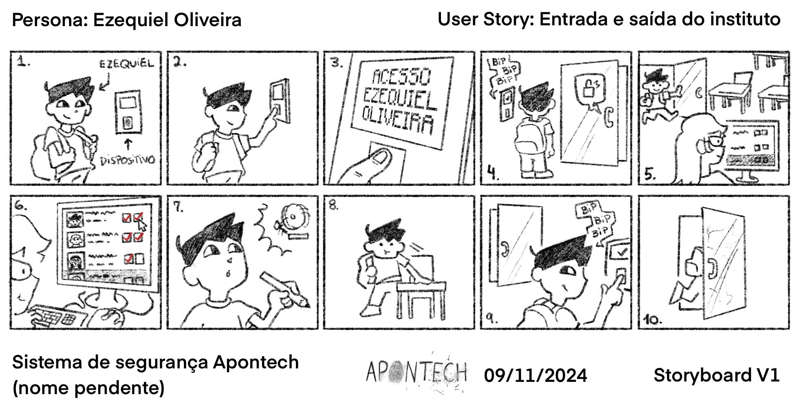

# Documentação IoTDoc - Módulo 4 - Inteli

## Apontech

#### Daniel Gonçalves, Giovanna Britto, Gustavo Colombini, Isadora Gatto, Karine Paixão, Lucas Ramenzoni, Sophia Senne


## Sumário

[1. Introdução](#1-introdução)<br>
&nbsp;&nbsp;&nbsp;&nbsp;[1.1. Objetivos](#11-objetivos)<br>
&nbsp;&nbsp;&nbsp;&nbsp;[1.2. Proposta da solução](#12-proposta-da-solução)<br>
&nbsp;&nbsp;&nbsp;&nbsp;[1.3. Justificativa](#13-justificativa)<br>


[2. Metodologia](#2-metodologia)<br>
&nbsp;&nbsp;&nbsp;&nbsp; [2.1. Visão de Tecnologia na Metodologia RM-ODP](#21-visão-de-tecnologia-na-metodologia-rm-odp)

[3. Desenvolvimento e Resultados](#3-desenvolvimento-e-resultados)<br>
&nbsp;&nbsp;&nbsp;&nbsp;[3.1. Domínio de Fundamentos de Negócio](#31-domínio-de-fundamentos-de-negócio)<br>
&nbsp;&nbsp;&nbsp;&nbsp;&nbsp;&nbsp;&nbsp;&nbsp;[3.1.1. Contexto da Indústria](#311-contexto-da-indústria)<br>
&nbsp;&nbsp;&nbsp;&nbsp;&nbsp;&nbsp;&nbsp;&nbsp;[3.1.2. Análise SWOT](#312-análise-swot)<br>
&nbsp;&nbsp;&nbsp;&nbsp;&nbsp;&nbsp;&nbsp;&nbsp;[3.1.3. Descrição da Solução a ser Desenvolvida](#313-descrição-da-solução-a-ser-desenvolvida)<br>
&nbsp;&nbsp;&nbsp;&nbsp;&nbsp;&nbsp;&nbsp;&nbsp;&nbsp;&nbsp;&nbsp;&nbsp;[3.1.3.1. Qual é o problema a ser resolvido](#3131-qual-é-o-problema-a-ser-resolvido)<br>
&nbsp;&nbsp;&nbsp;&nbsp;&nbsp;&nbsp;&nbsp;&nbsp;&nbsp;&nbsp;&nbsp;&nbsp;[3.1.3.2. Qual a solução proposta (visão de negócios)](#3132-qual-a-solução-proposta-visão-de-negócios)<br>
&nbsp;&nbsp;&nbsp;&nbsp;&nbsp;&nbsp;&nbsp;&nbsp;&nbsp;&nbsp;&nbsp;&nbsp;[3.1.3.3. Como a solução proposta deverá ser utilizada](#3133-como-a-solução-proposta-deverá-ser-utilizada)<br>
&nbsp;&nbsp;&nbsp;&nbsp;&nbsp;&nbsp;&nbsp;&nbsp;&nbsp;&nbsp;&nbsp;&nbsp;[3.1.3.4 Quais os benefícios trazidos pela solução proposta](#3134-quais-os-benefícios-trazidos-pela-solução-proposta)<br>
&nbsp;&nbsp;&nbsp;&nbsp;&nbsp;&nbsp;&nbsp;&nbsp;&nbsp;&nbsp;&nbsp;&nbsp;[3.1.3.5. Qual será o critério de sucesso e qual medida será utilizada para o avaliar](#3135-qual-será-o-critério-de-sucesso-e-qual-medida-será-utilizada-para-o-avaliar)<br>
&nbsp;&nbsp;&nbsp;&nbsp;&nbsp;&nbsp;&nbsp;&nbsp;[3.1.4. Value Proposition Canvas](#314-value-proposition-canvas)<br>
&nbsp;&nbsp;&nbsp;&nbsp;&nbsp;&nbsp;&nbsp;&nbsp;[3.1.5. Matriz de Riscos](#315-matriz-de-riscos)<br>
&nbsp;&nbsp;&nbsp;&nbsp;&nbsp;&nbsp;&nbsp;&nbsp;[3.1.6 Política de Privacidade de acordo com a LGPD](#316-política-de-privacidade-de-acordo-com-a-lgpd)<br>
&nbsp;&nbsp;&nbsp;&nbsp;&nbsp;&nbsp;&nbsp;&nbsp;&nbsp;&nbsp;&nbsp;&nbsp;[3.1.6.1. Informações gerais sobre a empresa/organização](#3161-informações-gerais-sobre-a-empresa--organização)<br>
&nbsp;&nbsp;&nbsp;&nbsp;&nbsp;&nbsp;&nbsp;&nbsp;&nbsp;&nbsp;&nbsp;&nbsp;[3.1.6.2. Informações sobre o tratamento de dados](#3162-informações-sobre-o-tratamento-de-dados)<br>
&nbsp;&nbsp;&nbsp;&nbsp;&nbsp;&nbsp;&nbsp;&nbsp;&nbsp;&nbsp;&nbsp;&nbsp;[3.1.6.3. Quais são os dados coletados](#3163-quais-são-os-dados-coletados)<br>
&nbsp;&nbsp;&nbsp;&nbsp;&nbsp;&nbsp;&nbsp;&nbsp;&nbsp;&nbsp;&nbsp;&nbsp;[3.1.6.4. Onde os dados são coletados](#3164-onde-os-dados-são-coletados)<br>
&nbsp;&nbsp;&nbsp;&nbsp;&nbsp;&nbsp;&nbsp;&nbsp;&nbsp;&nbsp;&nbsp;&nbsp;[3.1.6.5 Para quais finalidades os dados serão utilizados](#3165-para-quais-finalidades-os-dados-serão-utilizados)<br>
&nbsp;&nbsp;&nbsp;&nbsp;&nbsp;&nbsp;&nbsp;&nbsp;&nbsp;&nbsp;&nbsp;&nbsp;[3.1.6.6 Onde os dados ficam armazenados](#3166-onde-os-dados-ficam-armazenados)<br>
&nbsp;&nbsp;&nbsp;&nbsp;&nbsp;&nbsp;&nbsp;&nbsp;&nbsp;&nbsp;&nbsp;&nbsp;[3.1.6.7 Qual o período de armazenamento dos dados (retenção)](#3167-qual-o-período-de-armazenamento-dos-dados-retenção)<br>
&nbsp;&nbsp;&nbsp;&nbsp;&nbsp;&nbsp;&nbsp;&nbsp;&nbsp;&nbsp;&nbsp;&nbsp;[3.1.6.8 Uso de cookies e/ou tecnologias semelhantes](#3168-uso-de-cookies-eou-tecnologias-semelhantes)<br>
&nbsp;&nbsp;&nbsp;&nbsp;&nbsp;&nbsp;&nbsp;&nbsp;&nbsp;&nbsp;&nbsp;&nbsp;[3.1.6.9 Com quem esses dados são compartilhados (parceiros, fornecedores, subcontratados)](#3169-com-quem-esses-dados-são-compartilhados-parceiros-fornecedores-subcontratados)<br>
&nbsp;&nbsp;&nbsp;&nbsp;&nbsp;&nbsp;&nbsp;&nbsp;&nbsp;&nbsp;&nbsp;&nbsp;[3.1.6.10 Informações sobre medidas de segurança adotadas pela empresa](#31610-informações-sobre-medidas-de-segurança-adotadas-pela-empresa)<br>
&nbsp;&nbsp;&nbsp;&nbsp;&nbsp;&nbsp;&nbsp;&nbsp;&nbsp;&nbsp;&nbsp;&nbsp;[3.1.6.11 Orientações sobre como a empresa/organização atende aos direitos dos usuários](#31611-orientações-sobre-como-a-empresaorganização-atende-aos-direitos-dos-usuários)<br>
&nbsp;&nbsp;&nbsp;&nbsp;&nbsp;&nbsp;&nbsp;&nbsp;&nbsp;&nbsp;&nbsp;&nbsp;[3.1.6.12 Informações sobre como o titular de dados pode solicitar e exercer os seus direitos](#31612-informações-sobre-como-o-titular-de-dados-pode-solicitar-e-exercer-os-seus-direitos)<br>
&nbsp;&nbsp;&nbsp;&nbsp;&nbsp;&nbsp;&nbsp;&nbsp;&nbsp;&nbsp;&nbsp;&nbsp;[3.1.6.13 Informações de contato do Data Protection Officer (DPO) ou encarregado de proteção de dados da organização](#31613-informações-de-contato-do-data-protection-officer-dpo-ou-encarregado-de-proteção-de-dados-da-organização)<br>
&nbsp;&nbsp;&nbsp;&nbsp;&nbsp;&nbsp;&nbsp;&nbsp;[3.1.7. Bill of Material (BOM)](#317-bill-of-material-bom)<br>
&nbsp;&nbsp;&nbsp;&nbsp;[3.2. Domínio de Fundamentos de Experiência de Usuário](#32-domínio-de-fundamentos-de-experiência-de-usuário)<br>
&nbsp;&nbsp;&nbsp;&nbsp;&nbsp;&nbsp;&nbsp;&nbsp;&nbsp;&nbsp;&nbsp;&nbsp;[3.2.1. Personas](#321-personas)<br>
&nbsp;&nbsp;&nbsp;&nbsp;&nbsp;&nbsp;&nbsp;&nbsp;&nbsp;&nbsp;&nbsp;&nbsp;[3.2.2. Jornada do Usuário e Storyboard](#322-jornada-do-usuário-e-storyboard)<br>
&nbsp;&nbsp;&nbsp;&nbsp;[3.3. Solução Técnica](#33-solução-técnica)<br>
&nbsp;&nbsp;&nbsp;&nbsp;&nbsp;&nbsp;&nbsp;&nbsp;[3.3.1. Requisitos Funcionais](#331-requisitos-funcionais)<br>
&nbsp;&nbsp;&nbsp;&nbsp;&nbsp;&nbsp;&nbsp;&nbsp;[3.3.2. Requisitos Não Funcionais](#332-requisitos-não-funcionais)<br>
&nbsp;&nbsp;&nbsp;&nbsp;&nbsp;&nbsp;&nbsp;&nbsp;[3.3.3. Arquitetura da Solução](#334-arquitetura-da-solução)<br>
&nbsp;&nbsp;&nbsp;&nbsp;&nbsp;&nbsp;&nbsp;&nbsp;[3.3.4. Arquitetura do Protótipo](#335-arquitetura-do-protótipo)<br>
&nbsp;&nbsp;&nbsp;&nbsp;&nbsp;&nbsp;&nbsp;&nbsp;[3.3.5. Arquitetura Refinada da Solução](#336-arquitetura-refinada-da-solução)<br>
&nbsp;&nbsp;&nbsp;&nbsp;[3.4. Resultados](#34-resultados)<br>
&nbsp;&nbsp;&nbsp;&nbsp;&nbsp;&nbsp;&nbsp;&nbsp;[3.4.1. Protótipo Inicial do Projeto usando o Simulador Wokwi](#341protótipo-inicial-do-projeto-usando-o-simulador-wokwi)<br>
&nbsp;&nbsp;&nbsp;&nbsp;&nbsp;&nbsp;&nbsp;&nbsp;&nbsp;&nbsp;&nbsp;&nbsp;[3.4.1.1. Explicação Técnica](#3411-explicação-técnica)<br>
&nbsp;&nbsp;&nbsp;&nbsp;&nbsp;&nbsp;&nbsp;&nbsp;&nbsp;&nbsp;&nbsp;&nbsp;[3.4.1.2. Detalhamento do Código](#3412-detalhamento-do-código)<br>
&nbsp;&nbsp;&nbsp;&nbsp;&nbsp;&nbsp;&nbsp;&nbsp;&nbsp;&nbsp;&nbsp;&nbsp;[3.4.1.3. Casos de Teste](#3413-casos-de-teste)<br>
&nbsp;&nbsp;&nbsp;&nbsp;&nbsp;&nbsp;&nbsp;&nbsp;&nbsp;&nbsp;&nbsp;&nbsp;[3.4.1.4. Simulação Física](#3414-simulação-física)<br>
&nbsp;&nbsp;&nbsp;&nbsp;&nbsp;&nbsp;&nbsp;&nbsp;[3.4.2. Protótipo Físico do Projeto (offline)](#342-protótipo-físico-do-projeto-offline)<br>
&nbsp;&nbsp;&nbsp;&nbsp;&nbsp;&nbsp;&nbsp;&nbsp;&nbsp;&nbsp;&nbsp;&nbsp;[3.4.2.1. Explicação Técnica](#3421-explicação-técnica)<br>
&nbsp;&nbsp;&nbsp;&nbsp;&nbsp;&nbsp;&nbsp;&nbsp;&nbsp;&nbsp;&nbsp;&nbsp;[3.4.2.2. Detalhamento do Código](#3422-detalhamento-do-código)<br>
&nbsp;&nbsp;&nbsp;&nbsp;&nbsp;&nbsp;&nbsp;&nbsp;&nbsp;&nbsp;&nbsp;&nbsp;[3.4.2.3. Casos de Teste](#3423-casos-de-teste)<br>
&nbsp;&nbsp;&nbsp;&nbsp;&nbsp;&nbsp;&nbsp;&nbsp;[3.4.3. Protótipo do Projeto com MQTT e I2C](#343-protótipo-do-projeto-com-mqtt-e-i2c)<br>
&nbsp;&nbsp;&nbsp;&nbsp;&nbsp;&nbsp;&nbsp;&nbsp;&nbsp;&nbsp;&nbsp;&nbsp;[3.4.3.1. Casos de Teste](#3431-casos-de-teste)<br>
&nbsp;&nbsp;&nbsp;&nbsp;&nbsp;&nbsp;&nbsp;&nbsp;[3.4.4. Protótipo Físico do Projeto (online)](#344-protótipo-físico-do-projeto-online)<br>
&nbsp;&nbsp;&nbsp;&nbsp;&nbsp;&nbsp;&nbsp;&nbsp;&nbsp;&nbsp;&nbsp;&nbsp;[3.4.4.1. Montagem Física](#3441-montagem-física)<br>
&nbsp;&nbsp;&nbsp;&nbsp;&nbsp;&nbsp;&nbsp;&nbsp;&nbsp;&nbsp;&nbsp;&nbsp;[3.4.4.2. Código do Dispositivo Físico](#3442-código-do-dispositivo-físico)<br>
&nbsp;&nbsp;&nbsp;&nbsp;&nbsp;&nbsp;&nbsp;&nbsp;&nbsp;&nbsp;&nbsp;&nbsp;[3.4.4.3. Dashboard](#3443-dashboard)<br>
&nbsp;&nbsp;&nbsp;&nbsp;&nbsp;&nbsp;&nbsp;&nbsp;&nbsp;&nbsp;&nbsp;&nbsp;[3.4.4.4. Situações de Uso](#3444-situações-de-uso)<br>
&nbsp;&nbsp;&nbsp;&nbsp;&nbsp;&nbsp;&nbsp;&nbsp;&nbsp;&nbsp;&nbsp;&nbsp;&nbsp;&nbsp;&nbsp;&nbsp;[3.4.4.4.1. Acesso ao Instituto](#34441-acesso-ao-instituto)<br>
&nbsp;&nbsp;&nbsp;&nbsp;&nbsp;&nbsp;&nbsp;&nbsp;&nbsp;&nbsp;&nbsp;&nbsp;&nbsp;&nbsp;&nbsp;&nbsp;&nbsp;&nbsp;&nbsp;&nbsp;[3.4.4.4.1.1. Acesso de Usuário com Leitor Biométrico](#344411-acesso-de-usuário-com-leitor-biométrico)<br>
&nbsp;&nbsp;&nbsp;&nbsp;&nbsp;&nbsp;&nbsp;&nbsp;&nbsp;&nbsp;&nbsp;&nbsp;&nbsp;&nbsp;&nbsp;&nbsp;&nbsp;&nbsp;&nbsp;&nbsp;[3.4.4.4.1.2. Acesso de Usuário com Cartão RFID](#344412-acesso-de-usuário-com-cartão-rfid)<br>
&nbsp;&nbsp;&nbsp;&nbsp;&nbsp;&nbsp;&nbsp;&nbsp;&nbsp;&nbsp;&nbsp;&nbsp;&nbsp;&nbsp;&nbsp;&nbsp;[3.4.4.4.2. Cadastro](#34442-cadastro)<br>
&nbsp;&nbsp;&nbsp;&nbsp;&nbsp;&nbsp;&nbsp;&nbsp;&nbsp;&nbsp;&nbsp;&nbsp;&nbsp;&nbsp;&nbsp;&nbsp;&nbsp;&nbsp;&nbsp;&nbsp;[3.4.4.4.2.1. Cadastro de Usuário com Leitor Biométrico](#344421-cadastro-de-usuário-com-leitor-biométrico)<br>
&nbsp;&nbsp;&nbsp;&nbsp;&nbsp;&nbsp;&nbsp;&nbsp;&nbsp;&nbsp;&nbsp;&nbsp;&nbsp;&nbsp;&nbsp;&nbsp;&nbsp;&nbsp;&nbsp;&nbsp;[3.4.4.4.2.1. Cadastro de Usuário com Cartão RFID](#344422-cadastro-de-usuário-com-cartão-rfid)<br>
&nbsp;&nbsp;&nbsp;&nbsp;&nbsp;&nbsp;&nbsp;&nbsp;&nbsp;&nbsp;&nbsp;&nbsp;&nbsp;&nbsp;&nbsp;&nbsp;[3.4.4.4.5. Caso de Falha](#34445-caso-de-falha)<br>
&nbsp;&nbsp;&nbsp;&nbsp;&nbsp;&nbsp;&nbsp;&nbsp;&nbsp;&nbsp;&nbsp;&nbsp;&nbsp;&nbsp;&nbsp;&nbsp;[3.4.4.4.6. Conclusões das Situações de Uso](#34446-conclusões-das-situações-de-uso)<br>
&nbsp;&nbsp;&nbsp;&nbsp;&nbsp;&nbsp;&nbsp;&nbsp;[3.4.5. Protótipo Final do Projeto](#345-protótipo-final-do-projeto)<br>
&nbsp;&nbsp;&nbsp;&nbsp;&nbsp;&nbsp;&nbsp;&nbsp;&nbsp;&nbsp;&nbsp;&nbsp;[3.4.5.1. Protótipo Físico](#3451-protótipo-físico)<br>
&nbsp;&nbsp;&nbsp;&nbsp;&nbsp;&nbsp;&nbsp;&nbsp;&nbsp;&nbsp;&nbsp;&nbsp;[3.4.5.2. Código do Dispositivo](#3452-código-do-dispositivo)<br>
&nbsp;&nbsp;&nbsp;&nbsp;&nbsp;&nbsp;&nbsp;&nbsp;&nbsp;&nbsp;&nbsp;&nbsp;[3.4.5.3. Aplicação Web](#3453-aplicação-web)<br>
&nbsp;&nbsp;&nbsp;&nbsp;&nbsp;&nbsp;&nbsp;&nbsp;&nbsp;&nbsp;&nbsp;&nbsp;[3.4.5.4. Situações de Uso Revisadas](#3454-situações-de-uso-revisadas)<br>
&nbsp;&nbsp;&nbsp;&nbsp;&nbsp;&nbsp;&nbsp;&nbsp;[3.4.6. Teste de Usabilidade](#346-testes-de-usabilidade)<br>

[4. Conclusões e Recomendações](#4-conclusões-e-recomendações)

[5. Referências](#5-referências)

<br>


# <a name="c1"></a>1. Introdução

&nbsp;&nbsp;&nbsp;&nbsp;O projeto consiste no desenvolvimento de uma solução de Internet das Coisas (IoT) em parceria com o Instituto Apontar, uma instituição fundada em 1950, localizada no Rio de Janeiro - Lapa é dedicada a apoiar, auxiliar e acompanhar crianças e jovens com altas habilidades/superdotação. O Instituto é uma referência na área educacional e trabalha para promover o desenvolvimento dessas crianças e jovens, contribuindo para o fortalecimento de suas competências e habilidades.

&nbsp;&nbsp;&nbsp;&nbsp;O problema identificado no Instituto está relacionado à gestão manual da presença dos alunos. O processo atual de controle de entrada e saída nas dependências é pouco eficiente e suscetível a falhas. Assim, é necessária uma solução que automatize a metrificação da presença dos alunos e colaboradores de forma ágil e precisa, permitindo um acompanhamento mais eficiente.

## 1.1 Objetivos

&nbsp;&nbsp;&nbsp;&nbsp;O principal objetivo do Instituto Apontar é otimizar o acompanhamento e gestão do tempo de permanência dos alunos e colaboradores em suas instalações, garantindo maior controle, segurança e precisão nos registros de presença.

**Objetivo geral:**

&nbsp;&nbsp;&nbsp;&nbsp; Desenvolver um sistema de controle de presença automatizado para o Instituto Apontar, utilizando tecnologia de biometria digital para monitoramento de acesso e frequência dos alunos e colaboradores. Somado a isso, esse sistema deverá integrar-se ao Google Workspace para geração de registros em tempo real, proporcionando maior segurança e precisão nos dados de entrada e saída dos usuários, além de otimizar o controle de frequência.

**Objetivo do Grupo:**

    
&nbsp;&nbsp;&nbsp;&nbsp;Desenvolver um dispositivo de acesso eficiente que integre biometria digital, leitor de cartão e autenticação por senha para o Instituto Apontar. Além de atender às necessidades específicas do instituto, o projeto visa promover o desenvolvimento acadêmico do grupo, permitindo a aplicação prática dos conhecimentos adquiridos e o aprimoramento das habilidades técnicas dos integrantes.

**Objetivos específicos:**

&nbsp;&nbsp;&nbsp;&nbsp; A partir do objetivo geral estabelecido, é possível determinar os objetivos específicos, sendo esses:

- **Implementar o Controle de Acesso por Biometria**: Configurar um sistema de leitura biométrica digital para identificar e registrar automaticamente as entradas e saídas dos atendidos e colaboradores..

- **Integrar o Sistema ao Google Workspace**: Conectar o sistema de controle biométrico a uma planilha do Google, permitindo a atualização automática dos registros de presença e acesso em tempo real.

- **Estabelecer Regras e Limites de Acesso**: Configurar o sistema para que respeite os horários permitidos de acesso para cada usuário, garantindo que as portas sejam liberadas somente nos horários estabelecidos pelo instituto e monitorando a conformidade com as regras de presença.

- **Assegurar a Privacidade e Segurança dos Dados**: Garantir que todas as operações do sistema atendam aos requisitos da Lei Geral de Proteção de Dados (LGPD), protegendo as informações pessoais dos usuários.

## 1.2 Proposta da solução

&nbsp;&nbsp;&nbsp;&nbsp;A solução proposta é um sistema de controle de presença que utiliza dispositivos de IoT e biometria, especificamente um leitor de impressões digitais. Este sistema será responsável por registrar automaticamente os horários de entrada e saída de alunos e colaboradores nas dependências do Instituto Apontar. Cada aluno e colaborador terá sua impressão digital cadastrada no sistema, permitindo que, ao realizar a leitura da digital, seja automaticamente registrado o horário de entrada ou saída no sistema.

&nbsp;&nbsp;&nbsp;&nbsp;O sistema integrará hardware (o leitor biométrico) com um software de gestão de presença, que, por sua vez, será vinculado a uma planilha do Google. Assim, todas as informações capturadas pelo leitor de digitais serão enviadas em tempo real para essa planilha (Execel), onde poderão ser acessadas e monitoradas pelos gestores e administradores do Instituto. Esse banco de dados será atualizado continuamente, permitindo consultas detalhadas sobre o tempo de permanência de cada aluno ou colaborador.

&nbsp;&nbsp;&nbsp;&nbsp;Além de registrar a frequência, o sistema também permitirá a geração de relatórios automáticos com base nos dados registrados, oferecendo uma visão clara de quantas vezes cada aluno compareceu ao Instituto em uma semana, mês ou ano, assim como possíveis atrasos ou faltas. Para o protótipo inicial, o foco será na implementação do controle de entrada por digital, junto à integração com a planilha de logs de horários.

&nbsp;&nbsp;&nbsp;&nbsp;Esse sistema será configurado para funcionar dentro dos horários estabelecidos pelo Instituto, permitindo a liberação de acesso apenas nos momentos programados. A solução visa não apenas substituir o controle manual de presença, mas também fornecer uma base de dados robusta que poderá ser usada para monitorar o desempenho de frequência dos alunos e a assiduidade dos colaboradores.

## 1.3 Justificativa

&nbsp;&nbsp;&nbsp;&nbsp;A implementação da solução proposta apresenta uma série de benefícios significativos para o Instituto Apontar. Primeiramente, o sistema de leitura de digitais automatiza um processo que atualmente é feito manualmente, reduzindo erros humanos, como registros incorretos ou dados incompletos. A digitalização do controle de presença também proporciona uma economia de tempo para os funcionários, permitindo que se concentrem em atividades mais importantes do que a coleta manual de informações.


&nbsp;&nbsp;&nbsp;&nbsp;A integração do sistema com o Google Planilhas permite uma gestão eficaz e transparente dos dados, com a vantagem de que todas as informações podem ser acessadas em tempo real por qualquer dispositivo conectado à internet. Essa funcionalidade facilita o acompanhamento diário, semanal e até anual da frequência dos alunos e colaboradores, gerando um histórico completo de acessos.

&nbsp;&nbsp;&nbsp;&nbsp;Além disso, a solução aumenta a segurança do ambiente, uma vez que o controle de acesso é feito de forma biométrica, o que garante que apenas indivíduos autorizados possam entrar nas dependências. Esse controle automatizado ajuda a evitar situações em que os alunos ou colaboradores possam deixar o local sem o devido registro de saída. Com o monitoramento preciso de entradas e saídas, a gestão dos espaços torna-se mais eficiente, pois a administração passa a ter uma visão clara e em tempo real da ocupação dos ambientes, incluindo informações sobre quem está no Instituto, quem está em sala de aula e casos de saída antecipada, facilitando o acompanhamento e a visualização detalhada da movimentação de todos os indivíduos no Instituto.

&nbsp;&nbsp;&nbsp;&nbsp;Por fim, ao oferecer um sistema que pode ser expandido no futuro para outras tecnologias biométricas, como reconhecimento facial, a solução se mostra flexível e adaptável às necessidades futuras do Instituto. O diferencial dessa solução está em sua capacidade de integração com ferramentas já conhecidas pela equipe do Instituto, como o Google Workspace, e em sua potencial escalabilidade para incorporar novos recursos conforme o projeto evolui.

# <a name="c2"></a>2. Metodologia
&nbsp;&nbsp;&nbsp;&nbsp;Metodologia pode ser entendida como um conjunto de métodos, processos e práticas utilizadas para estruturar, organizar e conduzir um projeto. Ela fornece uma abordagem sistemática que orienta as etapas necessárias para atingir os objetivos estabelecidos. No contexto do desenvolvimento de sistemas, a metodologia é fundamental para garantir que o projeto siga padrões consistentes, desde a fase inicial de análise de requisitos até a implementação final.

&nbsp;&nbsp;&nbsp;&nbsp; Para esse projeto, foi utilizado a metologia  ODP (Open Distributed Processing), ou Processamento Distribuído Aberto, é um esforço da ISO (Organização Internacional de Padronização) para criar uma estrutura de padrões voltados ao desenvolvimento de sistemas de informação distribuídos e abertos. Por meio do ODP, a ISO busca garantir que diferentes sistemas distribuídos consigam interoperar, ou seja conversar entre si, com menos barreiras e de forma eficiente [[K]](#k-panigassi-rogério--método-para-especificação-e-modelagem-de-processos-de-fábrica-de-software-usando-rm-odp-e-bpm-2007-httpswwwtesesuspbrtesesdisponiveis33141tde-19072007-151910publicopanigassirdissert2007pdf).

&nbsp;&nbsp;&nbsp;&nbsp; Um dos principais componentes do ODP é o RM-ODP (Reference Model for Open Distributed Processing), que define um modelo de referência para sistemas distribuídos. Esse modelo de referência descreve diretrizes e padrões para projetar sistemas de forma que eles sejam abertos (utilizam padrões abertos que promovem portabilidade e interoperabilidade), integrados (permite a fácil incorporação com outros sistemas), flexíveis (fáceis de serem evoluídos por meio da incorporação de novas tecnologias ou configurações dinâmicas), seguros (utiliza recursos e dados do sistema com segurança), entre outros [[J]](#j-becerra-jorge-lr-et-al-arquitetura-de-um-middleware-corporativo-na-companhia-de-transmissão-de-energia-elétrica-paulista-jan-2016-wwwcgtiorgbrpublicacoeswp-contentuploads201601arquitetura-de-um-middleware-corporativo-na-companhia-de-transmissacc83o-de-energia-elecc81trica-paulistapdf).

&nbsp;&nbsp;&nbsp;&nbsp; Entretanto, obter todos esses atributos é uma tarefa complexa, e exige diversas atividades de modelagem, especificação, padronização de conceitos, arquitetura e níveis de conformidade. Para isso, o RM-ODP organiza a modelagem em cinco visões arquiteturais, de forma a endereçar todas as preocupações [[I]](#i-ianjoyner-open-distributed-processing-unplugged--4-viewpoints-medium-29-sept-2024-mediumcomianjoyneropen-distributed-processing-unplugged-687d4ca6159f-accessed-13-nov-2024). Essas visões compreendem:

1. **Empresa**: define a visão do contexto em que o sistema vai ser projetado e implantado, tendo como foco os objetivos, regras de negócios e políticas que irão receber o suporte do sistema a ser desenvolvido. Sendo assim, a ênfase está nas unidades de negócio e nas unidades sociais, como pessoas que irão especificar o sistema, organizações comerciais, ou entidades governamentais [[L]](#l-reference-model-of-open-distributed-processing--rm-odp-2023-httpsedisciplinasuspbrpluginfilephp7621933mod_resourcecontent18-rm-odp-22-03-2023pdf).

2. **Informação**: está relacionado com informação que é armazenada e processada pelo sistema, e fornece um modelo comum que pode ser referenciado por todas as partes da organização. Sendo assim, esse ponto de vista, pode evitar a ocorrência de divergências no uso das informações, como ocorre em sistemas integrados [[L]](#l-reference-model-of-open-distributed-processing--rm-odp-2023-httpsedisciplinasuspbrpluginfilephp7621933mod_resourcecontent18-rm-odp-22-03-2023pdf).  

3. **Computação**: esse ponto de vista visa definir as funcionalidades do sistema e a arquitetura que realiza essas funcionalidades, sendo assim, elas são definidas por meio dos serviços e como esses servços são realizados internamente. Dessa forma, essa visão fornece a disposição de um sistema em objetos que interagem em interfaces, permitindo uma futura divisão para distribuição [[L]](#l-reference-model-of-open-distributed-processing--rm-odp-2023-httpsedisciplinasuspbrpluginfilephp7621933mod_resourcecontent18-rm-odp-22-03-2023pdf).

4. **Engenharia**: enquanto a computação habilita implicitamente a distribuição, o ponto de vista da engenharia evidencia explicitamente essa distribuição. Sendo assim, essa visão tem como foco a definição da infraestrutura necessária para fornecer suporte à distribuição, fornecendo um conjunto de serviços de comunicação e outros serviços de suporte para a aplicação, com isso, é possível evitar que o sistema fique dependente de plataformas ou mecanismos de infraestrutura[[L]](#l-reference-model-of-open-distributed-processing--rm-odp-2023-httpsedisciplinasuspbrpluginfilephp7621933mod_resourcecontent18-rm-odp-22-03-2023pdf).

5. **Tecnologia**: tem como foco a construção do sistema, detalhando as tecnologias específicas, como hardware e software, que serão utilizadas para implementar um sistema. Dessa forma, esse ponto de vista representa os componentes de hardware e software do sistema, e a tecnologia de comunicação que permite a ligação entre os componentes [[I]](#i-ianjoyner-open-distributed-processing-unplugged--4-viewpoints-medium-29-sept-2024-mediumcomianjoyneropen-distributed-processing-unplugged-687d4ca6159f-accessed-13-nov-2024).

&nbsp;&nbsp;&nbsp;&nbsp; Esses pontos de vista podem se relacionar de duas maneiras, sendo essas representadas pelas imagens abaixo.


<div align="center">

<sub>Figura 1 - Primeira Representação da Metodologia RM-ODP</sub>


<sup>Fonte: Ianjoyner. “Open Distributed Processing: Unplugged! — 4 Viewpoints.” (2024)</sup>

</div>

<div align="center">

<sub>Figura 2 - Segunda Representação da Metodologia RM-ODP</sub>


<sup>Fonte: Ianjoyner. “Open Distributed Processing: Unplugged! — 4 Viewpoints.” (2024)</sup>

</div>

&nbsp;&nbsp;&nbsp;&nbsp; Conforme exposto, as duas imagens ilustram o modelo de referência RM-ODP e a relação entre suas cinco visões arquiteturais com as etapas de desenvolvimento de sistemas distribuídos.

&nbsp;&nbsp;&nbsp;&nbsp; Na primeira imagem, cada camada representa uma etapa do desenvolvimento de um sistema, desde a análise de requisitos até a implementação:

1. Requirements Analysis (Análise de Requisitos): No topo, há a visão Enterprise (Empresarial), que estabelece as políticas e objetivos gerais do sistema, onde são definidos os requisitos do sistema no contexto organizacional e de negócio, visando entender o propósito do sistema.

2. Functional Specification (Especificação Funcional): nessa seção entram as visões Information (Informação) e Computational (Computacional). Na qual, a visão de Informação define a estrutura e o gerenciamento dos dados, além de como as informações são organizadas. Enquanto a visão Computacional descreve como os diferentes componentes do sistema interagem entre si, tratando das funções que o sistema deve realizar.

3. Design (Projeto): A visão de Engenharia é usada para projetar a infraestrutura que permitirá a distribuição e a conectividade dos componentes do sistema. Nessa etapa, são considerados aspectos como comunicação, sincronização e o meio físico de distribuição.

4. Implementation (Implementação): Por fim, a visão Tecnológica define as tecnologias e padrões específicos a serem utilizados para a construção do sistema, considerando as ferramentas, linguagens e frameworks necessários.

&nbsp;&nbsp;&nbsp;&nbsp; Diferentemente da primeira, a segunda imagem apresenta um fluxo mais detalhado entre as visões, destacando a seguinte transição entre as fases do desenvolvimento de sistemas distribuídos:

1. User Requirements (Requisitos do Usuário): É o ponto de partida, onde as necessidades dos usuários são capturadas e compreendidas.

2. Purpose and Modelling (Propósito e Modelagem): As visões Enterprise (empresa) e Information(informação) são aplicadas para definir o propósito do sistema e criar uma modelagem inicial.

3. Design and Programming (Projeto e Programação): As visões Computational e Engineering (engenharia) trabalham em conjunto para detalhar o design e a lógica do sistema, sendo que a visão Computacional organiza a arquitetura funcional, especificando componentes e interfaces, e a visão de Engenharia aborda a infraestrutura necessária para a implementação dos componentes distribuídos.

4. Implementation and Generation (Implementação e Geração): A visão Tecnológica é o último estágio, onde se escolhem as tecnologias e ferramentas específicas para transformar o design em um sistema funcional.

&nbsp;&nbsp;&nbsp;&nbsp; Por meio disso é possível concluir que o RM-ODP fornece uma estrutura organizada para o desenvolvimento de sistemas distribuídos ao dividir o processo em cinco visões arquiteturais, no qual cada visão aborda uma dimensão específica do sistema, desde a definição dos objetivos de negócio até a seleção das tecnologias que serão usadas na implementação, conforme descrito na seção abaixo.

### 2.1. Visão de Tecnologia na Metodologia RM-ODP

&nbsp;&nbsp;&nbsp;&nbsp; Conforme apresentado, a visão de tecnologia na metodologia RM-ODP foca nos aspectos práticos da implementação do sistema, detalhando as tecnologias específicas utilizadas, como hardware, software e protocolos de comunicação, que garantem a funcionalidade, conectividade e integração entre os componentes. No desenvolvimento do protótipo de controle de acesso e frequência para o Instituto Apontar, a visão de tecnologia detalha a escolha e integração das tecnologias utilizadas, considerando aspectos como eficiência, segurança e compatibilidade com os requisitos do sistema. Abaixo, os componentes principais do protótipo são apresentados conforme sua função tecnológica:

#### 1. Dispositivos Físicos
- **ESP32-WROOM-32U**: O microcontrolador principal é responsável por realizar o processamento de dados localmente, se conectar à rede Wi-Fi e gerenciar a comunicação com sensores, atuadores e o Broker MQTT. Suas interfaces UART, I2C e SPI permitem a conexão com os sensores biométricos, RFID e teclado matricial.
- **Sensor Biométrico DY50**: Utiliza comunicação UART para capturar e autenticar impressões digitais com alta precisão, funcionando como um método de autenticação de alta segurança.
- **Leitor RFID MFRC522**: Emprega comunicação SPI para leitura de tags RFID. Permite autenticação sem contato, operando em 13,56 MHz com distância de leitura de até 5 cm.
- **Teclado Matricial 4x4**: Interface de entrada configurada em matriz, conectada ao ESP32 por comunicação digital, para coleta de senhas numéricas.
- **Display LCD 16x2 com Backlight Azul**: Utiliza protocolo I2C para comunicação eficiente com o ESP32, exibindo mensagens informativas ao usuário.
- **Relé 1 Canal 5V**: Atua como um interruptor eletromecânico controlado pelo ESP32 para liberar a corrente que aciona a fechadura solenoide.
- **Fechadura Solenoide**: Dispositivo eletromecânico que bloqueia ou libera o acesso físico ao ambiente controlado, operado indiretamente pelo relé.
- **Buzzer e LED Verde**: Indicadores sonoro e visual para feedback do sistema, controlados diretamente pelo ESP32.

#### 2. Comunicação e Rede
- **Broker MQTT (HiveMQ)**: Responsável por gerenciar a troca de mensagens entre o ESP32 e a aplicação web. Utiliza o protocolo MQTT, que garante comunicação eficiente e em tempo real, essencial para a operação do sistema distribuído.
- **Conexão Wi-Fi**: A comunicação sem fio entre o ESP32 e o Broker MQTT é estabelecida via rede local, utilizando o padrão IEEE 802.11 (Wi-Fi), permitindo integração com a aplicação web e banco de dados.

#### 3. Aplicação Web
- **Front-End (React e Tailwind)**: React é utilizado para desenvolver uma interface de usuário dinâmica e responsiva. Tailwind CSS adiciona estilização consistente, facilitando a interação com os dados do sistema, como logs de acesso e status de dispositivos.
- **Back-End (Node.js e JavaScript)**: Gerencia a lógica de negócios do sistema, atuando como intermediário entre o banco de dados e o Broker MQTT. Permite integração eficiente dos dados coletados pelo ESP32.
- **Banco de Dados (Supabase)**: Armazena informações críticas, como logs de autenticação, permissões de usuários e configurações do sistema, utilizando a infraestrutura do PostgreSQL.

&nbsp;&nbsp;&nbsp;&nbsp;Sendo assim, a arquitetura do sistema combina tecnologias de hardware e software de forma integrada, utilizando o **ESP32** como unidade de controle central, conectado a dispositivos periféricos (sensores, atuadores e interfaces de entrada/saída). Enquanto, o protocolo MQTT centraliza a troca de informações entre os dispositivos físicos e a aplicação web, garantindo baixa latência e comunicação segura. Por fim, o banco de dados Supabase garante armazenamento confiável e acesso rápido às informações, enquanto o front-end permite monitoramento e gestão do sistema.

# <a name="c3"></a>3. Desenvolvimento e Resultados 

## 3.1. Domínio de Fundamentos de Negócio

### 3.1.1. Contexto da Indústria
&nbsp;&nbsp;&nbsp;&nbsp;O Instituto Apontar é uma instituição dedicada a transformar a vida de crianças e adolescentes de baixa renda que possuem traços de altas habilidades ou superdotação. Seu principal objetivo é identificar e potencializar o talento desses jovens, oferecendo um ambiente favorável ao desenvolvimento de suas competências individuais.

&nbsp;&nbsp;&nbsp;&nbsp;Atualmente, o Instituto possui diversos programas, como o Programa Arcos, que seleciona alunos do 4º e 5º anos matriculados em escolas públicas municipais. Esses estudantes, ao demonstrarem indícios de superdotação, são inseridos no Instituto para participar de atividades especialmente desenvolvidas para aprimorar suas habilidades cognitivas, sociais e emocionais.

&nbsp;&nbsp;&nbsp;&nbsp;No entanto, uma das principais dificuldades enfrentadas pelo Instituto Apontar é encontrar parceiros e apoiadores que possam contribuir para a ampliação de seus programas. Isso impacta diretamente sua capacidade de alcançar mais crianças com potencial e expandir o alcance das atividades realizadas.

&nbsp;&nbsp;&nbsp;&nbsp;Diante desse desafio, é fundamental buscar soluções que promovam maior visibilidade ao Instituto, garantindo que suas ações e impactos positivos sejam reconhecidos por potenciais parceiros, colaboradores e pela sociedade como um todo. O crescimento do Instituto Apontar representa não apenas uma oportunidade para atender mais alunos capacitados, mas também um investimento em um futuro onde jovens talentosos possam transformar suas realidades e contribuir significativamente para a sociedade.

### Análise 5 Forças de Porter

##### Introdução 
&nbsp;&nbsp;&nbsp;&nbsp;O modelo das 5 Forças de Porter é uma forma de análise setorial que visa detalhar a competitividade do mercado e o modo com que fatores como a ameaça de novos produtos ou o poder de barganha dos fornecedores podem influenciar nas atividades da empresa. Utilizando as Forças de Porter, temos uma visão de mercado e de viabilidade econômica mais ampla, podendo assim concluir que a competitividade vai além dos concorrentes diretos, analisando fatores pontuais como a competitividade entre concorrentes, a ameaça de novos entrantes, o poder de barganha dos fornecedores, o poder de barganha dos clientes e a ameaça de produtos ou serviços substitutos. Ao analisar esses elementos, as empresas podem desenvolver estratégias mais eficazes para enfrentar desafios competitivos, explorar oportunidades de mercado e ajustar sua abordagem de acordo com a dinâmica setorial. A seguir uma imagem das 5 Forças de Poter [[X]](#6-referências)

<div align="center">

<sub>Figura 3 - Análise 5 Forças de Porter</sub>


<sup>Fonte: Material produzido pelos autores (2024)</sup>

</div>
&nbsp;&nbsp;&nbsp;&nbsp;A partir da imagem, poderá ser feita uma análise mais profunda sobre cada ponto das 5 Forças de Porter:

#### Ameaça de produtos substitutos
&nbsp;&nbsp;&nbsp;&nbsp;Serviços substitutos seriam outras formas de atendimento a crianças com altas habilidades, como programas online de desenvolvimento, tutoria privada, escolas especializadas, ou mesmo iniciativas governamentais mais abrangentes, porém, devido ao modo com que o Instituto Apontar aborda seus possíveis alunos, elegendo os candidatos viáveis e oferecendo essa oportunidade de desenvolvimento diretamente aos pais e professores, apresentando como uma possibilidade real e visível, é garantido ao Instituto uma posição única nesse setor, se consolidando e diminuindo a ameaça de outros serviços substitutos.

#### Ameaça de entrada de novos concorrentes
&nbsp;&nbsp;&nbsp;&nbsp;O Instituto Apontar já está consolidado entre as três maiores organizações sociais que trata de crianças com altas habilidades/superdotadas do Rio de Janeiro, se espalhando por 11 polos do estado e contanto com o apoio de grandes investidores, como a Globo, Visagio e muitas outras que contribuem para a permanência do Instituto Apontar nesse mercado. Além disso, contribuindo para a noção de que a ameaça de novos entrantes é baixa, é perceptível o quão nichado no Brasil o setor de apoio à crianças com altas habilidades ainda é. Além disso, e a entrada de novas instituições que ofereçam suporte específico a essa população é improvável, devido ao alto custo de manter programas especializados e de alta qualidade.

#### Poder de negociação dos clientes
&nbsp;&nbsp;&nbsp;&nbsp;O poder de barganha dos clientes do Instituto Apontar, que nesse caso são seus alunos, está em seu poder de escolher entre ingressar no Apontar ou optar por outros institutos que fazem o mesmo no Rio de Janeiro, o [Instituto Rogério Steinberg](http://irs.org.br/) e o [NAAH/S](https://www.jusbrasil.com.br/noticias/estado-oferece-programa-especial-para-superdotados/146045), o que influencia na popularidade do Instituto, e consequentemente em sua capacidade de reter e manter patrocinadores, desse modo aumentando o poder de negociação dos clientes. Essa possibilidade de escolha porém é mitigada pelo fato de que, segundo relatos do próprio Instituto Apontar em entrevista com a Turma 14 do Inteli, as três organizações (IRS, NAAH/S e Apontar) trabalham em conjunto formando parcerias e representando diferentes setores na educação de pessoas com altas habilidades.

#### Poder de negociação dos fornecedores
&nbsp;&nbsp;&nbsp;&nbsp;Vendo o Instituto Apontar como uma instituição sem fins lucrativos, seus principais fornecedores são seus parceiros de negócios, patrocinadores e aqueles que se voluntariam a oferecer recursos financeiros e apoiar a causa, portanto, se o número de organizações ou pessoas dispostas a apoiar o projeto for limitado, esses "fornecedores" terão maior poder de barganha, influenciando as condições de financiamento ou exigindo maior prestação de contas. <br>
&nbsp;&nbsp;&nbsp;&nbsp;Para lidar com isso, o Instituto Apontar pode diversificar suas fontes de financiamento, buscando apoio de empresas privadas, doações de indivíduos e fundos governamentais para reduzir a dependência de um único tipo de patrocinador.

#### Rivalidade entre os concorrentes
&nbsp;&nbsp;&nbsp;&nbsp;O Instituto Rogério Steinberg e o NAAH/S se mostram fortes concorrentes do Instituto Apontar, com os três atuando na área da educação de crianças com altas habilidades/superdotadas e na mesma região, o Rio de Janeiro. Com isso, é de se imaginar que o Instituto Apontar não tem a garantia e muito menos a segurança de que os alunos ingressarão em suas aulas, porém, se analisarmos bem cada instituto podemos ver que cada um possui a sua própria abordagem e nicho de mercado, o IRS por exemplo trabalha com programas educacionais, esportivos e culturais para desenvolver o potencial de jovens talentosos em situação de vulnerabilidade, enquanto o NAAH/S é uma iniciativa pública, oferecendo apoio pedagógico especializado. <br>
&nbsp;&nbsp;&nbsp;&nbsp;No final das contas, o impacto desses concorrentes é significativo pois todos disputam recursos limitados, como doações, parcerias e voluntários, no entanto, o fato de serem instituições com diferentes abordagens que trabalham juntas em uma mesma causa (privada, pública e do terceiro setor) pode permitir uma coexistência onde cada um atende nichos específicos. Nesse caso, o Instituto Apontar pode se destacar pelo seu atendimento personalizado e que busca conectar diretamente com a escola e os pais das crianças.

#### Conclusão
&nbsp;&nbsp;&nbsp;&nbsp;A análise das 5 Forças de Porter revela que o Instituto Apontar está em uma posição estratégica sólida no setor de apoio a crianças com altas habilidades no Rio de Janeiro. A ameaça de novos entrantes é baixa devido ao alto custo de manutenção de programas especializados, e a possibilidade de produtos substitutos, como tutoria privada ou programas online, é mitigada pela abordagem personalizada e o relacionamento direto com pais e professores, o que diferencia o Instituto no mercado. <br>
&nbsp;&nbsp;&nbsp;&nbsp;No entanto, a concorrência com o Instituto Rogério Steinberg e o NAAH/S é significativa, uma vez que todos disputam por recursos limitados, como doações e voluntários. Mesmo assim, as abordagens distintas de cada instituição permitem a coexistência, e o Apontar pode se destacar por seu foco em um atendimento mais abrangente, que envolve o desenvolvimento emocional e social das crianças, além do acadêmico. <br>
&nbsp;&nbsp;&nbsp;&nbsp;Para continuar crescendo e se destacando, o Instituto Apontar deve diversificar suas fontes de financiamento e fortalecer suas parcerias, garantindo que sua proposta de valor permaneça única e atraente para as famílias e patrocinadores. Essa estratégia assegurará sua posição de liderança no setor e permitirá que continue oferecendo oportunidades transformadoras para crianças de baixa renda com altas habilidades.

### 3.1.2. Análise SWOT

&nbsp;&nbsp;&nbsp;&nbsp;A matriz SWOT, também conhecida como matriz FOFA em português, é uma ferramenta que avalia diversos fatores externos e internos de uma empresa ou projeto para facilitar a tomada de decisões, separando-os em quatro categorias: Strengths (Forças), Weaknesses (Fraquezas), Opportunities (Oportunidades) e Threats (Ameaças). As forças e fraquezas representam fatores internos, que oferecem vantagens ou desvantagens dentro do mercado, enquanto as oportunidades e ameaças se referem a fatores externos, que devem ser considerados, que podem ou ser explorados para gerar benefícios ou representar desafios a serem enfrentados eventualmente. Com essa análise, a empresa ou equipe pode construir estratégias antecipadamente para maximizar o aproveitamento de oportunidades assim como se planejar para lidar com futuros obstáculos. No contexto do Instituto Apontar, a seguinte figura representa a matriz SWOT desenvolvida pela nossa equipe após extensa pesquisa.

<div align="center">

<sub>Figura 4 - Análise SWOT do Projeto</sub>


<sup>Fonte: Material produzido pelos autores (2024)</sup>

</div>

**Forças (_Strengths_):**

- **Ambiente de ensino inovador e transformador:** O Instituto Apontar conta com métodos de ensino alternativos, mais adaptados para jovens superdotados; Tomam vantagem de novas metodologias e tecnologias para aprimorar o ensino, tornando o aprendizado em uma experiência mais estimulante e interativa;
- **Oportunidades e apoio para alunos e famílias de baixa renda:** A organização tem missão social clara e bem definida, preenchendo lacuna importante no sistema educacional ao fornecer recursos adequados para famílias de baixa renda, inclusive em relação a estudos, permitindo acesso a ensino muito mais vigoroso comparado ao ensino público.
- **Alto índice de sucesso em competições:** As metodologias implementadas pelo instituto são validadas pelos resultados obtidos. Nos últimos anos, os alunos conquistaram mais de 100 medalhas em olimpíadas de conhecimento, incluindo o primeiro lugar em Olimpíadas de Matemática. Além disso, obtiveram aprovação em vestibulares de destaque, como os da UERJ e UFRJ, e se destacaram em competições como a FEBRACE.
- **Diversidade de parceiros:** Por se tratar de uma ONG, o instituto garante maior estabilidade financeira ao contar com o apoio de mais de 20 parceiros, incluindo grandes nomes como Rede Globo, Visagio e Vinci Partners, entre outros. Essa diversidade de parceiros ajuda a reduzir os impactos de cessações repentinas de doações.

**Fraquezas (_Weakness_):**

- **Dificuldade na identificação de alunos candidatos** Uma vez que o próprio instituto se responsabiliza de encontrar e convidar estudantes, encontra-se o desafio de identificar todos os alunos, uma vez que o próprio problema que o instituto visa solucionar é também um desafio a ser enfrentado, com alunos superdotados muitas vezes sendo invisíveis ao sistema, dificultando a identificação de seus potenciais.
- **Dependência em doações para funcionamento:** Por natureza de ser uma ONG, a ausência de uma fonte de lucro limita os riscos que o instituto pode tomar, pois enquanto a organização não é gerenciada pelos seus parceiros, ela é influenciada pela vontade deles.
- **Espaço físico limitado à apenas um prédio no Rio de Janeiro:** Há apenas uma sede da instituição, sendo um prédio no Rio de Janeiro, o que limita o alcance da ONG e seus benefícios e inovações a apenas a essa região.
- **Monitoramento de presença insuficiente:** A instituição expressa dificuldade com o monitoramento de presença de seus estudantes, e atualmente busca por uma solução para esse problema.

**Oportunidades (_Opportunities_):**

- **Conscientização sobre a superdotação:** Ao promover mais ainda a conscientização do público geral sobre a superdotação, se tornará mais fácil a identificação e assim a integração de mais alunos dentro do sistema da instituição.
- **Expansão para outras regiões:** Expandindo o escopo da ONG para outros estados, será possível aumentar o impacto da instituição, encontrar mais parceiros, e assim transformar ainda mais vidas.
- **Implementação de IA:** A introdução de IAs de maneira educada e apropriada pode trazer inúmeros benefícios tanto no aprendizado dos estudantes assim como na própria manutenção do instituto.
- **Integração com institutos similares:** Ao realizar parcerias ou fusões com outros institutos com objetivos similares, se torna mais plausível a expansão do projeto e o cumprimento da missão social. (Como já aconteceu anteriormente, o Instituto Apontar sendo resultado da fusão de duas entidades em 2018 [[X]](#5-referências))

**Ameaças (_Threats_):**

- **Financiamento incerto:** A qualquer momento a ONG pode perder grande parte de seus fundos, a perda de parceiros sendo então um risco constante.
- **Perda de contato com colaboradores:** É crucial que o instituto mantenha contato saudável e constante com seus colaboradores, pois a perda de contato com eles resulta novamente na perda de fundos da ONG. O instituto já possui um departamento dedicado às relações com colaboradores.
- **Estigma sobre alunos superdotados:** Ao convidar alunos específicos para a instituição, há possibilidade de se gerar um estigma sobre esses alunos, o que pode resultar em bullying ou afetar o aluno de outra maneira psicológica.
- **Mudanças e conflitos com horários escolares:** Alterações na rotina dos alunos podem impedir eles de frequentarem as classes do instituto, devido a horários conflitantes ou exaustão física ou mental dos alunos.

<br>
&nbsp;&nbsp;&nbsp;&nbsp;Contudo, a análise SWOT revela uma organização com compromisso e objetivos claros e nobres, e que, devido à sua natureza como ONG, enfrenta alguns riscos diferentes de outras entidades empresariais. A dificuldade na identificação de alunos superdotados foi classificada como uma fraqueza, mas essa atitude do instituto de ativamente buscar e se aproximar dos alunos em diversas escolas para transformar suas vidas também é o que torna o Instituto Apontar único em sua missão. Além disso, o comprometimento em oferecer educação de qualidade a estudantes de baixa renda e o sucesso nas competições acadêmicas são exemplos de como a organização supera limitações financeiras e operacionais, fortalecendo seu impacto social. No entanto, é necessário que o instituto dedique-se para mitigar os riscos e ameaças, tanto financeiros quanto gerenciais, e ao mesmo tempo aproveite de oportunidades de inovação e crescimento. Dito isso, a adoção de novas tecnologias é um bom caminho para o instituto realizar ambas coisas.

### 3.1.3. Descrição da Solução a ser Desenvolvida

&nbsp;&nbsp;&nbsp;&nbsp;Segundo Norman [[X]](#5-referências), é importante compreender profundamente o problema para criar soluções eficazes e apropriadas às necessidades apresentadas. Ademais, de acordo com Ries [[X]](#5-referências), além de entender o impacto das soluções, deve-se ter métricas claras para avaliação e validação contínua da eficácia da solução. Nesse cenário, esta seção tem como objetivo detalhar o desafio abordado pela solução, além de apresentar a visão de negócios por trás da proposta. Outrossim, a solução será descrita em termos de sua aplicação e expor-se-ão os benefícios esperados e os critérios de sucesso que nortearão a avaliação da solução. Dessa forma, o objetivo é garantir que a solução atenda às necessidades identificadas de forma eficiente, trazendo impactos mensuráveis para o contexto em que será aplicada.

#### 3.1.3.1 Qual é o problema a ser resolvido

&nbsp;&nbsp;&nbsp;&nbsp;O Instituto Apontar enfrenta desafios em seu sistema de controle de acesso e frequência, os quais impactam diretamente a segurança dos alunos e a eficiência operacional. Nesse sentido, o controle de presença em sala de aula é realizado manualmente, por meio de formulários do Google, os quais atualizam Planilhas do Google Sheets. Esse método é suscetível a erros de digitação, esquecimentos e inconsistências nos dados, o que compromete a precisão das informações registradas. Além disso, não há uma forma de averiguar a entrada dos alunos no prédio nem os horários de permanência deles.

&nbsp;&nbsp;&nbsp;&nbsp;Ainda, outro desafio enfrentado é a ausência de um mecanismo para restringir o acesso às dependências do instituto de acordo com horários e permissões pré-definidas. Não há controle automatizado sobre quem entra ou sai das instalações, o que representa um risco para a segurança, pois indivíduos podem acessar as áreas fora dos horários estabelecidos. A ausência de monitoramento também dificulta a fiscalização da presença de colaboradores, os quais necessitam assinar um papel constando horários de entrada e saída dificultando o trabalho daequipe financeira ao realizar o balanço mensal.

&nbsp;&nbsp;&nbsp;&nbsp;Ademais, outra questão trazida pelo Instituto é a liberação das portas: atualmente, as portas são destrancadas com o uso de chaves, as quais são carregadas pelos funcionário da instituição. Assim, caso alguém esqueça a chave, é necessário esperar algum outro funcionário chegar para abrir a porta. Além disso, as pessoas que estão trabalhando precisam interromper suas ações para liberar o acesso quando a campainha é tocada.

&nbsp;&nbsp;&nbsp;&nbsp;Portanto, a inexistência de uma forma precisa e automática de registrar entradas e saídas prejudica a capacidade do Instituto de avaliar a pontualidade e assiduidade dos colaboradores, além de dificultar o rastreamento de quem esteve no local em determinados momentos. Além disso, não há um sistema que bloqueie a entrada em horários não permitidos. Logo, esses problemas geram insegurança e ineficiência, com riscos tanto operacionais quanto de segurança física dos alunos.

#### 3.1.3.2 Qual a solução proposta (visão de negócios)

&nbsp;&nbsp;&nbsp;&nbsp;A solução visa a automatizar e otimizar o controle de acesso na instalação do Instituto Apontar na Lapa, garantindo maior eficiência na coleta de dados e maior segurança para o prédio. Desse modo, propõe-se o uso de IoT para automatizar o controle do acesso. O novo sistema utilizará um leitor biométrico para identificar alunos, colaboradores e visitantes na entrada e na saída de trechos da instalação. Essa identificação garantirá que o acesso seja exclusivo às pessoas autorizadas, permitindo que elas possam passar dentro de um período determinado. Após a leitura biométrica, os dados de presença e controle de acesso serão automaticamente atualizados em uma planilha no Google Sheets. A proposta inclui, portanto, a implementação de um sistema que integra a leitura biométrica com ferramentas do Google Workspace para automatizar a atualização dos registros de acesso.

&nbsp;&nbsp;&nbsp;&nbsp;Além de garantir uma coleta de dados mais precisa e confiável, o sistema proposto agiliza a gestão de acesso e frequência. Assim, a automação desse processo deve aumentar a eficiência operacional, pois diminui a necessidade de atuação humana em tarefas operacionais. Com isso, o gerenciamento de acessos torna-se mais inteligente, seguro e eficiente, facilitando o monitoramento das pessoas que estiveram na instalação. Portanto, a solução não apenas moderniza o controle de acessos, como também contribui para a criação de um ambiente mais produtivo e eficiente.

#### 3.1.3.3 Como a solução proposta deverá ser utilizada

&nbsp;&nbsp;&nbsp;&nbsp;Será utilizada com a instalação de dispositivos de leitura biométrica nas portas selecionadas do Instituto Apontar. Esses dispositivos estarão configurados para reconhecer alunos e colaboradores através da impressão digital previamente cadastrada. Ao chegar ao local, cada pessoa deverá posicionar seu dedo no leitor biométrico, que autentica a identidade e captura os dados de acesso. Caso as pessoas não esteja cadastrada ou não esteja no horário permitido, o acesso será negado.

&nbsp;&nbsp;&nbsp;&nbsp;Assim que o usuário for identificado, os dados de presença, como horário de entrada e saída, serão automaticamente registrados em uma planilha do Google que será visível às pessoas determinadas. Além disso, o sistema contará com um painel de controle, permitindo que os responsáveis visualizem as informações de frequência e acesso ao prédio. Dessa forma, será possível monitorar e gerenciar a presença de alunos e colaboradores de maneira eficiente.

#### 3.1.3.4 Quais os benefícios trazidos pela solução proposta

&nbsp;&nbsp;&nbsp;&nbsp;Com a automação do processo e a integração de tecnologias, como a leitura biométrica e o Google Workspace, a implementação do sistema trará uma série de benefícios que impactarão diretamente a eficiência, segurança e confiabilidade das operações diárias. A seguir, destaca-se alguns dos principais ganhos esperados com a adoção dessa solução:

- **Eficiência**: Eliminação de processos manuais de registro de entrada e saída de colaboradores, economizando tempo da equipe financeira do instituto.
- **Confiabilidade**: A automação reduz a probabilidade de erros humanos, garantindo que os dados de frequência sejam registrados de forma mais precisa e confiável.
- **Integração com Google Workspace**: Atualizações automáticas nas planilhas do Google facilitarão a gestão e a consulta de informações em uma ferramenta que os colaboradores já estão familiarizados.
- **Segurança**: O controle de acesso será mais rigoroso, permitindo apenas a entrada de pessoas autorizadas e, consequentemente, aumentando a segurança do local.
- **Monitoramento de Assiduidade**: A coleta automática de dados de frequência possibilitará um monitoramento da pontualidade e assiduidade de alunos e colaboradores, permitindo a identificação de atrasos ou faltas.
- **Eliminação do uso de chave**: Com o uso da biometria, não será mais necessário carregar chaves, as quais podem ser perdidas ou esquecidas.

&nbsp;&nbsp;&nbsp;&nbsp;Portanto, a solução proposta oferece uma abordagem para a gestão de dados, garantindo maior confiabilidade, segurança e integração com ferramentas já conhecidas pelos colaboradores. Com a eliminação de processos manuais, espera-se um impacto positivo tanto na organização interna quanto no acompanhamento da assiduidade e da presença. Dessa forma, o sistema contribui não apenas para a otimização operacional, mas também para a criação de um ambiente mais seguro para os alunos.

#### 3.1.3.5 Qual será o critério de sucesso e qual medida será utilizada para o avaliar

&nbsp;&nbsp;&nbsp;&nbsp;Definir critérios de sucesso e suas respectivas métricas é essencial para garantir que o projeto alcance os objetivos propostos. Para o sistema de controle de acesso, sugerimos os seguintes critérios e formas de avaliação:
- **Funcionamento Eficiente do Sistema**
	- **Métrica**: Taxa de erros na leitura biométrica.
	- **Objetivo**: Manter a taxa de erros abaixo de 5%.
- **Integração com Google Workspace**
	- **Métrica**: Tempo necessário para a atualização dos dados na planilha.
	- **Objetivo**: Garantir que a atualização ocorra em tempo real ou no máximo dentro de 5 minutos após a leitura.
- **Facilidade de Uso**
	- **Métrica**: Feedback dos usuários (colaboradores, alunos e visitantes) sobre a usabilidade do sistema.
	- **Objetivo**: Alcançar uma média de satisfação de pelo menos 4 em uma escala de 1 a 5.
- **Segurança**
	- **Métrica**: Número de incidentes de segurança (ex.: acessos não autorizados) em relação ao total de acessos.
	- **Objetivo**: Manter o número de incidentes de segurança abaixo de 1%.
- **Eficácia**: 
    - **Métrica**: Razão entre os dados inseridos automaticamente e os coletados pelos professores
    - **Objetivo**: Alcançar um valor próximo de 1, com variação de 1% para mais ou para menos.

&nbsp;&nbsp;&nbsp;&nbsp;Para acompanhar essas métricas, algumas das abordagens que podem ser adotadas são:
- **Feedback dos Usuários**: Conduzir pesquisas de satisfação regulares para coletar opiniões sobre a usabilidade do sistema.
- **Teste de Integração**: Realizar testes para garantir que o sistema atualize os dados de forma eficaz, verificando a rapidez e precisão da integração com o Google Workspace.
- **Cruzamento de dados**: Comparar os dados coletados manualmente com os coletados pelo sistema automatizado.

&nbsp;&nbsp;&nbsp;&nbsp;Essas métricas e critérios servirão para monitorar o progresso do projeto, identificar áreas que necessitam de melhorias e garantir que o sistema atenda às necessidades do Instituto Apontar.
	
### 3.1.4. Value Proposition Canvas
&nbsp;&nbsp;&nbsp;&nbsp;&nbsp;&nbsp;O Canvas de Proposta de Valor é essencial para análise do por que nosso produto é relevante para o consumidor. Ele nos permite identificar e compreender os desafios enfrentados pelos clientes e como criar uma solução que atenda às suas necessidades. Para isso, utilizamos essa ferramenta para examinar as dores do nosso público-alvo, resultando em uma solução que abordará os seus principais problemas. Na imagem a seguir está uma representação do nosso Canvas e após ela terá uma explicação sobre cada tópico representado no template.

<div align="center">

  <sub>Figura 5- Template do Canvas de Proposta de Valor  </sub>


<sup>Fonte: Material adaptado do Strategyzer pelo grupo X (2024)</sup>

</div>
&nbsp;&nbsp;&nbsp;&nbsp;&nbsp;&nbsp; A partir da imagem apresentada acima, é possível realizar uma análise mais aprofundada do Canvas de Proposta de Valor, permitindo identificar com maior clareza os elementos que compõem as ofertas de valor, os segmentos de clientes e como esses fatores se conectam para atender às necessidades do público-alvo:

#### 1. Tarefas do Cliente 
&nbsp;&nbsp;&nbsp;&nbsp;&nbsp;&nbsp;Aqui descrevemos quais são as atividades feitas pelo cliente no seu dia a dia. Isso nos ajuda a entender melhor as necessidades dos clientes e como nosso produto pode ajudá-los.
- **Marcar presença manualmente:** Os colaboradores precisam registrar manualmente qual é a entrada e saída de cada pessoa no Instituto. 
- **Gerenciar a frequência de alunos e colaboradores:** Colaboradores precisam  anotar manualmente a presença, faltas e tempo de permanência dos alunos e colaboradores, além de realizar a análise individual de cada pessoa de forma manual. Isso consome tempo, aumenta o risco de erros e dificulta o acompanhamento em tempo real
- **Verificar Identidade com Precisão:** Os colaboradores precisam garantir que apenas pessoas autorizadas (alunos, colaboradores e visitantes) entrem nas instalações do Instituto. Eles fazem essa verificação manualmente, conferindo listas de autorização, o que pode ser demorado.


#### 2. Dores do Cliente:
&nbsp;&nbsp;&nbsp;&nbsp;&nbsp;&nbsp;Aqui descrevemos  os desafios, riscos, frustrações e obstáculos que o cliente encontra ao tentar realizar suas tarefas. Identificar as dores nos ajuda e criar soluções para minimizá-las ou eliminá-las.
- **Processo manual e sujeito a erros:** O controle atual de presença é realizado manualmente pelos professores, o que gera frustração e cansaço, já que o processo é demorado e pode levar a erros de registro. Esse método manual também dificulta o monitoramento em tempo real,  pois eles não têm uma visão clara e imediata da presença dos alunos e do desempenho durante as aulas.
- **Falta de relatórios em tempo real:** Os dados de presença e frequência não estão prontamente disponíveis, exigindo uma busca manual e atrasando o acompanhamento.
- **Riscos de Acesso Não Autorizado:** Em ambientes onde o controle de acesso é manual, há maior risco de pessoas não autorizadas entrarem sem que sejam notadas. Isso pode comprometer a segurança física de alunos e colaboradores. Assim geremos um ambiente onde as pessoas não se sentem seguras.


#### 3. Ganhos do Cliente:
&nbsp;&nbsp;&nbsp;&nbsp;&nbsp;&nbsp;Aqui destacamos os benefícios ou ganhos que os clientes desejam alcançar ao resolver seus problemas. Esses ganhos podem ser funcionais, emocionais ou sociais e ajudam a direcionar o desenvolvimento do produto para atender às expectativas dos clientes.
- **Automação e precisão:** Com a automatização, espera-se uma redução de até 80% no tempo gasto com o registro manual de presença, melhorando a precisão e eficiência.
- **Monitoramento em tempo real:** A possibilidade de gerar relatórios e acessar os dados em tempo real melhora o controle sobre os alunos e colaboradores. 
- **Integração com Google Workspace:** AA integração com o Google Workspace permitirá que os dados sejam acessados de forma mais ágil e organizada, com um aumento de 50% na produtividade dos colaboradores responsáveis pela análise de frequência.
- **Maior Segurança com Verificação Automática:** Com a automatização do controle de acesso por biometria, o processo de identificação será mais ágil e preciso. Isso será bom, pois apenas pessoas autorizadas podem entrar, reduzindo o risco de erros humanos e aumentando a segurança no Instituto.


#### 4. Produto e Serviço:
 &nbsp;&nbsp;&nbsp;&nbsp;&nbsp;&nbsp;Aqui descrevemos o produto em si e como ele se encaixa nas necessidades, desejos e expectativas dos clientes. Esta seção oferece uma visão geral do que está sendo oferecido e como ele aborda as tarefas, dores, ganhos, criadores de ganho e avaliador. 
- **Sistema de controle biométrico:** A instalação de leitores biométricos e, futuramente, reconhecimento facial, que registra a entrada e saída automaticamente, atualizando planilhas com dados de presença em tempo real.
- **Painel de controle de frequência:** Um painel que mostra atrasos, faltas, presenças e gera relatórios de frequência de alunos e colaboradores, disponível para os gestores em qualquer momento.
- **Integração com Google Workspace:** Ferramenta que permite a geração de planilhas automáticas e o cruzamento de dados, facilitando o acesso e a consulta personalizada de dados históricos de presença.

  
#### 5. Aliviadores de Dores:
 &nbsp;&nbsp;&nbsp;&nbsp;&nbsp;&nbsp;Aqui descrevemos como o produto  alivia ou elimina as dores e dificuldades dos clientes. Isso inclui qualquer coisa que cause frustração, incômodo ou custo extra para o cliente.

- **Elimina a necessidade de controle manual de presença:** com a biometria, os colaboradores não vão mais precisar ficar anotando manualmente que horas o aluno chega ou vai embora, isso irá facilitar o checkin e será uma forma muito mais eficaz e rápida de presença.
- **Sem Interrupções na Rotina:** Com a presença manual que os colaboradores fazem pode gerar uma distração caso seja feito quando alguém já está falando, especialmente se elas precisarem esperar em fila. Com a automatização, a presença é feita de forma rápida e discreta, sem necessidade de intervenção manual, permitindo que as atividades sejam feitas sem pausas ou distrações.
- **Redução de erros:** Com um sistema automático, podemos minimizar erros feitos pelos colaboradores ao registrar horários de entrada, número de visitas esperadas e realizadas, tempo de permanência no local, e verificar se houve saídas pendentes ao final do dia. Esse sistema oferece maior precisão e eficiência no controle dessas informações, evitando inconsistências e facilitando o acompanhamento dessas importantes métricas. 

#### 6. Criadores de Ganhos:
   &nbsp;&nbsp;&nbsp;&nbsp;&nbsp;&nbsp; Aqui destacamos os benefícios ou ganhos que os clientes desejam alcançar ao resolver seus problemas. Esses ganhos podem ser funcionais, emocionais ou sociais e ajudam a direcionar o desenvolvimento do produto para atender às expectativas dos clientes

- **Automação na chamada do alunos:** relatórios automáticos de presença e ausência, facilitando a gestão dos colaboradores e alunos
- **Gerar dados dos alunos de forma organizada e acessível:** A integração com o Google Planilhas vai gerar dados organizados e acessíveis em tempo real, aumentando a eficiência para os colaboradores. 
- **Ter uma noção da Frequência dos alunos no instituto:** Além da integração com o Google Workspace fazer a integração plataformas educacionais, permitindo uma visão 360º dos alunos — como frequências correlacionadas com desempenho acadêmico ou necessidades de intervenção. 


&nbsp;&nbsp;&nbsp;&nbsp;&nbsp;&nbsp;Com essa análise, conseguimos entender por que nosso produto é relevante, focando nas dores dos clientes, como o controle manual e erros, e nas tarefas diárias dos colaboradores. Com a automação do sistema de presença e a integração com o Google Workspace, oferecemos uma solução eficiente, que melhora o monitoramento em tempo real e aumenta a segurança com controle de acesso biométrico, assim atendendo às principais necessidades do Instituto Apontar.

### 3.1.5. Matriz de Riscos	

&nbsp;&nbsp;&nbsp;&nbsp;A Matriz de Riscos é uma ferramenta estratégica de gerenciamento de projetos, amplamente utilizada para identificar, analisar e classificar potenciais ameaças e oportunidades que podem surgir ao longo da execução de um projeto. Ela relaciona a probabilidade de ocorrência de um evento com o impacto que esse evento teria sobre o projeto, proporcionando uma visão abrangente dos riscos e oportunidades. Esse recurso apoia a tomada de decisões de forma a minimizar impactos negativos e maximizar os positivos. [[X]](#5-referências)

&nbsp;&nbsp;&nbsp;&nbsp;Além de ser uma ferramenta analítica, a Matriz de Riscos desempenha um papel importante na criação de um plano de ação. Ao avaliar os riscos, a matriz facilita a mitigação de problemas e a definição de estratégias que explorem as oportunidades de forma eficaz. Assim, ela contribui para aumentar as chances de sucesso do projeto, reduzindo incertezas e melhorando a eficiência. Com base nessa análise, a matriz de riscos do presente projeto foi criada e está apresentada na Figura X.

<div align="center">
  
  <sup>Figura 6 - Matriz de riscos e oportunidades<sup>
  
  
  
  <sup>Fonte: Material produzido pelos autores (2024)<sup>

</div>

&nbsp;&nbsp;&nbsp;&nbsp;A explicação dos numeros encontrados na matriz de riscos e oportunidades pode ser encontrada no quadro 1 e 2

<div align="center">
<sup>Quadro 1 - Legenda da matriz de risco: ameaças</sup>

Numeração|Descrição do risco|
---|---|
1  | **Desvio de escopo:** Ocorre quando o escopo do projeto não está claramente definido, levando a entrega de uma solução que não atende as expectativas iniciais. 
2  | **Vazamento de dados sensíveis:** Exposição não autorizada de informações confidenciais, resultando em danos à privacidade e possíveis penalidades legais.
3  | **Uso de dados desconforme à LGPD:** O não cumprimento das diretrizes da Lei Geral de Proteção de Dados pode acarretar em multas e má reputação do projeto.
4  | **Perda de informações:** Ocorre quando dados importantes são deletados, corrompidos ou não acessados, dificultando a continuidade do projeto.
5 | **Quebra dos componentes físicos da solução:** Danos aos componentes físicos utilizados no projeto podem causar interrupções e a necessidade de reposição ou reparos imprevistos.
6  | **Ciberataques que podem comprometer a segurança do local:** A invasão de sistemas por hackers pode comprometer a integridade dos dados e a segurança física das instalações.
7  | **Curto-circuito:** Falhas elétricas podem danificar equipamentos, interromper operações e representar riscos à segurança.
8  | **Escassez de recursos financeiros:** A falta de orçamento suficiente pode limitar a execução de atividades e o andamento do projeto.

<sup>Fonte: Material produzido pelos autores (2024)</sup>
</div>

<div align="center">
<sup>Quadro 2 - Legenda da matriz de risco: oportunidades</sup>

Numeração|Descrição da oportunidade|
---|---|
11 | **Implementação da solução em outras instituições:** O sucesso do projeto pode abrir portas para a aplicação da solução em diferentes contextos.
12| **Possibilidade de reconhecimento e patenteação:** Se a solução for bem-sucedida e inovadora, pode haver a oportunidade de patenteá-la, garantindo reconhecimento no mercado.


<sup>Fonte: Material produzido pelos autores (2024)</sup>
</div>

&nbsp;&nbsp;&nbsp;&nbsp;Utilizando os conceitos explorados no início da seção, construiu-se um breve plano de mitigação para cada uma das ameaças identificadas que estão descritas no Quadro 3

<div align="center">
<sup>Quadro 3 - Tabela de mitigação de ameaças</sup>


| **Ameaça** | **Ação de Mitigação** | **Responsáveis da Mitigação** |
|------------|----------------------|------------------------------|
| 1          | Realizar uma definição clara e objetiva do escopo no início do projeto, com revisões rápidas semanais para evitar desvios. | Isadora                      |
| 2          | Aplicar soluções de segurança, como criptografia de arquivos e controle de acesso. | Karine                       |
| 3          | Garantir conformidade com a LGPD para assegurar a proteção de dados. | Daniel                       |
| 4          | Utilizar sistemas de backup automáticos (como Google Drive ou GitHub) para evitar perda de informações durante o desenvolvimento. | Lucas                        |
| 5          | Realizar verificações periódicas dos componentes físicos. | Giovanna                     |
| 6          | Utilizar ferramentas de segurança digital, como antivírus e firewall. | Sophia                       |
| 7          | Garantir que a instalação elétrica seja realizada com cuidado e que componentes básicos de segurança, como disjuntores e tomadas adequadas, estejam presentes. | Daniel                       |
| 8          | Buscar tornar a solução a mais econômica possível, sempre tentando substituir os componentes caros por aqueles com melhor custo-benefício. | Sophia                       |


<sup>Fonte: Material produzido pelos autores (2024)</sup>
</div>

&nbsp;&nbsp;&nbsp;&nbsp;Da mesma forma, criou-se um plano de aproveitamento para cada uma das oportunidades identificadas, que estão descritas no Quadro 4:

<div align="center">
<sup>Quadro 4 - Tabela de aproveitamento de oportunidades</sup>

Oportunidade |Ação de aproveitamento|
---|---|
11 | Um bom projeto pode ser utilizado por outras instituições, dado que elas costumam manter relações de parceria e podem trocar experiências entre si.
12 | Se a solução for inovadora, o instituto pode ter o desejo de realizar uma patenteação.

<sup>Fonte: Material produzido pelos autores (2024)</sup>
</div>

&nbsp;&nbsp;&nbsp;&nbsp;Com a elaboração da Matriz de Riscos, plano de mitigação e plano de aproveitamento, foi possível obter uma visão mais abrangente das potenciais ameaças e oportunidades ao longo do projeto. Essa análise é de grande ajuda para antecipar problemas e preparar a equipe para lidar com eles de forma eficiente. Além disso, o mapeamento de oportunidades permite explorar novas possibilidades, agregando ainda mais valor à solução e a equipe. Com base nas analises feitas, espera-se que o projeto seja executado de forma assertiva, garantindo resultados mais alinhados aos objetivos propostos.

### 3.1.6. Política de Privacidade de acordo com a LGPD	

&nbsp;&nbsp;&nbsp;&nbsp; A Lei Geral de Proteção de Dados (LGPD), ou Lei n. 13.709/2018, surgiu a partir da necessidade global de garantir o direito à privacidade e legitimar o direito do cidadão para exercer maior controle sobre o fluxo e o tratamento dos seus dados. Sendo assim, essa lei garante a transparência do tratamentos dos dados, dando autonomia para que o cidadão conceda ou não o uso dessas informações.

&nbsp;&nbsp;&nbsp;&nbsp; Dessa forma, a LGPD se aplica a todas as pessoas físicas ou jurídicas, de direito público ou privado, que realizam qualquer operação de tratamento de dados pessoais, visando isso, ela possui como fundamentos o respeito à privacidade, a autodeterminação informativa, a inviolabilidade da intimidade e os direitos humanos, o livre desenvolvimento e a dignidade das pessoas.

&nbsp;&nbsp;&nbsp;&nbsp; Posto isso, para o desenvolvimento desse projeto, no qual se utiliza dados pessoais sensíveis de alunos do Instituto Apontar, é preciso garantir o tratamento seguro e adequado desses dados. Sendo assim, esse instituto atua como Controlador dos Dados, e é responsável por definir as finalidades e os meios de tratamento, enquanto o Instituto de Tecnologia e Liderança (INTELI), na função de Operador dos Dados, processa essas informações de acordo com as instruções do Controlador, assegurando o cumprimento da LGPD em todas as etapas do tratamento.

&nbsp;&nbsp;&nbsp;&nbsp; Nesse sentido, para melhor entendimento do gerenciamentos dos dados utilizados pelo projeto, foi feita a definição da política de privacidade, conforme consta abaixo.

#### 3.1.6.1 Informações gerais sobre a empresa / organização

&nbsp;&nbsp;&nbsp;&nbsp; O Instituto Apontar é uma organização sem fins lucrativos, com a missão de atender alunos com altas habilidades e superdotação, proporcionando suporte educacional especializado. A empresa foi fundada em 23 de abril de 1970 e está sediada no Rio de Janeiro. O Instituto Apontar realiza atividades relacionadas à defesa de direitos sociais, com foco no desenvolvimento humano e educacional.

- **Nome da Empresa:** Instituto Apontar
- **CNPJ:** 34.050.815/0001-05
- **Endereço:** Rua Morais e Vale, 111, Andar 1, Centro, Rio de Janeiro - RJ, CEP 20021-260
- **Data de Fundação:** 23/04/1970
- **Natureza Jurídica:** Associação Privada
- **Atividade Principal:** Atividades de associações de defesa de direitos sociais
- **Contato:** (21) 3184-8544

&nbsp;&nbsp;&nbsp;&nbsp; O Instituto Apontar é o **Controlador de Dados**, sendo responsável pela definição das finalidades e meios de tratamento dos dados pessoais, conforme as disposições da LGPD.


#### 3.1.6.2 Informações sobre o tratamento de dados

&nbsp;&nbsp;&nbsp;&nbsp; O tratamento de dados realizado pelo Instituto Apontar envolve todas as operações necessárias para coletar, armazenar, processar e compartilhar dados pessoais de alunos e colaboradores. As operações de tratamento são feitas com base nas finalidades de controle de acesso, gestão de frequência e segurança, conforme estabelecido pelo Instituto.

&nbsp;&nbsp;&nbsp;&nbsp; Nesse sentido, o Instituto Apontar atua como o Controlador de Dados, enquanto o INTELI (Instituto de Tecnologia e Liderança) atua como Operador de Dados, processando as informações de acordo com as instruções do Instituto Apontar. Além disso, o tratamento dos dados segue as práticas de segurança, respeitando as disposições da LGPD e garantindo a privacidade e proteção das informações tratadas.


#### 3.1.6.3 Quais são os dados coletados

&nbsp;&nbsp;&nbsp;&nbsp; Os dados coletados pelo Instituto Apontar no projeto de controle de acesso e frequência por biometria digital incluem informações pessoais e sensíveis necessárias para a identificação segura de alunos e colaboradores.

&nbsp;&nbsp;&nbsp;&nbsp; Os tipos de dados coletados são:
- **Dados de Identificação Pessoal:**
  - Nome completo;
  - Identificação de matrícula;
- **Dados Biométricos:**
  - Impressões digitais;
- **Dados de Acesso e Frequência:**
  - Data e hora de entrada;
  - Data e hora de saída;
  - Local de entrada e saída;


#### 3.1.6.4 Onde os dados são coletados

&nbsp;&nbsp;&nbsp;&nbsp; Os dados são coletados diretamente dos dispositivos de leitura biométrica (IoT) instalados nas entradas e saídas do Instituto Apontar. Esses dispositivos capturam a impressão digital dos usuários, junto com informações de data, hora e local de acesso, no momento em que o aluno ou colaborador utiliza o sistema.

&nbsp;&nbsp;&nbsp;&nbsp; Além disso, a coleta pode ocorrer em pontos de controle adicionais, como entradas específicas de salas ou áreas restritas, conforme necessário para o controle de acesso e segurança.

#### 3.1.6.5 Para quais finalidades os dados serão utilizados
&nbsp;&nbsp;&nbsp;&nbsp; Os dados coletados pelo Instituto Apontar serão utilizados exclusivamente para os seguintes fins:
- **Controle de Acesso:** Garantir que apenas pessoas autorizadas possam acessar as dependências do Instituto, prevenindo acessos não autorizados.
- **Gestão de Frequência:** Monitorar a presença dos alunos e colaboradores, permitindo que os gestores acompanhem a presença, os horários de entrada e saída, e a permanência dentro da instituição.
- **Geração de Visualização de Presença:** Criar visualização de frequência dos alunos e colaboradores para fins de auditoria interna, segurança e planejamento de atividades.
- **Segurança:** Garantir um ambiente seguro e controlado, registrando todos os acessos e permitindo a identificação de qualquer incidente ou irregularidade nas dependências do Instituto.


#### 3.1.6.6 Onde os dados ficam armazenados

&nbsp;&nbsp;&nbsp;&nbsp; Os dados coletados pelo sistema de biometria digital do Instituto Apontar são armazenados em um ambiente seguro na nuvem, utilizando serviços de armazenamento com criptografia. Os dados de acesso e frequência são sincronizados automaticamente com o Google Planilhas, onde as visualizações são gerados em tempo real e podem ser acessados pelos gestores.

&nbsp;&nbsp;&nbsp;&nbsp; As informações armazenadas na nuvem são protegidas por protocolos de segurança, como criptografia e controles de acesso restrito.

#### 3.1.6.7 Qual o período de armazenamento dos dados (retenção)

&nbsp;&nbsp;&nbsp;&nbsp; Os dados pessoais coletados pelo Instituto Apontar serão armazenados pelo período necessário para cumprir as finalidades descritas nesta política. Em geral, os dados de acesso e frequência serão mantidos por um período de 5 anos, após o qual poderão ser anonimizados ou excluídos, de acordo com a necessidade do Instituto e as exigências legais.

&nbsp;&nbsp;&nbsp;&nbsp; Em casos onde o armazenamento por mais tempo seja necessário, por exemplo, para fins de auditoria ou obrigações legais, o Instituto poderá estender esse período conforme as exigências aplicáveis.

#### 3.1.6.8 Uso de cookies e/ou tecnologias semelhantes

&nbsp;&nbsp;&nbsp;&nbsp; O projeto de controle de acesso e frequência do Instituto Apontar não utiliza cookies ou tecnologias semelhantes, uma vez que a coleta de dados ocorre exclusivamente por meio dos dispositivos biométricos (IoT) instalados nas entradas e saídas do Instituto. Portanto, não há coleta de dados via navegadores ou dispositivos digitais para este fim.

#### 3.1.6.9 Com quem esses dados são compartilhados (parceiros, fornecedores, subcontratados)

&nbsp;&nbsp;&nbsp;&nbsp; Os dados pessoais coletados poderão ser compartilhados com os seguintes parceiros:
- **INTELI (Instituto de Tecnologia e Liderança):** Atua como Operador de Dados, processando os dados de acordo com as instruções do Instituto Apontar.
- **Fornecedores de Tecnologia:** Empresas contratadas para prestar suporte técnico ao sistema de biometria digital e garantir a manutenção e operação dos servidores e sistemas em nuvem.
- **Parceiros de Segurança:** Empresas especializadas em segurança da informação que auxiliam no monitoramento e proteção dos dados armazenados.

&nbsp;&nbsp;&nbsp;&nbsp; Todos os parceiros envolvidos no tratamento dos dados seguem as diretrizes da LGPD e são contratualmente obrigados a garantir a confidencialidade e a segurança dos dados.

#### 3.1.6.10 Informações sobre medidas de segurança adotadas pela empresa

&nbsp;&nbsp;&nbsp;&nbsp; O Instituto Apontar adota uma série de medidas técnicas e administrativas para garantir a segurança e a privacidade dos dados coletados, incluindo:
- **Criptografia de Dados:** Todos os dados biométricos e de acesso são criptografados durante a transmissão e o armazenamento.
- **Controles de Acesso:** Apenas pessoas autorizadas, como gestores e administradores, têm acesso aos dados coletados. Sendo esse acesso controlado por senhas e mecanismos de autenticação.
- **Auditoria e Monitoramento:** O Instituto realiza auditorias internas periódicas para garantir que as práticas de tratamento de dados estejam em conformidade com a LGPD.
- **Armazenamento Seguro na Nuvem:** O sistema utiliza provedores de nuvem com certificações de segurança reconhecidas, garantindo a proteção dos dados contra ataques e acessos não autorizados.

#### 3.1.6.11 Orientações sobre como a empresa/organização atende aos direitos dos usuários

&nbsp;&nbsp;&nbsp;&nbsp; O Instituto Apontar respeita e atende aos direitos dos titulares de dados, conforme garantido pela LGPD. Esses direitos incluem:
- Acesso aos dados pessoais tratados.
- Correção de dados incompletos, incorretos ou desatualizados.
- Solicitação de anonimização, bloqueio ou eliminação de dados desnecessários ou tratados em desconformidade.
- Informações sobre a possibilidade de não fornecer consentimento e as consequências disso.
- Revogação do consentimento, quando aplicável.

&nbsp;&nbsp;&nbsp;&nbsp; Para exercer esses direitos, o titular dos dados pode entrar em contato com o Instituto Apontar por meio dos canais indicados nesta política.

#### 3.1.6.12 Informações sobre como o titular de dados pode solicitar e exercer os seus direitos

&nbsp;&nbsp;&nbsp;&nbsp; Os titulares dos dados podem exercer seus direitos previstos pela LGPD entrando em contato diretamente com o Encarregado de Proteção de Dados (DPO) do Instituto Apontar. Para isso, devem enviar uma solicitação, especificando quais direitos desejam exercer.

&nbsp;&nbsp;&nbsp;&nbsp; Dessa forma, o Instituto Apontar se compromete a atender a todas as solicitações dentro dos prazos estabelecidos pela legislação, fornecendo respostas sobre o tratamento dos dados pessoais.


#### 3.1.6.13 Informações de contato do Data Protection Officer (DPO) ou encarregado de proteção de dados da organização

&nbsp;&nbsp;&nbsp;&nbsp; O Encarregado de Proteção de Dados (DPO) do Instituto Apontar é responsável por garantir que todas as práticas de tratamento de dados pessoais estejam em conformidade com a LGPD. Para qualquer dúvida, solicitação ou exercício de direitos, o titular dos dados pode entrar em contato com o DPO pelos seguintes canais:

- **E-mail:** dpo@institutoapontar.org  
- **Telefone:** (21) 3184-8544

&nbsp;&nbsp;&nbsp;&nbsp; Essa política de privacidade visa demonstrar o comprometimento com a proteção dos dados pessoais dos alunos e colaboradores. Sendo que, todas as práticas de tratamento de dados descritas nesta Política de Privacidade são regidas pelos princípios estabelecidos pela Lei Geral de Proteção de Dados (LGPD), garantindo transparência, segurança e respeito aos direitos dos titulares.

&nbsp;&nbsp;&nbsp;&nbsp; Além disso, foi estabelecido um termo de consentimento para o tratamento de dados pessoais dos alunos e colaboradores do Instituto Apontar. Este termo tem como objetivo esclarecer as práticas adotadas pela equipe responsável pelo projeto, no que diz respeito ao tratamento dos dados pessoais coletados, conforme consta abaixo.

---

<div style="border: 2px solid #ccc; padding: 10px; border-radius: 3px;">

**TERMO DE CONSENTIMENTO PARA TRATAMENTO DE DADOS PESSOAIS**

&nbsp;&nbsp;&nbsp;&nbsp; Em conformidade com a Lei n.º 13.709/2018, Lei Geral de Proteção de Dados Pessoais (LGPD), o presente termo tem como objetivo registrar a autorização para o uso de dados pessoais coletados e tratados pelo **Instituto Apontar**, pessoa jurídica de direito privado, inscrita no CNPJ n.º 34.050.815/0001-05, com sede na Rua Morais e Vale, 111, Andar 1, Centro, Rio de Janeiro - RJ, CEP 20021-260, doravante denominada Controladora.

&nbsp;&nbsp;&nbsp;&nbsp; O Instituto Apontar, no desenvolvimento de seus projetos e atividades, coleta e trata dados pessoais de seus alunos e colaboradores com o propósito de controle de acesso e frequência, segurança e monitoramento, conforme descrito neste termo, sempre em conformidade com as disposições da LGPD.

&nbsp;&nbsp;&nbsp;&nbsp; Este termo de consentimento tem como finalidade esclarecer as práticas adotadas pelo Instituto Apontar no que diz respeito ao tratamento dos dados pessoais coletados, particularmente no uso de informações biométricas e de frequência para fins de controle de acesso e geração de visualização de presença. Todos os procedimentos serão realizados de acordo com as diretrizes da LGPD, garantindo a privacidade e a segurança dos dados tratados.

---

**Definições**

- **Dados Pessoais:** Qualquer informação que identifique ou possa identificar uma pessoa natural, como nome, CPF, identificação de matrícula.
- **Dados Sensíveis:** Dados relacionados à biometria (impressões digitais) utilizados para controle de acesso.
- **Tratamento de Dados Pessoais:** Qualquer operação realizada com os dados pessoais, como coleta, armazenamento, utilização, processamento e eliminação.
- **Leis de Proteção de Dados:** Todas as normas legais que regulam o tratamento de dados pessoais, incluindo a Lei nº 13.709/18 (LGPD).

---

**1. Uso dos Dados Pessoais**

&nbsp;&nbsp;&nbsp;&nbsp; Os dados pessoais fornecidos pelo titular, incluindo impressões digitais e dados de entrada e saída, serão utilizados exclusivamente para os seguintes fins:
- **Controle de Acesso:** Permitir que apenas pessoas autorizadas entrem nas dependências do Instituto Apontar.
- **Monitoramento de Frequência:** Monitorar a presença de alunos e colaboradores no Instituto.
- **Geração de Visualização de Presença:** Criar uma visualização para verificar a frequência e presença dos alunos e colaboradores para fins de auditoria e gestão interna.

---

**2. Compartilhamento de Dados**

&nbsp;&nbsp;&nbsp;&nbsp; Os dados pessoais coletados poderão ser compartilhados com os seguintes terceiros:
- **INTELI (Instituto de Tecnologia e Liderança):** Atuará como **Operador de Dados**, processando as informações de acordo com as instruções do Instituto Apontar.
- **Fornecedores de Tecnologia e Segurança:** Empresas contratadas para prestar serviços de manutenção, suporte técnico e segurança para o sistema de controle de acesso e armazenamento de dados.

O compartilhamento de dados será limitado às finalidades estabelecidas neste termo, e não haverá o uso dos dados pessoais para fins comerciais ou de publicidade.

---

**3. Segurança dos Dados**

&nbsp;&nbsp;&nbsp;&nbsp; O Instituto Apontar adota medidas técnicas e administrativas adequadas para proteger os dados pessoais contra acessos não autorizados, perda acidental, destruição ou qualquer forma de tratamento inadequado. Entre as medidas adotadas, incluem-se:
- **Criptografia dos dados:** Durante o armazenamento e transmissão dos dados biométricos e de frequência.
- **Controle de Acesso Restrito:** Somente pessoas autorizadas podem acessar as informações.
- **Monitoramento e Auditoria:** Revisão periódica dos processos de tratamento de dados.

---

**4. Período de Retenção dos Dados**

&nbsp;&nbsp;&nbsp;&nbsp; Os dados pessoais serão mantidos pelo Instituto Apontar pelo período necessário para o cumprimento das finalidades descritas neste termo, sendo retidos por até 5 anos. Após esse período, os dados serão anonimizados ou excluídos, exceto quando houver exigência legal para retenção por um período maior.

---

**5. Direitos dos Titulares de Dados**

&nbsp;&nbsp;&nbsp;&nbsp; Os titulares dos dados têm os seguintes direitos, garantidos pela LGPD:
- Acessar, corrigir ou atualizar seus dados pessoais.
- Solicitar a exclusão ou bloqueio de dados que não sejam mais necessários para as finalidades estabelecidas.
- Solicitar informações sobre o compartilhamento de seus dados pessoais.
- Revogar o consentimento, quando aplicável.

&nbsp;&nbsp;&nbsp;&nbsp; O titular pode exercer seus direitos entrando em contato com o Instituto Apontar por meio dos canais de contato fornecidos ao final deste termo.

---

**Declaração de Consentimento:**

&nbsp;&nbsp;&nbsp;&nbsp; Declaro que li e compreendi os termos aqui apresentados, e consinto com o tratamento de meus dados pessoais pelo Instituto Apontar, de acordo com as finalidades descritas acima.

**Nome do Titular: __________________________________________**  
**Data: ______________________________________________________**  
**Assinatura: ________________________________________________**

</div>


### 3.1.7. Bill of Material (BOM)
&nbsp;&nbsp;&nbsp;&nbsp; O Bill of Material (BOM), ou Lista de Materiais, é um documento que descreve todos os componentes, peças e materiais necessários para fabricar, construir ou reparar um produto. Essa lista é utilizada para garantir que todos os itens necessários estejam disponíveis para o desenvolvimento do projeto, além de facilitar a logística e o controle de estoque. Sendo que, cada um desses itens do BOM contém informações, como descrições, quantidades necessárias, especificações técnicas, e em alguns casos, fornecedores e prazos de entrega. 

&nbsp;&nbsp;&nbsp;&nbsp; No contexto desse projeto, o Bill of Materials (BOM) é baseado em componentes eletrônicos para funcionamento de um leitor biométrico conectado a uma rede, permitindo o monitoramento e controle de entradas e saídas, conforme consta na tabela abaixo.

<div align="center">
<sup>Tabela 1- Bill of Materials</sup>

**Bill of Materials - Controle de Acesso Biométrico**

| **Categorias**           | **Quantidades** | **Referências dos Componentes na PCI** | **Códigos dos Componentes (Fabricante)** |
|--------------------------|-----------------|----------------------------------------|-----------------------------------------|
| **Microcontroladores**    | 1               | ESP32                                 | ESP32-WROOM-32U                         |
| **Antenas**               | 1               | Antena                                | 433MHz 3dbi + Cabo Pigtail UFL/IPX4     |
| **Displays**              | 1               | Display LCD                           | LCD 16x2                                |
| **Módulos**               | 1               | Módulo I2C para display LCD           | Módulo I2C para display LCD             |
| **Entradas**              | 1               | Teclado 4x4                           | Teclado Matricial 4x4                   |
| **Módulos**               | 1               | Módulo I2C para Teclado 4x4           | Módulo I2C 8 bit PCF8574                |
| **Sensores Biométricos**  | 1               | Sensor Leitor Biométrico              | DY50                                    |
| **Sensores**              | 1               | Sensor LDR                            | Sensor Fotoresistor LDR 5mm             |
| **Relés**                 | 1               | Módulo Relé                           | Relé 1 Canal 5V                         |
| **Atuadores**             | 1               | Buzzer                                | 12mm 5V Ativo Contínuo                  |
| **Indicadores Visuais**   | 1               | LED Vermelho                          | Difuso 5mm                              |
| **Indicadores Visuais**   | 1               | LED Verde                             | Difuso 5mm                              |
| **Placas de Montagem**    | 1               | Protoboard                            | 830 Pontos                              |
| **Cabos**                 | 1               | Cabo USB                              | Cabo Micro USB                          |
| **Cabos**                 | 30              | Cabos Jumper Macho x Macho            | 20 cm                                   |
| **Resistores**            | 2               | Resistor 10K 1/4W                     | Resistor 10K                            |
| **Resistores**            | 3               | Resistor 330R 1/4W                    | Resistor 330R - 5%                      |
| **Atuadores**             | 1               | Fechadura Solenoide                   | Trava Elétrica Solenóide 12V            |
| **Circuitos**             | 1               | Circuito Integrado                    | CMOS 4060                               |

<sub>Fonte: material produzido pelos autores (2024)</sub>
</div>


&nbsp;&nbsp;&nbsp;&nbsp; A partir dessa tabela, é possível verificar os seguintes componentes do projeto:

1. **Microcontroladores**  
- **ESP32-WROOM-32U**: Responsável por controlar os outros componentes eletrônicos e sensores. Microcontrolador com funcionalidades de comunicação via Wi-Fi e Bluetooth, permitindo uma comunicação sem fio e possibilitando que os dados de acesso sejam transmitidos a um servidor ou uma plataforma de gerenciamento.

2. **Antenas**
- **Antena 433MHz 3dbi com Cabo Pigtail UFL/IPX4**: Utilizada para comunicação sem fio em frequências de 433MHz, permitindo que os dados sejam enviados entre o dispositivo e o servidor de controle de acesso.

3. **Displays**
- **Arduino Display LCD 16x2**: Um display que permite exibir informações sobre o status do sistema, como indicações de acesso autorizado, tempo de resposta ou erro no processo de leitura biométrica.

4. **Entradas**
- **Teclado 4x4**: Teclado matricial de 16 botões, permite a entrada de senhas para acesso de pessoas não cadastradas que precisem entrar no instituto ou que por alguma necessidade não possam utilizar os outros modos de acesso.

4. **Módulos I2C**
- **Módulo I2C para Display LCD**: Módulo I2C que permite redução do uso de pinos do LCD, requerindo apenas dois pinos para comunicar-se com o microcontrolador.

- **Módulo I2C para Teclado 4x4**: Módulo I2C que permite redução do uso de pinos do teclado matricial, requerindo apenas dois pinos para comunicar-se com o microcontrolador, e esses pinos podendo ser os mesmos do que o do LCD.

5. **Sensores**
- **Sensor Leitor Biométrico DY50**: utilizado para capturar as impressões digitais dos usuários, armazenando e verificando as digitais para controlar o acesso, de forma a garantir a segurança na identificação.

- **Sensor LDR**: Sensor capaz de retornar dados analógicos sobre a atual luminosidade recebida por ele.

6. **Relés e Atuadores**
- **Módulo Relé 1 Canal 5V**: Permite controlar dispositivos de maior potência, como o sistema de travamento de portas, com base nos comandos recebidos do Arduino.

- **Buzzer 12mm 5V Ativo Contínuo**: Um pequeno atuador utilizado para gerar alertas sonoros, como confirmação de acesso ou aviso de erro, proporcionando uma indicação auditiva do status do sistema, de forma a torná-lo mais acessível.

- **Fechadura Solenóide**: Fechadura afetada pelo relé que irá abrir e fechar de acordo com o acesso realizado.

7. **Indicadores Visuais**
- **LED Difuso 5mm Vermelho**: Indica visualmente o estado de erro ou acesso negado. Quando aceso, o LED vermelho sinaliza que houve uma falha na leitura ou na autorização do acesso.

- **LED Difuso 5mm Verde**: Indica o sucesso na leitura da impressão digital e a autorização do acesso. No qual, o LED verde é aceso para confirmar visualmente que o usuário foi identificado corretamente.

8. **Placas de Montagem**
- **Protoboard 830 Pontos**: Utilizado para montagem e testes dos circuitos sem a necessidade de soldagem. 

9. **Cabos**
- **Cabo USB para Micro USB**: Utilizado para fornecer energia ao microcontrolador ESP32 e também para comunicação com o Arduino.

- **Cabos Jumper Macho x Macho 20 cm**: Usados para conectar os diferentes componentes na protoboard, facilitando o design do sistema e a interconexão entre o microcontrolador, sensores e atuadores.

10. **Resistores**
- **Resistor 10K 1/4W**: Usado em circuitos para controlar os níveis de tensão em sinais digitais, garantindo que os sinais de entrada e saída sejam lidos corretamente.

- **Resistor 330R 1/4W 5%**: Utilizado principalmente para limitar a corrente dos LEDs, protegendo-os contra queima ao regular a corrente que passa através deles.

11. **Circuitos**
- **Circuito Integrado CMOS 4060**: Divide sinais elétricos e controla temporizações em circuitos eletrônicos. Usado para regular o circuito do relé.

**Conclusão**

&nbsp;&nbsp;&nbsp;&nbsp; O **Bill of Materials (BOM)** descrito nesta seção apresenta os componentes necessários para a construção do sistema de controle e acesso para o Instituto Apontar, incluindo desde microcontroladores e sensores biométricos até atuadores e indicadores visuais, no qual cada possui um papel para o funcionamento eficiente da solução. Sendo assim, o BOM foi desenvolvido visando garantir a compatibilidade de todos os componentes, além de facilitar a montagem, manutenção e possíveis expansões do sistema. 

Para consultar a lista completa dos materiais basta acessar a [planilha do Google](https://docs.google.com/spreadsheets/d/1EjXS_Zc9LpcHZLSF6SvObl5p_cktWt3We0OatSsMb38/edit?usp=sharing) ou [arquivo](./outros/Bill%20Of%20Materials.pdf) presente nesse repositório.


## 3.2. Domínio de Fundamentos de Experiência de Usuário 

### 3.2.1. Personas 
    
&nbsp;&nbsp;&nbsp;&nbsp;Como poderíamos pensar na solução de um problema sem nos colocarmos no lugar de quem vai realmente usar essa solução? Por exemplo, se uma equipe fosse desenvolver uma plataforma de receitas voltada para mães, não seria suficiente considerar apenas observações gerais. Seria essencial entender a fundo as dores, necessidades e rotinas desse público específico, exigindo pesquisa e a criação de uma persona que representasse esse usuário ideal. Assim, essa persona serviria de base para o desenvolvimento de uma solução que atendesse de fato às expectativas e realidades dessas mães.

&nbsp;&nbsp;&nbsp;&nbsp;Da mesma forma, as personas são representações fictícias de usuários ideais, criadas a partir de pesquisas, e são fundamentais para guiar estratégias no desenvolvimento de qualquer produto. Elas permitem que empresas e equipes compreendam as necessidades, comportamentos e objetivos de seus clientes, facilitando a criação de experiências mais personalizadas e eficazes. Ao alinhar produtos e serviços às personas, as organizações conseguem projetar soluções mais adequadas, garantindo expectativas do público e, assim, aproximando-se de um mercado cada vez mais orientado pelo consumidor.

&nbsp;&nbsp;&nbsp;&nbsp;No contexto do nosso projeto no Instituto Apontar, estamos desenvolvendo uma solução para otimizar a gestão escolar através do uso de biometria. Neste momento, optamos por construir personas baseadas nas informações preliminares sobre o Instituto, sem entrevistas diretas. No entanto, planejamos aprofundar nossa compreensão durante o workshop com o parceiro, onde fizemos perguntas específicas para entender melhor o dia a dia no Instituto e o perfil dos alunos e colaboradores.

&nbsp;&nbsp;&nbsp;&nbsp;Assim, foram criadas duas personas principais: Ana Carolina, uma coordenadora, e Ezequiel Oliveira, um aluno do Instituto. A compreensão das necessidades e dores dessas personas nos ajuda a criar uma solução que atenda diretamente às expectativas de nossos usuários e torne o processo mais eficiente e seguro. A seguir, cada persona será detalhada.

<div align="center">

  <sub>Figura 7- Persona 1 - Ana Carolina - Parte 1  </sub>


<sup>Fonte: Material produzido pelo grupo X (2024)</sup>

</div>

<div align="center">

  <sub>Figura 8- Persona 1 - Ana Carolina - Parte 2  </sub>


<sup>Fonte: Material produzido pelo grupo X (2024)</sup>

</div>


<div align="center">

  <sub>Figura 9- Persona 2 - Ezequiel Oliveira  - Parte 1 </sub>


<sup>Fonte: Material produzido pelo grupo X (2024)</sup>

</div>


<div align="center">

  <sub>Figura 10- Persona 2 - Ezequiel Oliveira - Parte 2  </sub>


<sup>Fonte: Material produzido pelo grupo X (2024)</sup>

</div>


   <br></br>

  &nbsp;&nbsp;&nbsp;&nbsp;&nbsp;&nbsp;A Como vimos no template, cada persona apresenta uma dor, uma necessidade e um desejo específicos que direcionam suas expectativas em relação ao projeto. Por isso, aprofundamos e hierarquizamos essas características para facilitar o entendimento dos problemas e motivações de cada persona. Assim, podemos observar com clareza as áreas de maior impacto e como nossa solução pode atender melhor a cada uma delas. Abaixo, segue um resumo detalhado das necessidades, dores e desejos identificados para cada persona.<br></br>
  ### Ana Carolina:
  - **Necessidades:**
1. Economizar tempo nas tarefas administrativas, como o registro de presença dos alunos, para focar mais no desenvolvimento pedagógico.
2. Acesso rápido e preciso aos dados de frequência dos alunos para facilitar o acompanhamento e gerar relatórios mais organizados.
3. Integração de tecnologia no ambiente escolar, permitindo uma gestão mais prática e eficiente.
- **Dores:**
1. Sobrecarga de tarefas manuais, como o preenchimento de planilhas de frequência, que a impede de se dedicar plenamente ao acompanhamento pedagógico dos alunos.
2. Falta de precisão e confiabilidade dos dados manuais, o que dificulta a visualização clara da frequência dos alunos e gera retrabalho.
- **Desejos:**
1. Manter o Instituto atualizado com novas tecnologias que promovam um ambiente educacional mais eficiente e acolhedor.
2. Dedicar mais tempo ao desenvolvimento das crianças, sentindo que contribui diretamente para o crescimento acadêmico e emocional delas.

### Ezequiel Oliveira
- **Necessidades:**
1. Ambiente seguro e acolhedor, onde professores acompanhem seu progresso e ofereçam apoio emocional para fortalecer sua confiança.
2. Evitar interrupções nos estudos para responder à chamada, permitindo mais concentração nas atividades escolares.
3. Proteção de seus dados pessoais, uma vez que está começando a entender a importância da segurança nas tecnologias.
- **Dores:**
1. Interrupções constantes nas aulas para chamada manual, que afetam sua concentração e tiram seu foco dos estudos.
2. Desconforto com a ideia de compartilhar informações pessoais, já que ele ainda não entende totalmente o processo de segurança dos dados biométricos.
- **Desejos:**
1. Aprender mais sobre tecnologia e programação, explorando linguagens como Java e desenvolvendo suas habilidades técnicas.
2. Explorar sua criatividade em um ambiente seguro, sem preocupações com insegurança ao redor.

  &nbsp;&nbsp;&nbsp;&nbsp;&nbsp;&nbsp;A partir das personas desenvolvidas, podemos prever as necessidades e expectativas dos usuários em relação ao nosso projeto. Com isso, nossa solução visa atender diretamente às dores e motivações identificadas:

**Ana Carolina:** Nossa solução de controle biométrico integrada ao Google Workspace irá ajudar Ana Carolina a economizar tempo, eliminando a necessidade de registros manuais de presença dos alunos e colaboradores. Com acesso rápido e preciso aos dados de frequência, o sistema proporcionará uma visão mais clara e organizada do comportamento e frequência de cada aluno, facilitando o acompanhamento e permitindo que Ana se concentre mais nas questões pedagógicas.

**Ezequiel Oliveira:** Nossa solução visa atender diretamente as necessidades e dores do Ezequiel, oferecendo a segurança que ele precisa. Com o uso da biometria, a digital dele será transformada em um número criptografado (chamado hash), garantindo que os dados sensíveis, como sua impressão digital, não sejam armazenados diretamente. Esse número será associado ao seu nome, e não à sua digital, o que torna o processo muito mais seguro. Assim, Ezequiel pode se sentir tranquilo, sabendo que seus dados pessoais estão protegidos.


### 3.2.2. Jornada do Usuário e Storyboard

&nbsp;&nbsp;&nbsp;&nbsp;&nbsp;Muitos desafios necessitam serem superados quando se trada da criação de uma solução para um usuário. Todavia, existem diversas ferramentas que permitem aos desenvolvedores uma projeção de solução muito mais adequada ao seu respectivo público alvo. Uma das principais ferramentas para um entendimento mais claro das necessidades dos usuários é a Jornada do Usuário.

&nbsp;&nbsp;&nbsp;&nbsp;&nbsp;A Jornada do Usuário é o caminho completo que o usuário final irá percorrrer quando ele entra em contato com um determinado produto, ou até mesmo a jornada do usuário antes de conhecer o produto. Nesse sentido, a jornada representa todas as etapas, experiências e sentimentos vividos pelos os usuários durante todo o processo.

&nbsp;&nbsp;&nbsp;&nbsp;&nbsp;Muitas são as maneiras de desenvolver um produto, mas a formulação da jornada é essencial para entender as experiências e os sentimentos dos usuários em cada etapa, permitindo que sejam encontradas oportunidades de melhorar a eficácia de seus produtos, serviços e suportes oferecidos por alguma empresa, assim como sejam delimitadas as responsabilidades da equipe sobre cada uma das etapas do processo.

&nbsp;&nbsp;&nbsp;&nbsp;&nbsp;Neste contexto, a seguir é apresentada as jornadas dos usuários das personas desenvolvidas:


**1. Jornada do Ezequiel antes da solução**

<div align="center">

  <sub>Jornada Usuário antes da solução - Ezequiel Oliveira </sub>
                                                                


<sup>Fonte: Material produzido pelo grupo X (2024)</sup>

</div>

&nbsp;&nbsp;&nbsp;&nbsp;&nbsp;A jornada de Ezequiel Oliveira antes da solução proposta começa com sua chegada no primeiro andar do prédio do Instituto Apontar. Cansado do percurso e das atividades escolares, ele possui como expectativa ter um dia produtivo. Ao chegar, Ezequiel toca a campainha e espera ser autorizado para entrar, sentindo um pouco de incômodo sobre o tempo que levará para obter o acesso.

&nbsp;&nbsp;&nbsp;&nbsp;&nbsp;Depois que uma colaborador ir até a porta para destrancar a fechadura, Ezequiel entra no Instituto, ainda se sentindo levemente incomodado pela espera. Durante as aulas, ele se envolve ativamente com o conteúdo, participando das discussões e respondendo às perguntas do professor.

&nbsp;&nbsp;&nbsp;&nbsp;&nbsp;  Ao final do dia, Ezequiel está cansado, mas realizado com o que aprendeu. Ele pode sair do Instituto sem necessidade de autorização, o que facilita sua saída. Com a sensação de dever cumprido e de um dia produtivo, ele se sente animado para voltar para casa, encerrando a jornada com um sentimento positivo e gratificante.


**2. Jornada do Ezequiel depois da solução**

<div align="center">

  <sub>Jornada Usuário depois da solução- Ezequiel Oliveira </sub>
                                                                


<sup>Fonte: Material produzido pelo grupo X (2024)</sup>

</div>

&nbsp;&nbsp;&nbsp;&nbsp;&nbsp;A jornada do usuário Ezequiel Oliveira após a implementação da solução na instituição começa com sua chegada ao Instituto Apontar, ele se sente cansado do trajeto, mas com expectativa para as aulas. Ele se dirige para o primeiro andar e se aproxima da porta que possui leitura biométrica. Ao colocar o dedo no sensor, sente uma leve ansiedade, mas com confiança de que o sistema irá facilitar seu acesso. Após o leitor biométrico confirmar sua entrada, a porta é destravada automaticamente, permitindo que ele a empurre e entre no Instituto. Nessa etapa, ele se sente satisfeito com a rapidez e simplicidade do processo.

&nbsp;&nbsp;&nbsp;&nbsp;&nbsp;Durante as aulas, Ezequiel participa das atividades, interage com o conteúdo e responde à chamada do professor. Ele demonstra empolgação com os novos conhecimentos adquiridos e fica tranquilo ao saber que sua presença foi registrada e confirmada. O Instituto oferece uma experiência de aprendizado produtiva e satisfatória, reforçando a importância de um ambiente que reconheça e registre a presença dos alunos de maneira eficiente.

&nbsp;&nbsp;&nbsp;&nbsp;&nbsp;Ao término das atividades, Ezequiel realiza o mesmo processo de leitura biométrica para registrar sua saída, mas agora, acessando o leitor presente no lado de dentro do instituto. Ele se sente satisfeito ao saber que o sistema é eficiente tanto para entrada quanto para saída. Após o destravamento da porta, ele vai para casa, concluindo sua jornada. Embora ainda esteja cansado, Ezequiel se sente realizado com o seu dia, com uma experiência positiva e ágil nas  interações com o sistema.


<div align="center">

  <sub>Jornada do Usuário- Ana Carolina - Cadastro da digital de aluno </sub>


<sup>Fonte: Material produzido pelo grupo X (2024)</sup>

</div>

&nbsp;&nbsp;&nbsp;&nbsp;&nbsp; Com a solução já implementada, a jornada do cadastro inicia-se com Ana Carolina, coordenadora do instituto, conecta o dispositivo com sensor biométrico em seu computador. Ana sente um pouco de receio sobre a possibilidade do dispositivo não ser reconhecido pelo computador, ou até mesmo não funcionar, felizmente nenhuma desses problemas acontecem. Ana acessa a aplicação no computador e realiza seu login, clica no botão de cadastro e então chama por Ezequiel, o aluno a ser cadastrado.

&nbsp;&nbsp;&nbsp;&nbsp;&nbsp; São exibidas na tela do computador instruções para o cadastro da biometria, solicitando então que o dedo a ser registrado seja colocado no sensor (As instruções devem ser claras e fáceis de acompanhar). O aluno então coloca o seu dedo por breves segundos até a mensagem de confirmação aparecer no computador, trocando para uma tela com simples formulário, pedindo por algumas informações de identificação do aluno que, após inseridas, sinaliza que o cadastro foi realizado com sucesso.

&nbsp;&nbsp;&nbsp;&nbsp;&nbsp; Finalmente, Ezequiel se dirige para a porta para validar o seu cadastro, e após colocar o seu dedo no sensor biométrico na parede, a porta se destranca com sucesso, e esse acesso é notificado dentro da aplicação no computador da Ana. Espera-se que a coordenadora fique impressionada com a rapidez e eficiência do processo, pois em poucos minutos o acesso ao instituto do aluno e o registro de presença do mesmo tornou-se completamente automatizado.

<div align="center">

  <sub>Jornada do Usuário- Ana Carolina - Acesso às informações de presença </sub>


<sup>Fonte: Material produzido pelo grupo X (2024)</sup>

</div>

&nbsp;&nbsp;&nbsp;&nbsp;&nbsp; O ponto do projeto é facilitar e automatizar o máximo possível do registro de presença de pessoas no instituto. Nesse escopo, o acesso às informações deve ser algo extremamente rápido, com essa jornada focando exatamente nisso.

&nbsp;&nbsp;&nbsp;&nbsp;&nbsp; A coordenadora Ana Carolina deseja acessar as informações de presença de um aluno específico, Ezequiel, na instituição. Uma vez que, com a solução implementada, todo o sistema de registro de presença torna-se automatizado, e a checagem desses dados requer que Ana apenas acesse o documento em que essas informações são armazenadas, algo que pode ser realizado tanto por dentro da aplicação quanto no próprio Google Workspace, dando Ana o acesso ao documento em uma planilha Google. O acesso a esses dados deve requerir o mínimo de trabalho possível da coordenadora enquanto ainda mantêm a segurança deles de acordo com a LGPD.

&nbsp;&nbsp;&nbsp;&nbsp;&nbsp;Compreender a jornada do usuário permite realização de melhorias para a experiência do usuário, atendendo melhor às suas necessidades, expectativas e sentimentos. No caso do Ezequiel, cada etapa da jornada mostra como ele interage com a aplicação biométrica e quais são os seus sentimentos durante o processo. No caso  da Ana Carolina, sua jornada mostra sua interação com o sistema web e realizar a checagem das informações relacionados a presença de cada aluno.  Ao focar nas responsabilidades e nas oportunidades identificadas, o instituto pode não apenas aumentar a qualidade do seu produto, mas também reforçar a confiança e a satisfação do usuário ao longo de toda a jornada.

### Storyboard

&nbsp;&nbsp;&nbsp;&nbsp;&nbsp;&nbsp; O Storyboard é uma técnica que utiliza desenhos e ilustrações em sequência para representar diferentes estados de uma interface durante a interação com o cliente. Sendo assim, ela serve como uma forma de facilitar a visualização de uma ideia a ser realizada.  No contexto da prototipação, essa ferramenta é utilizada no estágio inicial do projeto e atua como uma prototipação não funcional, permitindo a verificação e validação dos esboços realizados. 

&nbsp;&nbsp;&nbsp;&nbsp;&nbsp;&nbsp; Considerando esses fatores e  objetivando facilitar o entendimento da solução desenvolvida para controlar o  acesso e presença do Instituto Apontar, foram criados dois Storyboards de forma a também atender as personas definidas pelo grupo. Dessa forma, o primeiro tem como personagem principal o Ezequiel, um estudante do Instituto Apontar, enquanto o segundo storyboard tem a Ana Carolina (coordenadora da Instituição) como personagem principal.


**Storyboard 1: Dia a Dia do Ezequiel** 

<div align="center">

  <sub>Figura 11- Storyboard 1 - Ezequiel Oliveira  </sub>



<sup>Fonte: Material produzido pelo grupo X (2024)</sup>

</div>

&nbsp;&nbsp;&nbsp;&nbsp;&nbsp;&nbsp; Ezequiel é um estudante do Instituto Apontar, e hoje é um dia como qualquer outro. (1) Ele chega cedo, mochila nas costas, pronto para mais uma aula. Diante da porta de entrada, ele encontra o sensor biométrico. (2) Com um gesto simples, ele coloca o dedo no sensor e em segundos, (3) um LED confirma seu acesso, (4) e a porta se destranca automaticamente, permitindo que ele entre com segurança.

&nbsp;&nbsp;&nbsp;&nbsp;&nbsp;&nbsp; (5) Uma vez dentro, Ezequiel segue até sua sala de aula. Lá, o(a) professor(a) utiliza o sistema de presença digital para confirmar os alunos presentes. (6) Quando o nome de Ezequiel aparece, ele levanta a mão, garantindo que sua presença seja registrada no sistema de forma rápida e precisa.

&nbsp;&nbsp;&nbsp;&nbsp;&nbsp;&nbsp; (7) No final do dia, a aula chega ao fim, (8) e Ezequiel se prepara para sair do Instituto. (9) No caminho para a saída, ele utiliza o sensor biométrico mais uma vez para registrar sua saída. Com um simples toque, a porta se destranca, (10) e ele deixa o Instituto com um sorriso tranquilo, sabendo que ele está mais seguro do que nunca na instituição.

**Storyboard 2: Ana recebendo um doador** 

<div align="center">

  <sub>Figura 12- Storyboard 2 - Ana Carolina  </sub>


<sup>Fonte: Material produzido pelo grupo X (2024)</sup>

</div>

&nbsp;&nbsp;&nbsp;&nbsp;&nbsp;&nbsp;Ana Carolina, coordenadora do Instituto Apontar, está pronta para receber João Carlos, um doador do Instituto, para apresentar o novo sistema de segurança e monitoramento. Com tudo preparado, ela espera para compartilhar detalhes sobre as novas tecnologias implementadas. (1) João Carlos chega ao Instituto segurando um cartão de acesso RFID. (2) Ele passa o cartão no leitor ao lado da porta, que destrava automaticamente após um LED confirmar seu acesso. (3) João entra no Instituto e segue até a sala de Ana. Quando ele chega à sala, (4) Ana o recebe com um sorriso acolhedor e começa a explicar o funcionamento do sistema de controle e segurança dos alunos. 


**Storyboard 3: Entrada de um possível doador** 

<div align="center">

  <sub>Figura 13- Storyboard 3 - Ana Carolina  </sub>


<sup>Fonte: Material produzido pelo grupo X (2024)</sup>

</div>

&nbsp;&nbsp;&nbsp;&nbsp;&nbsp;&nbsp;Letícia é uma possível parceira do Instituto Apontar. Ela conheceu o Instituto através de notícias no Instagram e ficou encantada com sua missão: transformar a vida de jovens de baixa renda com altas habilidades/superdotação, oferecendo apoio por meio da assistência social. Inspirada por essa ideia, Letícia decidiu visitar o local pessoalmente para avaliar se seus interesses estavam alinhados e se seria possível estabelecer uma parceria.

&nbsp;&nbsp;&nbsp;&nbsp;&nbsp;&nbsp;Em um determinado dia, Letícia vai até o Instituto. Ao chegar, ela vê a campainha ao lado da porta e a aciona para informar sua chegada. (1) Assim que toca a campainha, Ana recebe uma notificação informando que há alguém na entrada. (2) Por meio de uma camera de segurança, Ana pode visualizar quem está na porta, (3) e a Letícia tenta se comunicar por ela também. (4) Com um simples clicar do mouse, Letícia é autorizada remotamente. (5) Ao entrar, (6) ela é recebida por Ana, coordenadora do Instituto, que a apresenta pessoalmente à organização e compartilha seus objetivos.


**Conclusão**

&nbsp;&nbsp;&nbsp;&nbsp;&nbsp;&nbsp;Para concluir, o desenvolvimento desses storyboards nos ajudou a ilustrar o fluxo de interação e a experiência dos usuários com o novo sistema de controle de acesso e presença do Instituto Apontar. Com isso, foi possível validar e alinhar a proposta da solução com as necessidades das personas definidas, assegurando que tanto estudantes como potenciais doadores possam vivenciar uma experiência segura, ágil e acolhedora.
## 3.3. Solução Técnica	

### 3.3.1. Requisitos Funcionais

&nbsp;&nbsp;&nbsp;&nbsp;&nbsp; Conforme o Tribunal Regional do Trabalho da 9ª Região, um requisito pode ser entendido como a definição documentada de uma propriedade ou comportamento que o produto deve atender. Sendo assim, esse termo define o que é preciso desenvolver e dá um foco para a equipe responsável pelo projeto [F].

&nbsp;&nbsp;&nbsp;&nbsp;&nbsp; Dessa forma, é possível considerar que os requisitos levam em conta as necessidades do usuário, as exigências do negócio e os desejos da empresa para construir um determinando sistema [G]. Para atingir esses três fatores, existem três tipos de requisitos, sendo esses:

1. **Requisitos Funcionais (RF)**: que são as funções que um sistema deve atender ou realizar, podendo ser uma exigência, solicitação, desejo e/ou necessidade. Dessa forma, o requisito funcional não é necessariamente uma funcionalidade, mas uma necessidade funcional (ou função) a ser atendida [G].

    **Exemplo**: Em um sistema de loja online, um requisito funcional poderia ser “permitir que o cliente adicione produtos ao carrinho” ou “realizar o pagamento por cartão de crédito”.

2. **Requisitos Não Funcionais (RNF):** esse tipo de requisito não é necessariamente uma funcionalidade, mas é algo que precisa ser realizado para que o produto atenda ao seu objetivo. Esse tipo de requisito está associado ao desempenho, disponibilidade, segurança, usabilidade e compatibilidade do sistema. Em resumo, ele funciona como "regras" implícitas para garantir o bom funcionamento do sistema[G].

    **Exemplo:** Em uma loja online, um requisito não funcional pode ser “a página de checkout deve carregar em menos de 3 segundos” ou “o sistema deve estar disponível 99,9% do tempo”.

3. **Restrições:** são limitações ou condições específicas que afetam a forma como os requisitos (funcionais e não funcionais) e as regras de negócio podem ser implementados ou atendidos em um sistema. Elas não são requisitos propriamente ditos, mas influenciam o desenvolvimento, a operação ou a implementação do sistema, determinando os limites dentro dos quais ele deve funcionar [G].  

    **Exemplo**: Uma restrição em uma loja online poderia ser “A loja online deve seguir as leis de proteção ao consumidor e LGPD para tratamento de dados pessoais.

&nbsp;&nbsp;&nbsp;&nbsp;&nbsp; Fazer a definição desses três tipos requisitos é fundamental, entretanto definir os requisitos Funcionais é importante porque sem eles não há funcionalidades, e sem elas não há sistema. Por conta disso essas funções precisam ser criadas se baseando em 9 atributos, sendo esses: completo, correto, único, viável, necessário, priorizado, não ambíguo, verificável e conforme [G]. 

&nbsp;&nbsp;&nbsp;&nbsp;&nbsp; Logo, visando a criação de um sistema de controle de presença para o Instituto Apontar, foi feita a definição dos requisitos funcionais. Para isso, foi seguida a seguinte estrutura:

<div align="center">
<sub>Tabela 2 - Exemplo de Tabela de Requisitos Funcionais </sub>

|Requisito Funcional| |
|---| --- | 
| Identificador | Número de Identificação |
| Nome | Nome curto do RF | 
| Data de Criação | Data da criação do RF |
| Autor | Nome do Autor |
| Data da Última Alteração | Data da Última Alteração |
| Autor da Última Alteração | Nome do Autor da última alteração |
| Versão | Número da Versão |
| Prioridade | Define o nível de prioridade |
| Descrição | Descrição do RF |
| Regra de Negócio | Define a regra de negócio a qual o RF está associado |

<sup>Fonte: Material produzido pelos autores (2024).</sup>
</div>

&nbsp;&nbsp;&nbsp;&nbsp;&nbsp; Além disso, para fazer a definição de prioridade de cada um desses requisitos foi utilizado a matriz de Eisenhower (figura abaixo) e uma escala numérica de 1 a 10, sendo que os requisitos com prioridade 1 a 3 estão no quadrante 1 (Urgente e Importante), de 4 a 6 no quadrante 2 (importante e não urgente), de 7 a 8 no quadrante 3 (Urgente e não importante) e de 9 a 10 estão no quadrante 4 (não urgente e não importante). 

<div align="center">
  
  <sup>Figura 14 - Matriz de Eisenhower<sup>
  
  
  
  <sup>Fonte: Material produzido pelos autores (2024)<sup>

</div>


&nbsp;&nbsp;&nbsp;&nbsp;&nbsp; Por conseguinte, foram desenvolvidos os seguintes Requisitos Funcionais:

<div align="center">
<sub>Tabela 3 - Requisito Funcional 1 (RF01)</sub>

|Requisito Funcional 01| |
|---| --- | 
| Identificador | RF01 |
| Nome | Coleta de dados biométricos para autenticação | 
| Data de Criação | 22/10/2024 |
| Autor | Daniel Gonçalves |
| Data da Última Alteração | 21/11/2024 |
| Autor da Última Alteração | Giovanna Vieira |
| Versão | 0.2 |
| Prioridade | 1 |
| Descrição | O sistema deve permitir a leitura de digitais por meio de um sensor biométrico, validando se a digital corresponde a um cadastro existente no banco de dados. |
| Regra de Negócio | Apenas usuários cadastrados no sistema poderão ser identificados e autenticados |

<sup>Fonte: Material produzido pelos autores (2024).</sup>
</div>

<div align="center">
<sub>Tabela 4 - Requisito Funcional 2 (RF02)</sub>

|Requisito Funcional 02| |
|---| --- | 
| Identificador | RF02 |
| Nome | Registro de horário de entrada e saída |  
| Data de Criação | 22/10/2024 |
| Autor | Daniel Gonçalves |
| Data da Última Alteração | 21/11/2024 |
| Autor da Última Alteração | Giovanna Vieira |
| Versão | 0.2 |
| Prioridade | 1 |
| Descrição | O sistema deve registrar automaticamente os horários exatos de entrada e saída de colaboradores e alunos no momento da leitura da digital|
| Regra de Negócio | A presença será confirmada apenas se o registro for efetuado no banco de dados |

<sup>Fonte: Material produzido pelos autores (2024).</sup>
</div>

<div align="center">
<sub>Tabela 5 - Requisito Funcional 3 (RF03)</sub>

|Requisito Funcional 03| |
|---| --- | 
| Identificador | RF03 |
| Nome | Envio dos dados para a planilha |  
| Data de Criação | 22/10/2024 |
| Autor | Daniel Gonçalves |
| Data da Última Alteração | 21/11/2024 |
| Autor da Última Alteração | Giovanna Vieira |
| Versão | 0.2 |
| Prioridade | 4 |
| Descrição | O sistema deve enviar os dados de entrada e saída registrados para um armazenamento remoto, garantindo sua persistência para consultas futuras |
| Regra de Negócio | Controle de entrada/saída dos 
colaboradores e alunos |

<sup>Fonte: Material produzido pelos autores (2024).</sup>
</div>

<div align="center">
<sub>Tabela 6 - Requisito Funcional 4 (RF04)</sub>

|Requisito Funcional 04| |
|---| --- | 
| Identificador | RF04 |
| Nome | Tratamento de ausência de registro de saída |  
| Data de Criação | 22/10/2024 |
| Autor | Daniel Gonçalves |
| Data da Última Alteração | 21/11/2024 |
| Autor da Última Alteração | Giovanna Vieira |
| Versão | 0.2 |
| Prioridade | 3 |
| Descrição |O sistema deve identificar e alertar sobre ausência de registro de saída, permitindo que o administrador ou o usuário finalize manualmente o registro |
| Regra de Negócio | O sistema deverá gerar relatórios de inconsistência para controle |

<sup>Fonte: Material produzido pelos autores (2024).</sup>
</div>

<div align="center">
<sub>Tabela 7 - Requisito Funcional 5 (RF05)</sub>

|Requisito Funcional 05  |  |
|---| --- | 
| Identificador | RF05 |
| Nome | Consulta de registros em tempo real |  
| Data de Criação | 22/10/2024 |
| Autor | Daniel Gonçalves |
| Data da Última Alteração | 21/11/2024 |
| Autor da Última Alteração | Giovanna Vieira |
| Versão | 0.2 |
| Prioridade | 6 |
| Descrição | O sistema deve permitir que administradores consultem em tempo real os registros de entrada e saída por meio de um dashboard |
| Regra de Negócio | Apenas usuários com privilégios administrativos poderão realizar consultas no dashboard |

<sup>Fonte: Material produzido pelos autores (2024).</sup>
</div>

<div align="center">
<sub>Tabela 8 - Requisito Funcional 6 (RF06)</sub>

|Requisito Funcional 06 | |
|---| --- | 
| Identificador | RF06 |
| Nome | Alerta de falta de registro de saída |  
| Data de Criação | 22/10/2024 |
| Autor | Daniel Gonçalves |
| Data da Última Alteração | 21/11/2024 |
| Autor da Última Alteração | Giovanna Vieira |
| Versão | 0.2 |
| Prioridade | 5 |
| Descrição | O sistema deve alertar os administradores caso algum colaborador ou aluno não registre a saída após um horário limite |
| Regra de Negócio | Alerta será enviado automaticamente se o horário limite for excedido |

<sup>Fonte: Material produzido pelos autores (2024).</sup>
</div>

<div align="center">
<sub>Tabela 9 - Requisito Funcional 7 (RF07)</sub>

|Requisito Funcional 07| |
|---| --- | 
| Identificador | RF07 |
| Nome | Alerta de ausência de registro de entrada por muito tempo |  
| Data de Criação | 22/10/2024 |
| Autor | Daniel Gonçalves |
| Data da Última Alteração | 21/11/2024 |
| Autor da Última Alteração | Giovanna Vieira |
| Versão | 0.2 |
| Prioridade | 7 |
| Descrição | O sistema deverá alertar os administradores caso algum colaborador ou aluno não esteja registrando alguma entrada durante um período de dias |
| Regra de Negócio | O alerta será enviado apenas se não haver o registro de entrada de um aluno ou colaborador durante uma quantidade de dias pré-definidos |

<sup>Fonte: Material produzido pelos autores (2024).</sup>
</div>

<div align="center">
<sub>Tabela 10 - Requisito Funcional 8 (RF08)</sub>

|Requisito Funcional 08| |
|---| --- | 
| Identificador | RF08 |
| Nome | Destravar porta de entrada do instituto para os colaboradores |  
| Data de Criação | 22/10/2024 |
| Autor | Daniel Gonçalves |
| Data da Última Alteração | 21/11/2024 |
| Autor da Última Alteração | Giovanna Vieira |
| Versão | 0.2 |
| Prioridade | 2 |
| Descrição | O sistema deverá destravar a porta de entrada do instituto automaticamente para colaboradores ao reconhecer o usuário |
| Regra de Negócio | A digital precisará estar previamente cadastrada no sistema, e o destravamento só ocorre em horários permitidos para entrada e saída |

<sup>Fonte: Material produzido pelos autores (2024).</sup>
</div>

<div align="center">
<sub>Tabela 11 - Requisito Funcional 9 (RF09)</sub>

|Requisito Funcional 09| |
|---| --- | 
| Identificador | RF09 |
| Nome | Validação de presença por professor | 
| Data de Criação | 22/10/2024 |
| Autor | Daniel Gonçalves |
| Data da Última Alteração | 21/11/2024 |
| Autor da Última Alteração | Giovanna Vieira |
| Versão | 0.2 |
| Prioridade | 8 |
| Descrição | O sistema deve permitir que professores validem manualmente a presença de alunos que não registraram entrada via digital |
| Regra de Negócio | Apenas alunos dentro da sala poderão ter presença validada |

<sup>Fonte: Material produzido pelos autores (2024).</sup>
</div>

<div align="center">
<sub>Tabela 12 - Requisito Funcional 10 (RF10)</sub>

|Requisito Funcional 10| |
|---| --- | 
| Identificador | RF10 |
| Nome | Notificação e abertura emergencial de portas | 
| Data de Criação | 22/10/2024 |
| Autor | Daniel Gonçalves |
| Data da Última Alteração | 21/11/2024 |
| Autor da Última Alteração | Giovanna Vieira |
| Versão | 0.2 |
| Prioridade | 9 |
| Descrição | O sistema deve permitir que, em situações de emergência, professores ou administradores possam liberar portas remotamente por meio de autenticação digital |
| Regra de Negócio | Apenas professores ou administradores com autenticação registrada poderão realizar esta ação|

<sup>Fonte: Material produzido pelos autores (2024).</sup>
</div>

<div align="center">
<sub>Tabela 13 - Requisito Funcional 11 (RF11)</sub>

| Requisito Funcional 11 |  |
|---| --- | 
| Identificador | RF11 |
| Nome | Cadastro de usuários no sistema | 
| Data de Criação | 24/10/2024 |
| Autor | Daniel Gonçalves |
| Data da Última Alteração | 21/11/2024 |
| Autor da Última Alteração | Giovanna Vieira |
| Versão | 0.2 |
| Prioridade | 1 |
| Descrição | O sistema deve permitir o cadastro de colaboradores e alunos, incluindo informações pessoais (nome, matrícula/ID, e-mail) e a digital biométrica por meio do sensor. |
| Regra de Negócio | Apenas administradores autorizados podem cadastrar novos usuários. O cadastro só será concluído após a validação bem-sucedida da digital biométrica e o armazenamento seguro das informações no banco de dados. |

<sup>Fonte: Material produzido pelos autores (2024).</sup>
</div>

<div align="center">
<sub>Tabela 14 - Requisito Funcional 12 (RF12)</sub>

| Requisito Funcional 12 |  |
|---| --- | 
| Identificador | RF12 |
| Nome | Alteração e exclusão de cadastros | 
| Data de Criação | 24/10/2024 |
| Autor | Daniel Gonçalves |
| Data da Última Alteração | 21/11/2024 |
| Autor da Última Alteração | Giovanna Vieira |
| Versão | 0.2 |
| Prioridade | 2 |
| Descrição | O sistema deve permitir a alteração de dados cadastrais (como nome e matrícula) e a remoção de cadastros, mediante autorização administrativa. |
| Regra de Negócio | Apenas administradores com privilégios podem realizar alterações ou exclusões, e todas as ações devem ser registradas no sistema para auditoria. |

<sup>Fonte: Material produzido pelos autores (2024).</sup>
</div>


&nbsp;&nbsp;&nbsp;&nbsp;&nbsp; Após essas definições, a Matriz de Eisenhower para avaliação do nível de prioridade de cada RF segue a seguinte determinação:

<div align="center">
    
   <sup>Figura 15 - Matriz de Eisenhower<sup>
    
  
   
  <sup>Fonte: Material produzido pelos autores (2024)<sup>

  </div>

&nbsp;&nbsp;&nbsp;&nbsp;&nbsp; Conforme apresentado anteriormente, a definição de requisitos funcionais é importante para o desenvolvimento de um sistema porque determina as funções e comportamentos que o produto deve atender para alcançar os objetivos estabelecidos pelo negócio. Dessa forma, para aplicar esse conceito ao contexto do projeto (sistema de controle de presença desenvolvido para o Instituto Apontar) foram definidos 10 requisitos funcionais (RF), levando em consideração as necessidades operacionais e as exigências específicas do projeto.

&nbsp;&nbsp;&nbsp;&nbsp;&nbsp; Logo, dentre os requisitos definidos são incluídos desde funções essenciais, como o registro de entradas e saídas de colaboradores e de alunos (RF01 e RF02), até funcionalidades adicionais, como envio de dados para planilhas em tempo real (RF03) e alertas de ausência ou falta de registro (RF06 e RF07). Além disso, também foram estabelecidas regras de negócio (RN) para assegurar o funcionamento automatizado e seguro do sistema, atendendo às demandas de segurança e usabilidade.

&nbsp;&nbsp;&nbsp;&nbsp;&nbsp; Somado a isso, foi utilizado a Matriz de Eisenhower como uma ferramenta para priorização, que permite a análise de quais requisitos possuem maior impacto e urgência na operação do sistema. Sendo assim, requisitos como a coleta de dados biométricos (RF01) e o registro de horários (RF02) foram classificados como prioritários, pois são essenciais para o funcionamento básico do sistema, estando no quadrante 1 (Urgente e Importante). Enquanto outros requisitos, como o alerta de falta de registro de saída (RF06) e a consulta de registros via dashboard (RF05), foram classificados como importantes, mas não urgentes, permitindo o seu desenvolvimento em fases subsequentes do projeto.

&nbsp;&nbsp;&nbsp;&nbsp;&nbsp; Assim, a definição dos requisitos funcionais, acompanhada de sua priorização, pode ajudar a garantir que o projeto seja executado de forma organizada, focando nas funções essenciais e implementando as demais conforme as necessidades evoluam. Por meio disso, o Instituto Apontar poderá verificar se o projeto atendeu às demandas estabelecidas e proporcionou uma solução eficiente para o controle de presença.

### 3.3.2. Requisitos Não Funcionais 	
&nbsp;&nbsp;&nbsp;&nbsp;&nbsp;Conforme apresentado na seção 3.3.1 sobre Requisitos Funcionais, esses requisitos descrevem o que o sistema deve realizar para cumprir seu propósito, ou seja, suas funcionalidades essenciais. Em contrapartida, os Requisitos Não Funcionais (RNFs) não definem funcionalidades diretamente, mas indicam como o sistema deve operar para alcançar o nível desejado de qualidade e desempenho. Os RNFs são, portanto, características que garantem que o software atenderá às expectativas do projeto em termos de eficiência, usabilidade, segurança e outros aspectos de qualidade.

&nbsp;&nbsp;&nbsp;&nbsp;&nbsp;Por exemplo, considere um sistema de vendas online. Um requisito funcional seria a capacidade do usuário de visualizar produtos e adicioná-los ao carrinho. Já um requisito não funcional poderia ser a exigência de que as páginas carreguem em no máximo 2 segundos. Esse RNF não define uma função específica, mas sim um atributo de desempenho que impacta diretamente a experiência do usuário, garantindo que o sistema seja ágil e responda de forma adequada.

&nbsp;&nbsp;&nbsp;&nbsp;&nbsp;A definição de um Requisito Não Funcional (RNF) envolve a consideração de aspectos de qualidade especificados pela norma **ISO/IEC 25010**. Essa norma estabelece um modelo para avaliar a qualidade de produtos de software, fornecendo uma estrutura detalhada para garantir que os sistemas atendam a critérios de desempenho, segurança, usabilidade e outros atributos essenciais. A seguir, uma breve explicação sobre cada aspecto de qualidade descrito na ISO/IEC 25010:
- **Adequação Funcional:** Verifica se o software atende com precisão os requisitos definidos.
- **Eficiência de Performance:** Mede a rapidez e o uso eficaz de recursos pelo sistema.
- **Compatibilidade:** Avalia a capacidade de operar em diversos ambientes e integrar com outros sistemas.
- **Usabilidade:** Examina a facilidade de uso, clareza e eficiência na interação do usuário.
- **Confiabilidade:** Garante a operação sem falhas e disponibilidade em momentos críticos.
- **Segurança:** Protege dados e previne acessos não autorizados.
- **Manutenibilidade:** Avalia a facilidade de modificar e corrigir o sistema.
- **Portabilidade:** Verifica a adaptação do software a diferentes ambientes e plataformas.

&nbsp;&nbsp;&nbsp;&nbsp;&nbsp;Logo, visando a criação de um sistema de controle de presença para o Instituto Apontar, foi feita a definição dos requisitos não funcionais. Para isso, foi seguida a seguinte estrutura:

<div align="center">
<sub>Tabela 15 - Exemplo de Tabela de Requisitos Funcionais </sub>

|Requisito Não Funcional| |
|---| --- | 
| Identificador | Número de Identificação |
| Categoria |  Aspecto de qualidade do RNF
| Nome | Nome curto do RNF | 
| Módulo | Módulo ao qual o RF pertence | 
| Data de Criação | Data da criação do RF |
| Autor | Nome do Autor |
| Data da Última Alteração | Data da Última Alteração |
| Autor da Última Alteração | Nome do Autor da última alteração |
| Versão | Número da Versão |
| Prioridade | Define o nível de prioridade |
| Descrição do RNF | Descreve do RNF |
| Descrição da Categoria | Descreve a categoria do RNF |

<sup>Fonte: Material produzido pelos autores (2024).</sup>
</div>

&nbsp;&nbsp;&nbsp;&nbsp;&nbsp;Por conseguinte, foram desenvolvidos os seguintes Requisitos Não Funcionais:


 

<div align="center">
<sub>Tabela 16 - RNF01 - Precisão na Identificação Biométrica </sub>

|Requisito Não Funcional 01| |
|---| --- | 
| Identificador | RNF01|
| Categoria | Adequação funcional (precisão)
| Nome | Taxa de precisão mínima de 93% na identificação das digitais.| 
| Módulo | Não se aplica| 
| Data de Criação | 28/10/2024 |
| Autor | Isadora Gatto |
| Data da Última Alteração | 07/11/2024 |
| Autor da Última Alteração | Karine Paixão |
| Versão | 0.1 |
| Prioridade | 1 |
| Descrição do RNF | Sistema deve ser capaz de reconhecer corretamente as digitais cadastradas, mantendo uma margem de erro baixa. Esse nível de precisão reduz a ocorrência de falsos positivos (autorização indevida de um usuário não autorizado) e falsos negativos (rejeição de um usuário autorizado), assegurando confiabilidade e segurança no controle de acesso. A alta precisão contribui para uma experiência do usuário mais segura e eficiente, mantendo os padrões de qualidade exigidos para sistemas de identificação biométrica.
| Demandas do Negócio | Garante confiabilidade no controle de acesso, um requisito fundamental para a segurança do Instituto |
| Descrição da Categoria |Indica a necessidade de acurácia ao identificar corretamente as digitais. Esse aspecto de acurácia é essencial para garantir que a função biométrica funcione com precisão esperada, minimizando erros, assim evitando que não autorizados não entre no Instituto.

 

<sup>Fonte: Material produzido pelos autores (2024).</sup>
</div>

<div align="center">
<sub>Tabela 17 - RNF02 - Tempo de Resposta na Identificação </sub>

|Requisito Não Funcional 02| |
|---| --- | 
| Identificador | RNF02|
| Categoria |  	Eficiência de Desempenho
| Nome | Alterar a luz vermelha em menos de 2 segundos após a verificação da digital.| 
| Módulo | Não se aplica| 
| Data de Criação | 28/10/2024 |
| Autor | Isadora Gatto |
| Data da Última Alteração | 29/10/2024 |
| Autor da Última Alteração | Karine Paixão |
| Versão | 0.1 |
| Prioridade | 4 |
| Descrição do RNF | Quando o sistema não identificar a digital, o usuário deverá ser notificado com uma luz vermelha. Caso o usuário coloque novamente sua digital e o sistema a reconheça, a luz deve mudar de vermelha para verde em menos de 2 segundos.
| Demandas do Negócio |Reduz filas e melhora a experiência dos usuários no controle de acesso |
| Descrição da Categoria |O aspecto de qualidade é a Eficiência de Performance, mais especificamente o subatributo de Comportamento do Tempo, que abrange o tempo de resposta e processamento. Nesse caso, o requisito define um limite de tempo para que a ação de mudança de luz ocorra após a verificação da digital. A luz deve mudar de vermelha para verde em menos de 2 segundos, estabelecendo um tempo de resposta claro para a transição visual no sistema de biometria. 


 

<sup>Fonte: Material produzido pelos autores (2024).</sup>
</div>

<div align="center">
<sub>Tabela 18 - RNF03 - Confiabilidade no Registro de Dados </sub>

|Requisito Não Funcional 03| |
|---| --- | 
| Identificador | RNF03|
| Categoria |  Confiabilidade
| Nome |Registro confiavel de informações de presença.| 
| Módulo | Não se aplica| 
| Data de Criação | 28/10/2024 |
| Autor | Isadora Gatto |
| Data da Última Alteração | 29/10/2024 |
| Autor da Última Alteração | Karine Paixão |
| Versão | 0.1 |
| Prioridade | 2 |
| Descrição do RNF | O sistema deve assegurar que todas as informações de presença sejam registradas de forma confiável e estejam disponíveis em caso de falhas no sistema, como quedas de conexão ou reinicializações |
| Demandas do Negócio | Garante a integridade e rastreabilidade dos dados, indispensáveis para auditorias e conformidade institucional |
| Descrição da Categoria | A confiabilidade garante que o sistema mantenha os dados íntegros, mesmo em condições adversas, alinhando-se às demandas de segurança e continuidade operacional |

<sup>Fonte: Material produzido pelos autores (2024).</sup>
</div>


<div align="center">
<sub>Tabela 19 RNF04 - Feedback Visual para Orientação </sub>

|Requisito Não Funcional 04 | |
|---| --- | 
| Identificador | RNF04|
| Categoria | Usabilidade
| Nome | Feedback visual para orientar visitantes enquanto aguardam liberação.| 
| Módulo | Não se aplica| 
| Data de Criação | 29/10/2024 |
| Autor | Karine Paixão |
| Data da Última Alteração | 30/10/2024 |
| Autor da Última Alteração | Isadora Gatto |
| Versão | 0.1 |
| Prioridade | 6 |
| Descrição do RNF |  O sistema deve exibir uma mensagem, como "Aguarde", para informar ao usuário que ele deve esperar até que um colaborador libere a entrada. A mensagem deve ser clara e legível, permitindo que visitantes, como pais de alunos, compreendam facilmente a orientação de espera. Além disso, deve estar em local visível e com fácil leitura, garantindo que os visitantes saibam que sua presença foi registrada e que um colaborador será notificado para abrir a porta.
| Demandas do Negócio | Promove uma interação fluida e reduz a necessidade de intervenção humana, otimizando o fluxo operacional |
| Descrição da Categoria |O requisito RNF04 está relacionado à Usabilidade pois foca em como a informação é apresentada e compreendida pelos visitantes durante a interação com o sistema de biometria. Garantir que a mensagem "Aguarde" seja exibida de forma clara e visível promove uma comunicação visual acessível, ajudando o usuário a entender rapidamente que deve aguardar a autorização de um colaborador. Esse aspecto melhora a experiência do usuário, especialmente para aqueles que não estão familiarizados com o sistema, pois facilita a interação, evita frustrações e reduz a necessidade de assistência adicional.


<sup>Fonte: Material produzido pelos autores (2024).</sup>
</div>


<div align="center">
<sub>Tabela 20F05 - Segurança dos Dados Biométricos </sub>

|Requisito Não Funcional 05 | |
|---| --- | 
| Identificador | RNF05|
| Categoria | Segurança
| Nome | Garantir a privacidade dos dados biométricos.| 
| Módulo | Não se aplica| 
| Data de Criação | 29/10/2024 |
| Autor | Karine Paixão |
| Data da Última Alteração | 30/10/2024 |
| Autor da Última Alteração | Isadora Gatto |
| Versão | 0.1 |
| Prioridade | 3 |
| Descrição do RNF | Os dados biométricos capturados, as impressões digitais, devem ser protegidos imediatamente após a captura e armazenados em um banco de dados seguro. Essa medida garante que informações sensíveis dos usuários não sejam acessadas ou comprometidas, em conformidade com regulamentações de proteção de dados.
| Demandas do Negócio | Assegura conformidade com leis de proteção de dados e aumenta a confiança dos usuários |
| Descrição da Categoria |O aspecto de qualidade é a Segurança, mais precisamente Confidencialidade. A criptografia dos dados biométricos impede que informações pessoais dos usuários sejam expostas ou manipuladas, assegurando a privacidade e a proteção de dados em conformidade com leis de segurança de informações, como a LGPD.


<sup>Fonte: Material produzido pelos autores (2024).</sup>
</div>

<div align="center">
<sub>Tabela 21 RNF06 - Exibição e Resolução de Erros </sub>

|Requisito Não Funcional 06 | |
|---| --- | 
| Identificador | RNF06|
| Categoria | Usabilidade e Manutenibilidade
| Nome | Registrar e exibir erros técnicos de forma clara, com instruções básicas de resolução.| 
| Módulo | Não se aplica| 
| Data de Criação | 29/10/2024 |
| Autor | Karine Paixão |
| Data da Última Alteração | 30/10/2024 |
| Autor da Última Alteração | Isadora Gatto |
| Versão | 0.1 |
| Prioridade | 7 |
| Descrição do RNF |  Em caso de erro, como uma digital não reconhecida, o sistema deve exibir uma mensagem clara, como "Digital não reconhecida" e fornecer instruções básicas, como "Tente novamente ou registre sua digital". Essa comunicação ajuda os usuários a entender a natureza do problema e como resolvê-lo rapidamente.
| Demandas do Negócio |Melhora a autonomia dos usuários e reduz o suporte técnico necessário |
| Descrição da Categoria |Este requisito foca na Usabilidade e Manutenibilidade, ajudando usuários e administradores a identificar e resolver problemas de forma eficiente.


<sup>Fonte: Material produzido pelos autores (2024).</sup>
</div>

<div align="center">
<sub>Tabela 22Exemplo de Tabela de Requisitos Funcionais </sub>

|Requisito Não Funcional 07 | |
|---| --- | 
| Identificador | RNF07|
| Categoria | Portabilidade
| Nome |  	Integração com pelo menos dois sistemas externos.| 
| Módulo | Não se aplica| 
| Data de Criação | 29/10/2024 |
| Autor | Karine Paixão |
| Data da Última Alteração | 30/10/2024 |
| Autor da Última Alteração | Isadora Gatto |
| Versão | 0.1 |
| Prioridade | 5 |
| Descrição do RNF |  O sistema deve ser projetado para integrar-se facilmente com Google Workspace para gerenciar e compartilhar dados, como informações de presença e relatórios, além de um sistema de gerenciamento de visitantes para otimizar o fluxo e controle de entradas.
| Descrição da Categoria |Este requisito foca na Portabilidade, permitindo uma maior flexibilidade na operação do sistema e melhorando a experiência do usuário ao permitir a troca de informações entre diferentes plataformas.

<sup>Fonte: Material produzido pelos autores (2024).</sup>
</div>


  &nbsp;&nbsp;&nbsp;&nbsp;&nbsp; Com base nessas definições de cada RNF, a Matriz de Eisenhower, mostrada na seção anterior, foi utilizada para avaliação do nível de prioridade de cada Requisito Não Funcional segue a seguinte classificação:
<div align="center">
  
  <sup>Figura 16 - Matriz de Eisenhower<sup>
  
  
  
  <sup>Fonte: Material produzido pelos autores (2024)<sup>

</div>


  ## Casos de Teste para Requisitos Não Funcionais:
  &nbsp;&nbsp;&nbsp;&nbsp;&nbsp;Casos de teste para Requisistos Não Funcionais desempenham um papel de verificação da qualidade do sistema, pois garantem que ele atenda a aspectos críticos como desempenho, segurança, confiabilidade e interoperabilidade. Testar os RNFs é essencial para confirmar que o sistema é robusto o suficiente para funcionar de forma eficaz em cenários do mundo real. Esses testes abrangem desde a capacidade de identificar digitais de maneira precisa até a integração com sistemas externos e a proteção dos dados biométricos dos usuários. Dessa forma, os testes de RNFs garantem que o sistema não apenas funcione tecnicamente, mas também ofereça confiabilidade, privacidade e uma experiência fluida.

  &nbsp;&nbsp;&nbsp;&nbsp;&nbsp;Cada caso de teste foi documentado de maneira detalhada, seguindo uma estrutura que inclui objetivos claros, pré-condições, passos específicos, critérios de sucesso resultados esperados e prioridade de cada teste. Essa organização permite à equipe de desenvolvimento e QA *(Quality Assurance)*  avaliar cada requisito de forma precisa, permitindo um processo de testes mais objetivo e eficiente.

  ### RNF01 - Taxa de precisão mínima de 93% na identificação das digitais

  - **Objetivo**: Validar que o sistema atinge uma precisão mínima de 93% na identificação correta das digitais cadastradas.
  - **Prioridade:** 1
  - **Pré-condições**:
    - O sistema deve ter digitais cadastradas e estar configurado para capturar e identificar digitais.
  - **Passos**:
    1. Realizar 100 tentativas de verificação utilizando digitais cadastradas e não cadastradas.
    2. Registrar o número de identificações corretas, falsos positivos e falsos negativos.
  - **Critério de Sucesso**: O sistema deve identificar corretamente ao menos 93% das tentativas, evitando falsos positivos (identificação de não autorizados) e falsos negativos (rejeição de autorizados).
  - **Resultados Esperados**: 
    - Precisão >= 93% nas identificações corretas.
    - Erros mantidos dentro da margem de 7%.


  ### RNF02 - Alterar a luz vermelha em menos de 2 segundos após a verificação da digital

  - **Objetivo**: Garantir que a transição da luz vermelha para verde ocorra em menos de 2 segundos após a digital ser verificada positivamente.
  - **Prioridade:** 4
  - **Pré-condições**:
    - O sistema deve estar configurado para alterar a luz com base na verificação de digital.
  - **Passos**:
    1. Colocar uma digital cadastrada no sensor.
    2. Medir o tempo desde a verificação positiva da digital até a transição da luz de vermelha para verde.
    3. Repetir o teste pelo menos 10 vezes para consistência.
  - **Critério de Sucesso**: A luz deve mudar de vermelha para verde em menos de 2 segundos em todas as tentativas.
  - **Resultados Esperados**:
    - Tempo de resposta <= 2 segundos em pelo menos 90% dos casos de tentativa.


  ### RNF03 - Registro confiável de informações de presença

  - **Objetivo**: Assegurar que o sistema salve automaticamente as informações de presença e recupere esses dados em caso de falhas.
  - **Prioridade:** 2
  - **Pré-condições**:
    - O sistema deve estar configurado para salvar e recuperar dados automaticamente.
  - **Passos**:
    1. Registrar várias presenças no sistema.
    2. Simular uma queda de energia abrupta.
    3. Reiniciar o sistema.
    4. Verificar se as informações de presença registradas antes da queda de energia estão disponíveis.
  - **Critério de Sucesso**: Todos os dados de presença registrados antes da queda devem estar intactos e recuperados após o reinício.
  - **Resultados Esperados**:
    - Integridade dos dados de presença preservada após interrupções em pelo menos 95% dos casos.


  ### RNF04 - Feedback visual para orientar visitantes enquanto aguardam liberação.

  - **Objetivo**: Verificar se o sistema exibe uma mensagem de espera clara e visível para visitantes aguardando liberação.
  - **Prioridade:** 6
  - **Pré-condições**:
    - O sistema deve estar configurado para exibir mensagens de status.
  - **Passos**:
    1. Simular uma tentativa de entrada sem liberação imediata.
    2. Verificar se a mensagem "Aguarde" é exibida em local visível e com legibilidade adequada.
    3. Realizar o teste em condições de iluminação variadas para garantir visibilidade.
  - **Critério de Sucesso**: A mensagem "Aguarde" deve ser clara, legível e visível em todas as condições testadas.
  - **Resultados Esperados**:
    - Mensagem "Aguarde" exibida corretamente e visível em todas as tentativas.


  ### RNF05 - Garantir a privacidade dos dados biométricos

  - **Objetivo**: Verificar se os dados biométricos estão protegidos e criptografados conforme as normas de segurança.
  - **Prioridade:** 3
  - **Pré-condições**:
    - Dados biométricos devem ser armazenados no sistema e criptografados.
  - **Passos**:
    1. Realizar cadastro de uma digital no sistema.
    2. Tentar acessar os dados biométricos diretamente no banco de dados sem a devida autenticação.
    3. Validar a presença de criptografia e a impossibilidade de visualizar dados sem autenticação.
  - **Critério de Sucesso**: Os dados biométricos devem estar criptografados e inacessíveis sem as credenciais apropriadas.
  - **Resultados Esperados**:
    - Criptografia aplicada aos dados.
    - Proteção contra acesso não autorizado confirmada.


  ### RNF06 - Registrar e exibir erros técnicos de forma clara, com instruções básicas de resolução

  - **Objetivo**: Assegurar que mensagens de erro sejam claras e contenham instruções para resolução.
  - **Prioridade:** 7
  - **Pré-condições**:
    - O sistema deve estar configurado para exibir mensagens de erro.
  - **Passos**:
    1. Colocar uma digital não cadastrada no sensor.
    2. Observar a mensagem de erro exibida pelo sistema.
    3. Verificar se a mensagem contém instruções claras, como "Tente novamente ou registre sua digital".
  - **Critério de Sucesso**: A mensagem "Digital não reconhecida" deve ser exibida com instruções apropriadas para resolução do erro.
  - **Resultados Esperados**:
    - Mensagem de erro clara, com instruções para próxima ação.


  ### RNF07 - Integração com pelo menos dois sistemas externos

  - **Objetivo**: Verificar a capacidade de integração do sistema com Google Workspace e sistema de gerenciamento de visitantes.
  - **Prioridade:** 5
  - **Pré-condições**:
    - O sistema deve estar preparado para integração com sistemas externos.
  - **Passos**:
    1. Configurar a integração com Google Workspace e um sistema de gerenciamento de visitantes.
    2. Enviar informações de presença para ambos os sistemas.
    3. Verificar o recebimento e armazenamento corretos das informações nos sistemas integrados.
  - **Critério de Sucesso**: As informações de presença devem ser compartilhadas e armazenadas corretamente em ambos os sistemas externos.
  - **Resultados Esperados**:
    - Dados de presença transmitidos com sucesso e integrados aos sistemas externos.


  &nbsp;&nbsp;&nbsp;&nbsp;&nbsp;A definição e implementação dos requisitos não funcionais proporcionaram a equipe valiosos aprendizados, sobretudo no que se refere aos aspectos de qualidade da norma **ISO 25010**. Ao estabelecer critérios de adequação funcional, usabilidade, confiabilidade, segurança e portabilidade, evidenciou-se que os RNFs não são apenas requisitos técnicos, mas também são necessários para garantir uma experiência de uso segura, consistente e de qualidade.

  &nbsp;&nbsp;&nbsp;&nbsp;&nbsp;Esse processo permitiu à equipe um entendimento mais aprofundado sobre os elementos, como a adequação funcional (RNF01) na biometria, que exige uma precisão mínima de 93%, assegurando confiabilidade ao minimizar erros de autorização. Adicionalmente, foi reforçada a importância da eficiência de performance (RNF02), com o tempo de resposta definido para que a luz de verificação mude de cor em menos de 2 segundos, oferecendo agilidade e fluidez ao usuário. No aspecto de confiabilidade, o requisito de recuperabilidade de dados (RNF03) garante robustez ao sistema, prevenindo a perda de informações em caso de falhas. Além disso, a portabilidade (RNF07), por meio da integração com sistemas externos, facilitou a interoperabilidade e otimização de processos, expandindo as possibilidades de uso do sistema.

  &nbsp;&nbsp;&nbsp;&nbsp;&nbsp;O cuidado e a atenção aos requisitos não funcionais elevam a sustentabilidade e adaptabilidade do sistema, resultando em um produto final eficiente e preparado para responder a necessidades e demandas futuras. Com isso, a equipe garante que o sistema esteja alinhado aos melhores padrões de qualidade, capaz de se adaptar e evoluir com segurança e eficiência.


### 3.3.3. Arquitetura da Solução

_Vídeo de explicação sobre a arquitetura da solução: [Vídeo](https://drive.google.com/drive/folders/1qjc2Q2h90f_GrbRa9lIZUZGgHgkev-ay?usp=sharing)_

_Quadro com a arquitetura da solução: [Canva](https://www.canva.com/design/DAGWZjpy5YM/o5ZsDPRFB1EqnNFNmJ9JXA/edit?utm_content=DAGWZjpy5YM&utm_campaign=designshare&utm_medium=link2&utm_source=sharebutton)_

&nbsp;&nbsp;&nbsp;&nbsp;&nbsp; A arquitetura de solução é uma estrutura que envolve o planejamento, a definição e a implementação de sistemas de informação que atendam aos requisitos específicos de uma organização. Para isso, ela estabelece a estrutura de software e hardware necessária, seleciona as tecnologias apropriadas e integra sistemas existentes para criar uma solução, dessa forma o objetivo principal é alinhar as necessidades de negócios com as capacidades tecnológicas, garantindo que os sistemas de informação sejam eficientes, seguros e escaláveis. 

&nbsp;&nbsp;&nbsp;&nbsp;&nbsp; Sendo assim, para desenvolver uma arquitetura da solução é preciso levar em consideração os seguintes aspectos:
1. **Análise de Requisitos**: Identificar e compreender as necessidades e objetivos do negócio para que a solução proposta atenda às expectativas dos stakeholders.

2. **Seleção de Tecnologias**: Escolher as ferramentas, plataformas e linguagens de programação que melhor se adequem aos requisitos do projeto e às diretrizes da organização.

3. **Integração de Sistemas**: Garantir que a nova solução se integre com os sistemas, promovendo a interoperabilidade e evitando redundâncias.

4. **Escalabilidade e Manutenção**: Projetar a solução de forma que possa crescer e se adaptar às futuras demandas do negócio, facilitando também a manutenção e a atualização dos sistemas.

&nbsp;&nbsp;&nbsp;&nbsp;&nbsp; Considerando esses fatores e visando criar um sistema de acesso e frequência para o Instituto Apontar, foi criada a arquitetura da solução, conforme consta abaixo. A arquitetura apresentada neste infográfico é composta por três camadas principais que colaboram de forma integrada para garantir o funcionamento do sistema.

<div align="center">
  
  <sup>Figura 17 - Camadas da Arquitetura<sup>
  
  
  
  <sup>Fonte: Material produzido pelos autores (2024)<sup>

</div>

&nbsp;&nbsp;&nbsp;&nbsp;&nbsp; As camadas apresentadas nesse infográfico se dividem em:

**1. Dispositivo Físico**: Essa camada é composta pelos componentes físicos responsáveis pelo reconhecimento e autenticação de usuários. Estes dispositivos realizam a coleta de informações, processam localmente os dados para validação e enviam os resultados às camadas superiores.

**2. Comunicação e Rede**: Essa camada gerencia a troca de informações entre o dispositivo físico e os sistemas de monitoramento e gestão, garantindo a comunicação em tempo real com eficiência e confiabilidade.

**3. Aplicação Web**: Esta camada proporciona a interface gráfica para que os administradores gerenciem o sistema. A aplicação web centraliza o controle e o monitoramento dos acessos, promovendo uma experiência de uso simplificada e eficiente.

&nbsp;&nbsp;&nbsp;&nbsp;&nbsp; Com base nessa divisão foi possível estabelecer a seguinte arquitetura (imagem X), na qual detalha cada um dos componentes e qual a sua função para a solução. 

<div align="center">
  
  <sup>Figura 18 - Esquema da Solução<sup>
  
  
  
  <sup>Fonte: Material produzido pelos autores (2024)<sup>

</div>

&nbsp;&nbsp;&nbsp;&nbsp;&nbsp; De forma a facilitar o entendimento e a leitura dos componentes dessa arquitetura ela foi dividida nas três camadas, seguidas da explicação dos componentes presentes em cada seção, conforme consta abaixo.

<div align="center">
  
  <sup>Figura 19 - Camada do Dispositivo Físico<sup>
  
  
  
  <sup>Fonte: Material produzido pelos autores (2024)<sup>

</div>


**1. Microcontroladores**

-  Processa as autenticações dos usuários utilizando os dados do sensor biométricos, RFID e teclado matricial. Aciona os atuadores, como o relé e a fechadura, após validar os dados. 

&nbsp;&nbsp;&nbsp;&nbsp;&nbsp; Além disso, ele se conecta diretamente aos sensores e atuadores, enviando dados ao Broker MQTT para comunicação com o sistema central.

**2. Sensores**
- **Sensor Biométrico de Impressão Digital**: Captura e valida as impressões digitais dos usuários para autenticação. Sendo que, o usuário posiciona o dedo no sensor, que gera uma imagem e a converte em um padrão digital, no qual é comparado com um banco de dados local no microcontrolador ou validado via sistema remoto. Esse sensor, apresenta as seguintes especificações:
  - Resolução de 508 DPI para captura de detalhes.
  - Tempo médio de resposta de 300 ms.
  - Capacidade de armazenar até 200 identificadores locais, permitindo operação offline. 

- **Leitor RFID**: Realiza autenticação via cartões RFID, identificando usuários previamente cadastrados. Sendo assim, o leitor verifica o UID do cartão e o envia ao microcontrolador para autenticação no banco de dados, além disso, esse leitor segue as seguintes especificações:
  - Frequência de operação de 13,56 MHz.
  - Distância de leitura de até 5 cm.
  - Capacidade de ler tags compatíveis com o padrão ISO/IEC 14443.

- **Teclado Matricial**: Permite a inserção de senhas e a seleção de opções no menu inicial. Seguindo as seguintes especificações:
  - Teclado 4x4 com contatos mecânicos resistentes.
  - Possui debounce interno para evitar múltiplas leituras da mesma tecla.


**3. Atuadores**
- **Relé**:  O microcontrolador envia um pulso elétrico para o relé, que ativa a fechadura por um período configurável quando a autenticação é validada. Apresentando as seguintes especificações:
  - Tensão de operação de 5V, controlada por um pino GPIO do microcontrolador.
  - Corrente suportada: até 10A, suficiente para a maioria das fechaduras elétricas.
- **Fechadura Solenoide**: tem como função desbloquear o acesso físico ao local, no qual quando ativada pelo relé, a fechadura destrava a porta e permanece aberta até o término do pulso elétrico.
  - Alimentação de 12V.
  - Mecanismo anti-travamento para evitar falhas mecânicas.

**4. Display e Feedback**
- **Display LCD**: Exibe mensagens de status como "Acesso Concedido", "Senha Incorreta" ou "Erro de Leitura".
  - Tipo: LCD I2C 16x2.
  - Suporta até 32 caracteres simultâneos.

- **Buzzer**: Fornece feedback sonoro para sinalizar estados de operação ou erros.
  - Tom configurável (ex.: 500 Hz para erros, 1.000 Hz para confirmações).
  - Duração ajustável para diferentes tipos de feedback.

- **LEDs**: Indicadores visuais de conectividade e status do sistema.

&nbsp;&nbsp;&nbsp;&nbsp;&nbsp; Além disso, há a camada de Comunicação e Rede que é responsável por interligar o dispositivo físico, que utiliza o microcontrolador com o restante da solução. Essa comunicação é realizada utilizando protocolos para dispositivos IoT, como o MQTT, através de uma conexão sem fio via Wi-Fi. Essa abordagem elimina a necessidade de cabos físicos, proporcionando flexibilidade na instalação e operação do sistema, conforme consta abaixo:

<div align="center">
  
  <sup>Figura 20 - Camada de Comunicação e Rede<sup>
  
  
  
  <sup>Fonte: Material produzido pelos autores (2024)<sup>

</div>

**Conexão via Wi-Fi**: A conexão sem fio utiliza a tecnologia Wi-Fi para transmitir dados entre o dispositivo e o Broker MQTT. Essa comunicação é usada para garantir a transmissão de informações do dispositivo físico para a aplicação web de maneira rápida e sem a necessidade de fios, oferecendo:
  - Flexibilidade: Permite que o dispositivo seja instalado em locais de difícil acesso, sem a necessidade de cabeamento físico.
  - Escalabilidade: Facilita a adição de novos dispositivos à rede sem grandes alterações na infraestrutura.
  - Eficiência: Minimiza latências na transmissão de dados para o sistema.

**Broker MQTT**: Atua como intermediário na comunicação entre o dispositivo e o servidor da aplicação web, gerenciando a troca de mensagens entre os dispositivos e os sistemas de monitoramento e controle. No qual, 


&nbsp;&nbsp;&nbsp;&nbsp;&nbsp; Por fim, a última camada é a Aplicação Web que é o ponto de interação do usuário com o sistema, para isso essa aplicação é composta por três componentes principais: o Front-End, o Back-End (API) e o Banco de Dados, que trabalham em conjunto para fornecer acesso a informações, gerenciar usuários e monitorar atividades do sistema de controle de acesso.

<div align="center">
  
  <sup>Figura 21 - Camada da Aplicação Web<sup>
  
  
  
  <sup>Fonte: Material produzido pelos autores (2024)<sup>

</div>

**1. Front-End**: O front-end desenvolvido utilizando tecnologias que proporcionam uma interface moderna, responsiva e fácil de usar. Apresentando como funcionalidades: 
  - Exibir registros de acesso e logs de autenticação em tempo real.
  - Permitir que administradores cadastrem novos usuários e gerenciem permissões.
  - Apresentar gráficos e relatórios detalhados para análises de padrões de comportamento e frequência.


**2. API (Back-End)**: A API é o núcleo de comunicação entre o front-end e o banco de dados, sua função é garantir que todas as operações sejam realizadas de forma segura e eficiente. E possui as seguintes funcionalidade:
  - Receber requisições do front-end para operações de cadastro, consulta e atualização de dados.
  - Gerenciar autenticação e permissões dos usuários do sistema.
  - Conectar-se ao Broker MQTT para obter dados de dispositivos físicos, integrando essas informações à interface web.

**3. Banco de Dados**: O banco de dados é responsável por armazenar todas as informações de autenticação, atividades dos usuários e logs do sistema. E possui como funcionalidades:
  - Registrar eventos de acesso, incluindo data, hora e método utilizado (biometria, RFID ou senha).
  - Armazenar informações de usuários cadastrados, como dados pessoais e permissões.
  - Permitir consultas rápidas para geração de relatórios e auditorias.

&nbsp;&nbsp;&nbsp;&nbsp;&nbsp; Além dessas arquiteturas, foi feito um diagrama para complementar a arquitetura anterior, visando detalhar as conexões físicas e lógicas entre os componentes do sistema, e especificando os tipos de comunicação (com fio e sem fio) utilizados no projeto, demonstrando como os sensores, atuadores e interfaces de usuário estão conectados ao microcontrolador microcontrolador. Além de também apresentar o papel do roteador e do Broker MQTT na comunicação com a aplicação web, garantindo a transmissão eficiente de dados para o banco de dados e o dashboard. 

<div align="center">
  
  <sup>Figura 22 - Diagrama da Arquitetura da Solução<sup>
  
  
  
  <sup>Fonte: Material produzido pelos autores (2024)<sup>

</div>

&nbsp;&nbsp;&nbsp;&nbsp;&nbsp; Nesse diagrama foi descrito, de forma mais detalhada, como está estabelecida as conexões entre os componentes dessa arquitetura, sendo assim, os componentes presentes na arquitetura podem ser vistos na tabela Y, enquanto as conexões são descritas na tabela Y.

<div align="center">
<sub>Tabela Y - Tabela com os Componentes do Diagrama </sub>

| **Item**                         | **Descrição da Função**                                                                                                                                                                                                                                                                   | **Tipo**                              |
|----------------------------------|-------------------------------------------------------------------------------------------------------------------------------------------------------------------------------------------------------------------------------------------------------------------------------------------|---------------------------------------|
| **Sensor Biométrico**  | Captura impressões digitais dos usuários com alta precisão e envia os dados para o microcontrolador, que realiza a validação com base nas informações armazenadas no sistema.                                                                                                                        | Componente - Entrada                 |
| **Leitor RFID**       | Lê o UID dos cartões RFID utilizados para autenticação de usuários. Envia as informações lidas para o microcontrolador, que verifica a permissão de acesso com base no banco de dados.                                                                                                             | Componente - Entrada                 |
| **Teclado Matricial**  | Recebe senhas numéricas ou comandos do usuário, permitindo tanto a autenticação como a interação com menus e configurações. Envia os dados digitados ao microcontrolador para processamento.                                                                                                       | Componente - Entrada                 |
| **Display LCD**        | Exibe mensagens informativas como "Acesso Concedido", "Senha Incorreta" ou "Erro no Sistema". Está conectado ao microcontrolador via protocolo I2C e serve como principal canal de feedback visual para o usuário.                                                                                  | Componente - Saída                   |
| **LED RGB**            | Indica o status do sistema por meio de cores (ex.: verde para sucesso, vermelho para erro e azul para alerta). É controlado pelo microcontrolador para fornecer feedback visual imediato ao usuário ou ao administrador.                                                                             | Componente - Saída                   |
| **Buzzer**             | Emite sinais sonoros para alertar o usuário sobre eventos como autenticação bem-sucedida ou falhas no sistema. É configurado pelo microcontrolador para diferentes tonalidades e padrões de som, dependendo do evento.                                                                               | Componente - Saída                   |
| **Relé**              | Aciona a fechadura solenoide quando o microcontrolador valida a autenticação do usuário. É projetado para ativar/desativar correntes elétricas que controlam o mecanismo de destravamento físico da porta.                                                                                          | Componente - Atuador                 |
| **Fechadura Solenoide** | Dispositivo de segurança que libera ou bloqueia o acesso físico à porta. É acionada pelo relé sob controle do microcontrolador após validação bem-sucedida do usuário.                                                                                                                             | Componente - Atuador                 |
| **Microcontrolador** | Ele é responsável por coordenar a comunicação entre todos os componentes do sistema, realizar o processamento local de dados de autenticação, interagir com a rede Wi-Fi e enviar/receber mensagens ao Broker MQTT.                                                        | Componente - Central                 |
| **Roteador**           | Estabelece conexão sem fio entre o microcontrolador e o Broker MQTT, permitindo que os dados do dispositivo sejam enviados ao sistema central para processamento e armazenamento.                                                                                                                   | Conexão - Sem fio                    |
| **Broker MQTT**       | Gerencia a troca de mensagens entre o microcontrolador e a API do sistema. Utiliza o protocolo MQTT para comunicação eficiente e de baixa latência, garantindo a sincronização entre dispositivos e o sistema web.                                                                                     | Conexão - Sem fio                    |
| **Front-End**         | Interface web desenvolvida com React e Tailwind, permite que administradores visualizem logs de acesso, configurem dispositivos e gerenciem usuários de forma remota.                                                                                                                     | Componente - Interface |
| **API**               | Camada intermediária que processa solicitações do front-end e se comunica com o banco de dados. É responsável por garantir a segurança e integridade dos dados ao enviar e recuperar informações.                                                                                          | Componente - Back-end |
| **Banco de Dados**    | Armazena informações de autenticação, logs de acesso e configurações do sistema. Permite consultas para análise e auditoria de atividades, garantindo segurança e integridade dos dados.                                                                                                   | Componente - Armazenamento |

<sup>Fonte: Material produzido pelos autores (2024).</sup>
</div>

<div align="center">
<sub>Tabela Y - Tabela com a Descrição das Conexões da Arquitetura </sub>


| **Conexão**                      | **Descrição da Função**                                                                                                                                                                                                                                                                   | **Tipo**                              |
|----------------------------------|-------------------------------------------------------------------------------------------------------------------------------------------------------------------------------------------------------------------------------------------------------------------------------------------|---------------------------------------|
| **PBIO-CF**                      | Comunicação via fio entre o ESP32 e o Sensor Biométrico, permitindo a captura de impressões digitais e envio para validação.                                                                                                                                                              | Conexão com fio                      |
| **PRFID-CF**                     | Comunicação via fio entre o ESP32 e o Leitor RFID, possibilitando a leitura do UID dos cartões e envio das informações para o ESP32.                                                                                                                                                     | Conexão com fio                      |
| **PTCL-CF**                      | Comunicação via fio entre o ESP32 e o Teclado Matricial, permitindo a entrada de senhas ou comandos pelo usuário.                                                                                                                                                                         | Conexão com fio                      |
| **PLCD-CF**                      | Comunicação via fio entre o ESP32 e o Display LCD, garantindo a exibição de mensagens como "Acesso Concedido" ou "Erro no Sistema".                                                                                                                                                      | Conexão com fio                      |
| **PLED-CF**                      | Comunicação via fio entre o ESP32 e os LEDs RGB, fornecendo feedback visual imediato sobre o status do sistema.                                                                                                                                                                          | Conexão com fio                      |
| **PBUZ-CF**                      | Comunicação via fio entre o ESP32 e o Buzzer, possibilitando a emissão de alertas sonoros para eventos como erros ou autenticações bem-sucedidas.                                                                                                                                        | Conexão com fio                      |
| **PRELE-CF**                     | Comunicação via fio entre o ESP32 e o Relé, permitindo o controle de ativação do mecanismo que libera ou bloqueia a fechadura solenoide.                                                                                                                                                 | Conexão com fio                      |
| **RFS-CF**                       | Comunicação via fio entre o Relé e a Fechadura Solenoide, permitindo o destravamento físico da porta após autenticação.                                                                                                                                                                  | Conexão com fio                      |
| **PRWF-SF**                      | Conexão sem fio entre o ESP32 e o Roteador, estabelecendo o envio de dados ao Broker MQTT para processamento remoto.                                                                                                                                                                     | Conexão sem fio                      |
| **RBR-SF**                       | Conexão sem fio entre o Roteador e o Broker MQTT, utilizando o protocolo MQTT para troca de mensagens de forma eficiente e em baixa latência.                                                                                                                                            | Conexão sem fio                      |
| **BRAPI-SF**                     | Comunicação sem fio entre o Broker MQTT e a API, permitindo o envio de mensagens processadas para o sistema web e banco de dados.                                                                                                                                                       | Conexão sem fio                      |
| **APIFE-SF**                     | Comunicação sem fio entre o Front-End e a API, garantindo a interação entre a interface do usuário e os dados do sistema.                                                                                                                                                               | Conexão sem fio                      |
| **APIBD-SF**                     | Comunicação sem fio entre a API e o Banco de Dados, permitindo armazenamento e recuperação de informações para auditoria e monitoramento.                                                                                                                                               | Conexão sem fio                      |
| **FEDP-SF**                     | Comunicação sem fio entre o Front-End e os dispositivos físicos, permitindo que os usuários visualizem a plataforma e consigam interagir com o sistema     | Conexão sem fio                      |

<sup>Fonte: Material produzido pelos autores (2024).</sup>
</div>

&nbsp;&nbsp;&nbsp;&nbsp;&nbsp; Feita a definição da arquitetura da solução, é preciso justificar como os requisitos funcionais e não funcionais estabelecidos são atendidos com a arquitetura proposta. Sendo assim, a seguir são apresentadas duas tabelas uma relacionando a arquitetura com os requisitos funcionais e a segunda relacionando com os requisitos não funcionais.

<div align="center">
<sub>Tabela Y - Tabela relacionando os Requisitos Funcionais com a Arquitetura da Solução </sub>

| **Requisito Funcional** | **Como a arquitetura atende** |
|--------------------------|-------------------------------|
| **RF01 - Coleta de dados biométricos para autenticação** | O **Sensor biométrico** coleta a digital e envia ao **microcontrolador** via comunicação I2C. O **microcontrolador** processa os dados e utiliza a **API**, conectada via **Broker MQTT**, para validar a digital no banco de dados. Apenas digitais cadastradas são autenticadas. |
| **RF02 - Registro de horário de entrada e saída** | Após a validação da digital, o **microcontrolador** registra automaticamente os horários no banco de dados utilizando a **API** via **Broker MQTT**. As informações são exibidas no **Dashboard** em tempo real para consulta administrativa. |
| **RF03 - Envio dos dados para a planilha** | Após o registro dos horários no banco de dados, a **API** é utilizada para enviar os dados de entrada e saída para um armazenamento remoto (como planilhas ou outro sistema), garantindo persistência e segurança das informações. |
| **RF04 - Tratamento de ausência de registro de saída** | O **microcontrolador**, conectado ao banco de dados via **API**, analisa inconsistências, como a ausência de registro de saída. O sistema alerta os administradores no **Dashboard**, permitindo a correção manual. |
| **RF05 - Consulta de registros em tempo real** | A **Aplicação Web**, por meio de um **Dashboard**, se comunica com o banco de dados através da **API**, permitindo que administradores consultem os registros de entrada e saída em tempo real. |
| **RF06 - Alerta de falta de registro de saída** | O **Banco de Dados**, acessado pela **API**, monitora registros de saída. Caso o horário limite seja excedido sem registro, o sistema gera alertas automáticos exibidos no **Dashboard** para os administradores. |
| **RF07 - Alerta de ausência de registro de entrada por dias** | A **API**, conectada ao banco de dados, verifica padrões de entrada. Se nenhum registro for detectado em um período definido, o sistema notifica o administrador por meio do **Dashboard**. |
| **RF08 - Destravar porta de entrada para colaboradores** | O **Sensor biométrico** valida a digital do colaborador. O **microcontrolador** aciona o **Relé** via GPIO, que destrava a porta. A **API** verifica o horário permitido de acesso no banco de dados para autorizar a liberação. |
| **RF09 - Validação de presença por professor** | O **Dashboard** permite que professores validem manualmente a presença de alunos no sistema, acessando os registros do banco de dados por meio da **API**. Essa funcionalidade é usada para corrigir ausências de registro de entrada. |
| **RF10 - Notificação e abertura emergencial de portas** | O **microcontrolador** registra eventos de emergência e notifica o professor ou administrador via **Dashboard**. A abertura remota da porta é autorizada no **Front-End**, que aciona a **API**, conectada ao **microcontrolador**, para liberar a porta. |
| **RF11 - Cadastro de usuários no sistema** | O **Sensor biométrico**, conectado ao **microcontrolador** via I2C, captura a digital durante o processo de cadastro. Os dados pessoais e biométricos são enviados à **API**, que os armazena de forma segura no banco de dados. |
| **RF12 - Alteração e exclusão de cadastros** | A **Aplicação Web**, por meio do **Dashboard**, permite que administradores realizem alterações ou exclusões de cadastros no banco de dados. A **API** registra essas ações para fins de auditoria. |

<sup>Fonte: Material produzido pelos autores (2024).</sup>
</div>

<div align="center">
<sub>Tabela Y - Tabela relacionando os Requisitos não Funcionais com a Arquitetura da Solução </sub>

| **Requisito Não Funcional** | **Como a arquitetura atende** |
|-----------------------------|-------------------------------|
| **RNF01 - Taxa de precisão mínima de 93% na identificação das digitais** | O **Sensor biométrico**, conectado ao **microcontrolador** via I2C, captura as digitais e realiza a validação com alta precisão no banco de dados utilizando a **API** via **Broker MQTT**. O processamento eficiente minimiza erros, assegurando a confiabilidade e a segurança no controle de acesso. |
| **RNF02 - Alteração rápida do LED** | Após a verificação de uma digital, o **microcontrolador** controla os LEDs conectados diretamente por GPIO, garantindo a mudança do LED vermelho para verde em menos de 2 segundos. Isso é realizado através de processamento em tempo real, assegurando resposta imediata. |
| **RNF03 - Registro confiável de dados** | O **microcontrolador** realiza salvamentos automáticos dos registros no banco de dados através da **API**, mesmo durante falhas no sistema, como quedas de conexão. Esse recurso permite recuperação completa e garante integridade dos dados de presença armazenados. |
| **RNF04 - Feedback visual para visitantes** | O **Display LCD**, conectado ao **microcontrolador** via I2C, exibe mensagens claras como "Aguarde" para informar o status do sistema. A mensagem é gerada automaticamente pelo sistema e configurada para fácil leitura, otimizando a interação do usuário com o sistema. |
| **RNF05 - Privacidade dos dados biométricos** | Os dados biométricos capturados pelo **Sensor biométrico** são transmitidos de forma segura ao banco de dados utilizando a **API**, com suporte a criptografia. Essa implementação atende às normas da LGPD, protegendo informações sensíveis contra acessos não autorizados. |
| **RNF06 - Mensagens de erro claras** | Em casos de erro, como digitais não reconhecidas, o **microcontrolador** utiliza o **Display LCD** para exibir mensagens específicas como "Digital não reconhecida" e instruções como "Tente novamente ou registre sua digital". Esse feedback visual simplifica a interação e reduz o suporte técnico necessário. |
| **RNF07 - Integração com sistemas externos** | O **microcontrolador**, através da **API**, integra-se ao Google Workspace para registro e compartilhamento de dados em planilhas, além de permitir integração com sistemas de gerenciamento de visitantes, otimizando a operação do controle de acesso. |

<sup>Fonte: Material produzido pelos autores (2024).</sup>
</div>

&nbsp;&nbsp;&nbsp;&nbsp;&nbsp; Por meio disso, é possível concluir que a arquitetura apresentada atende os requisitos funcionais e não funcionais desenvolvidos. Sendo que, as conexões definidas, como **PBIO-CF** e **PRELE-CF**, garantem comunicação entre os componentes. A modularidade do sistema, baseada no uso de **API** e **Broker MQTT**, possibilita escalabilidade, integração com sistemas externos, enquanto recursos visuais (LEDs e LCD) asseguram usabilidade aprimorada para os usuários.

&nbsp;&nbsp;&nbsp;&nbsp;&nbsp; Para finalizar, objetivando complementar a arquitetura definida, abaixo são descritos como esse sistema garante a segurança dos dados e como ele promove a acessibilidade e usabilidade para os usuários.

**Segurança:**

A segurança do sistema é garantida por meio dos seguintes aspectos:

- **Criptografia de Dados**: Todos os dados biométricos e informações sensíveis são criptografados antes de serem armazenados no banco de dados. Isso garante que, mesmo em caso de acesso não autorizado ao banco de dados, os dados estarão protegidos.
- **Autenticação de Usuários**: O sistema utiliza autenticação baseada em biometria, RFID, ou senhas, garantindo que apenas usuários autorizados possam acessar o ambiente.
- **Controle de Acesso**: Somente usuários com privilégios administrativos podem visualizar ou alterar informações armazenadas no dashboard ou banco de dados.
- **Conformidade com LGPD**: A captura, processamento e armazenamento dos dados pessoais estão em conformidade com as diretrizes da Lei Geral de Proteção de Dados (LGPD), assegurando a proteção da privacidade dos usuários.
- **Logs e Auditoria**: O sistema registra todas as tentativas de acesso, bem-sucedidas ou não, permitindo auditorias regulares para identificar potenciais ameaças ou atividades suspeitas.

&nbsp;&nbsp;&nbsp;&nbsp;&nbsp; E quanto à **Acessibilidade e Usabilidade** o sistema foi projetado para incluir os usuários, considerando diferentes perfis e necessidades. Sendo que os principais aspectos de acessibilidade e usabilidade incluem:

- **Usuários com Necessidades Especiais**: 
  - O sistema suporta feedback sonoro e visual para auxiliar pessoas com deficiência visual ou auditiva. 
  - Interfaces amigáveis e botões táteis garantem que usuários com mobilidade reduzida possam interagir com o sistema sem dificuldade.

- **Feedback Sonoro e Visual**:
  - **Sonoro**: Alertas audíveis indicam o sucesso ou falha de uma ação, como a validação de uma digital ou tentativa de acesso não autorizada.
  - **Visual**: O display LCD exibe mensagens em tempo real, como "Acesso Concedido" ou "Digital Não Reconhecida", além de mudanças no LED (verde para sucesso, vermelho para erro).
  - **Mensagens de Erro**: Instruções claras, como "Tente Novamente" ou "Registre sua Digital", são fornecidas para guiar o usuário em caso de falhas.

### 3.3.4. Arquitetura do Protótipo

Vídeo de explicação sobre a arquitetura do protótipo físico: https://drive.google.com/drive/folders/151T7CNZkSD1MPyL0Fgu4aZv9iv5QVg_f

&nbsp;&nbsp;&nbsp;&nbsp;&nbsp; A arquitetura de protótipo refere-se à estrutura de um sistema em desenvolvimento, detalhando seus componentes principais, suas interações e o fluxo de informações entre eles. Essa arquitetura serve como um modelo preliminar que orienta o design e a implementação do sistema, permitindo a visualização e avaliação de suas funcionalidades antes da construção final. No contexto de desenvolvimento de produtos e sistemas, a prototipagem é a etapa que possibilita a validação de conceitos, a identificação de possíveis falhas e a realização de ajustes necessários, garantindo que o produto final atenda às expectativas dos usuários e aos requisitos do projeto. 

&nbsp;&nbsp;&nbsp;&nbsp;&nbsp; Sendo assim, no desenvolvimento do protótipo para o sistema de controle de acesso e frequência do Instituto Apontar, a arquitetura foi feita para integrar diversos componentes de hardware e software, como microcontroladores, sensores biométricos, leitores RFID, interfaces de usuário e sistemas de comunicação, todos interconectados para fornecer uma solução funcional e eficiente. A elaboração dessa arquitetura envolveu uma seleção de tecnologias compatíveis e a definição das interações entre os componentes, assegurando que o sistema atenda aos requisitos de desempenho, segurança e usabilidade estabelecidos pelo projeto, conforme consta abaixo. 

<div align="center">
  
  <sup>Figura 23 - Arquitetura do Protótipo<sup>
  
  
  
  <sup>Fonte: Material produzido pelos autores (2024)<sup>

</div>

&nbsp;&nbsp;&nbsp;&nbsp;&nbsp; A arquitetura apresentada no diagrama consiste em uma estrutura que integra componentes físicos, comunicação via rede e uma aplicação web para oferecer um sistema completo de controle de acesso e frequência. A seguir, cada camada da arquitetura é detalhada:


<div align="center">
  
  <sup>Figura 24 - Camada de Componentes Físico<sup>
  
  
  
  <sup>Fonte: Material produzido pelos autores (2024)<sup>

</div>

&nbsp;&nbsp;&nbsp;&nbsp;&nbsp; Na camada do dispositivo físico são apresentados os seguintes componentes:

**1. Leitor RFID (MFRC522)**

- **Descrição**: Módulo de leitura e escrita RFID que opera na frequência de 13,56 MHz. Permite autenticação por meio de cartões ou etiquetas RFID, sendo um método alternativo de validação de usuários.
- **Função**: Captura informações de identificação de tags RFID, validando o acesso de usuários cadastrados no sistema.
- **Especificações Técnicas**:
  - Interface: Comunicação SPI.
  - Tensão de operação: 3.3V.
  - Distância de leitura: 0 a 5 cm.


**2. Sensor Leitor Biométrico DY50**
- **Descrição**: Sensor de impressões digitais que permite captura, armazenamento e autenticação biométrica. Utiliza comunicação serial para envio e recebimento de dados.
- **Função**: Autenticação de usuários por meio da análise e validação de impressões digitais.
- **Especificações Técnicas**:
  - Interface: UART (Serial).
  - Taxa de transmissão: 57600 bps.
  - Tensão de operação: 3.3V ou 5V.
  - Tempo de reconhecimento: < 1 segundo.


**3. "ESP32"-WROOM-32U**
- **Descrição**: Microcontrolador com Wi-Fi e Bluetooth integrados. Possui alta capacidade de processamento e suporte a vários protocolos de comunicação.
- **Função**: Processamento de dados, comunicação com sensores e atuadores, e integração com o Broker MQTT.
- **Especificações Técnicas**:
  - CPU: Dual-core Tensilica LX6, até 240 MHz.
  - Memória: 520 KB SRAM.
  - Comunicação: UART, SPI, I2C, Wi-Fi (802.11 b/g/n).
  - Tensão de operação: 3.3V.


**4. Módulo Expansor de Portas I2C (PCF8574)**

- **Descrição**: Módulo expansor de portas que utiliza o protocolo I2C para comunicação, permite aumentar o número de entradas/saídas digitais disponíveis em microcontroladores, como o ESP32, de maneira eficiente. Nesse projeto ele está sendo utilizado para conectar o teclado matricial ao microcontrolador.
- **Função**: Facilita a conexão do teclado matricial ao ESP32 ao reduzir a quantidade de pinos necessários, convertendo os sinais do teclado para o barramento I2C, economizando recursos no microcontrolador.
- **Especificações Técnicas**:
  - Interface: Comunicação I2C.
  - Endereço I2C: Configurável (0x20 a 0x27, dependendo do estado dos pinos A0, A1 e A2).
  - Tensão de operação: 2.5V a 6V.
  - Quantidade de portas: 8 portas digitais configuráveis como entrada ou saída.
  - Corrente máxima por porta: 25 mA.
  - Alta confiabilidade para comunicação de periféricos.


**5. Trava Solenoide**
- **Descrição**: Dispositivo eletromecânico que bloqueia ou libera portas ao receber um sinal elétrico.
- **Função**: Permite ou nega o acesso físico ao espaço controlado.
- **Especificações Técnicas**:
  - Tensão de operação: 12V.
  - Corrente de operação: 300 mA.


**6. Relé 1 Canal 5V**
- **Descrição**: Componente eletromecânico que funciona como um interruptor controlado eletricamente, permitindo o controle de dispositivos de alta corrente por sinais de baixa corrente.
- **Função**: Aciona a trava solenoide sob o comando do ESP32.
- **Especificações Técnicas**:
  - Tensão de acionamento: 5V.
  - Capacidade de corrente: Até 10A.


**7. Buzzer 12mm 5V Ativo Contínuo**
- **Descrição**: Dispositivo sonoro utilizado para alertas e notificações.
- **Função**: Emite sons para indicar eventos, como autenticação negada ou erro.
- **Especificações Técnicas**:
  - Tensão de operação: 5V.
  - Frequência: ~3 kHz.


**8. LED Verde Difuso 5mm**
- **Descrição**: LED indicador que exibe estados do sistema, como autenticação bem-sucedida.
- **Função**: Feedback visual para usuários.
- **Especificações Técnicas**:
  - Tensão de operação: 2.1V.
  - Corrente máxima: 20 mA.


**9. Teclado Matricial Membrana 4x4**
- **Descrição**: Interface de entrada com 16 teclas configuradas em uma matriz de 4 linhas e 4 colunas.
- **Função**: Permite inserção de senhas numéricas para autenticação.
- **Especificações Técnicas**:
  - Tensão de operação: 3.3V a 5V.
  - Tipo de conexão: 8 pinos para linhas e colunas.


**10. Display LCD 16x2 com Backlight Azul**
- **Descrição**: Tela de 16 colunas e 2 linhas para exibição de mensagens e informações de status.
- **Função**: Exibe mensagens como "Acesso Permitido" ou "Erro na Autenticação".
- **Especificações Técnicas**:
  - Interface: I2C.
  - Endereço padrão: 0x27.
  - Tensão de operação: 5V.

&nbsp;&nbsp;&nbsp;&nbsp;&nbsp; Em relação à coleta ou exibição de dados, cada um desses componentes apresentam uma função, conforme apresentado na tabela a seguir.


| **Sensor/Dispositivo**         | **Tipo de Informação Coletada/Exibida**                                                                                  | **Descrição**                                                                                                                                                          |
|--------------------------------|------------------------------------------------------------------------------------------------------------------|----------------------------------------------------------------------------------------------------------------------------------------------------------------------|
| **Leitor RFID (MFRC522)**      | Código único do cartão RFID                                                                                      | Captura e valida o identificador único (UID) de cartões ou tags RFID, usado para autenticar usuários previamente cadastrados.                                        |
| **Sensor Biométrico DY50**     | Impressão digital                                                                                               | Coleta e processa os dados de impressão digital do usuário, verificando se correspondem às digitais registradas no banco de dados.                                  |
| **Teclado Matricial 4x4**      | Entrada de senha numérica                                                                                        | Registra a sequência numérica digitada pelo usuário, que será comparada à senha cadastrada no sistema para autenticação.                                            |
| **Módulo Expansor de Portas I2C (PCF8574)** | Estado das teclas pressionadas em um teclado matricial | Facilita a conexão de teclados matriciais ao ESP32, convertendo os sinais do teclado para comunicação I2C, economizando pinos no microcontrolador. |
| **Relé 1 Canal 5V**            | Estado de ativação                                                                                              | Determina se o circuito da fechadura elétrica deve ser ativado ou desativado, coletando o comando enviado pelo ESP32.                                               |
| **Display LCD 16x2**           | Mensagens de status                                                                                             | Não coleta dados, mas exibe informações como feedback de status ("Acesso Permitido", "Senha Inválida"), orientando o usuário durante o processo de autenticação.    |
| **Buzzer 12mm 5V Ativo**       | Feedback sonoro                                                                                                 | Não coleta dados, mas emite sinais sonoros que indicam o resultado da autenticação ou erros no sistema.                                                             |
| **Trava Solenoide**            | Estado da porta                                                                                                 | Não coleta dados diretamente, mas recebe comandos para liberar ou bloquear o acesso com base no status de autenticação.                                            |


<div align="center">
  
  <sup>Figura 25 - Camada de Comunicação e Rede<sup>
  
  
  
  <sup>Fonte: Material produzido pelos autores (2024)<sup>

</div>

&nbsp;&nbsp;&nbsp;&nbsp;&nbsp; Enquanto na camada de Comunicação e Rede estão presentes os seguintes componentes, conforme consta na imagem acima.

**1. Broker MQTT (Hive MQ)**
- **Descrição**: Servidor MQTT responsável por gerenciar as mensagens publicadas e subscritas no sistema.
- **Função**: Centraliza a comunicação entre o ESP32 e os sistemas externos, como a aplicação web.
- **Especificações Técnicas**:
  - Protocolo: MQTT 3.1.1.
  - Segurança: Suporte a TLS e autenticação.

**2. Conexão Wi-Fi**
- **Descrição**: Rede de comunicação sem fio utilizada pelo ESP32 para conexão ao Broker MQTT e ao Supabase.
- **Função**: Permite a comunicação entre o hardware e a aplicação web em tempo real.


<div align="center">
  
  <sup>Figura 26 - Camadas da Aplicação Web<sup>
  
  
  
  <sup>Fonte: Material produzido pelos autores (2024)<sup>

</div>

&nbsp;&nbsp;&nbsp;&nbsp;&nbsp; Por fim, a última camada apresenta as seguintes tecnologias da Aplicação Web:

**1. Front-End**
- **React**:
  - **Descrição**: Biblioteca JavaScript para construção de interfaces dinâmicas e responsivas.
  - **Função**: Interface gráfica para monitorar dados e gerenciar usuários.
- **Tailwind CSS**:
  - **Descrição**: Framework CSS utilitário para estilização do front-end.
  - **Função**: Fornece design visual consistente e moderno.


**2. Back-End**
- **JavaScript e NodeJS**:
  - **Descrição**: Linguagens e runtime utilizadas para criar APIs e lógica de integração com o banco de dados e o MQTT.
  - **Função**: Processamento de dados e comunicação com o hardware.


**3. Banco de Dados**
- **Supabase**:
  - **Descrição**: Plataforma de banco de dados baseada em PostgreSQL com suporte a autenticação e armazenamento em tempo real.
  - **Função**: Armazena registros de acesso, configurações do sis

&nbsp;&nbsp;&nbsp;&nbsp;&nbsp; Todos os componentes e tecnologias descritas anteriormente se conectam de duas maneiras, sendo uma conexão por fio ou sem fio, a partir disso é possível estabelecer um fluxo de informações entre cada um dos componentes descritos, e visando entender como se dá essa conexão foi produzido o seguinte diagrama de blocos.

<div align="center">
  
  <sup>Figura 27 - Diagrama de Conexões<sup>
  
  
  
  <sup>Fonte: Material produzido pelos autores (2024)<sup>

</div>


<div align="center">
<sub>Tabela Y - Tabela com os Componentes do Diagrama </sub>

| **Item**| **Descrição da Função**| **Tipo**|
|---------|------------------------|---------|
| **Sensor Biométrico DY50**       | Captura impressões digitais dos usuários e envia os dados para o ESP32, que realiza a validação com base nas informações armazenadas no sistema.  | Componente - Entrada                 |
| **Leitor RFID (MFRC522)**        | Lê o UID dos cartões RFID utilizados para autenticação de usuários. Envia as informações lidas para o ESP32, que verifica a permissão de acesso com base no banco de dados.                                                                                                             | Componente - Entrada                 |
| **Teclado Matricial (4x4)**      | Recebe senhas numéricas ou comandos do usuário, permitindo tanto a autenticação como a interação com menus e configurações. Envia os dados digitados ao ESP32 para processamento.                                                                                                       | Componente - Entrada                 |
|**Módulo Expansor de Portas I2C (PCF8574)** | Facilita a conexão do teclado matricial com o ESP32, por meio de uma conexão I2C, diminuindo a quantidade de portas utilizadas pelo microcontrolador. | Componente - Entrada | 
| **Display LCD (16x2)**           | Exibe mensagens informativas, como "Acesso Concedido", "Senha Incorreta" ou "Erro no Sistema". Está conectado ao ESP32 via protocolo I2C e serve como principal canal de feedback visual para o usuário.                                                                                  | Componente - Saída                   |
| **LED RGB**                      | Indica o status do sistema por meio de cores (ex.: verde para sucesso, vermelho para erro e azul para alerta). É controlado pelo ESP32 para fornecer feedback visual imediato ao usuário ou ao administrador.                                                                             | Componente - Saída                   |
| **Buzzer (5V)**                  | Emite sinais sonoros para alertar o usuário sobre eventos, como autenticação bem-sucedida ou falhas no sistema. É configurado pelo ESP32 para diferentes tonalidades e padrões de som, dependendo do evento.                                                                               | Componente - Saída                   |
| **Relé 1 Canal (5V)**            | Aciona a fechadura solenoide quando o ESP32 valida a autenticação do usuário. É projetado para ativar/desativar correntes elétricas que controlam o mecanismo de destravamento físico da porta.                                                                                          | Componente - Atuador                 |
| **Fechadura Solenoide**          | Dispositivo eletromecânico que bloqueia ou libera o acesso físico à porta. É acionada pelo relé sob controle do ESP32 após validação bem-sucedida do usuário.                                                                                                                             | Componente - Atuador                 |
| **ESP32**                        | Microcontrolador principal que gerencia a comunicação entre sensores, atuadores e a rede. Também processa dados de autenticação e realiza a integração com o Broker MQTT para envio e recebimento de informações.                                                                          | Componente - Central                 |
| **Roteador Wi-Fi**               | Estabelece conexão sem fio entre o ESP32 e o Broker MQTT, permitindo que os dados do dispositivo sejam enviados ao sistema central para processamento e armazenamento.                                                                                                                   | Conexão - Sem fio                    |
| **Broker MQTT**                  | Gerencia a troca de mensagens entre o ESP32 e a API do sistema. Utiliza o protocolo MQTT para comunicação eficiente e de baixa latência, garantindo a sincronização entre dispositivos e o sistema web.                                                                                     | Componente - Comunicação             |
| **Front-End**                    | Interface web desenvolvida com React e Tailwind, permitindo que administradores visualizem logs de acesso, configurem dispositivos e gerenciem usuários de forma remota.                                                                                                                  | Componente - Interface               |
| **API**                          | Camada intermediária que processa solicitações do front-end e se comunica com o banco de dados. É responsável por garantir a segurança e integridade dos dados ao enviar e recuperar informações.                                                                                          | Componente - Back-end                |
| **Banco de Dados**               | Armazena informações de autenticação, logs de acesso e configurações do sistema. Permite consultas para análise e auditoria de atividades, garantindo segurança e integridade dos dados.                                                                                                   | Componente - Armazenamento           |

<sup>Fonte: Material produzido pelos autores (2024).</sup>
</div>


<div align="center">
<sub>Tabela Y - Tabela com a Descrição das Conexões da Arquitetura </sub>

| **Conexão**  | **Descrição da Função**   | **Tipo**   |
|--------------|---------------------------|------------|
| **PBIO-CF**                      | Comunicação via fio entre o ESP32 e o Sensor Biométrico, permitindo a captura de impressões digitais e envio para validação.                                                                               | Conexão com fio                      | 
| **PRFID-CF**                     | Comunicação via fio entre o ESP32 e o Leitor RFID, possibilitando a leitura do UID dos cartões e envio das informações para o ESP32.                                                                      | Conexão com fio                      |
| **METM-CF**                      | Comunicação via fio entre o Teclado Matricial e o módulo expansor de porta | Conexão com fio    |
| **PME-CF**  | Comunicação via fio entre o ESP32 e o módulo expansor de porta, utilizando uma comunicação I2C | Conexão com fio    |
| **PLCD-CF**| Comunicação via fio entre o ESP32 e o módulo expansor de portas, que está conectado ao teclado matricial, visando diminuir a quantida de fios utilizados  | Conexão com fio  |
| **PLED-CF**                      | Comunicação via fio entre o ESP32 e os LEDs RGB, fornecendo feedback visual imediato sobre o status do sistema.                                                                                          | Conexão com fio                      |
| **PBUZ-CF**                      | Comunicação via fio entre o ESP32 e o Buzzer, possibilitando a emissão de alertas sonoros para eventos, como erros ou autenticações bem-sucedidas.                                                      | Conexão com fio                      |
| **PRELE-CF**                     | Comunicação via fio entre o ESP32 e o Relé, permitindo o controle de ativação do mecanismo que libera ou bloqueia a fechadura solenoide.                                                                 | Conexão com fio                      |
| **RFS-CF**                       | Comunicação via fio entre o Relé e a Fechadura Solenoide, permitindo o destravamento físico da porta após autenticação bem-sucedida.                                                                    | Conexão com fio                      |
| **PR-SF**                      | Conexão sem fio entre o ESP32 e o Roteador Wi-Fi, estabelecendo o envio de dados ao Broker MQTT para processamento remoto.                                                                               | Conexão sem fio                      |
| **RBR-SF**  | Conexão sem fio entre o Roteador e o Broker MQTT, utilizando o protocolo MQTT para troca de mensagens de forma eficiente e em baixa latência.    | Conexão sem fio  |
| **BRAPI-SF**                     | Comunicação sem fio entre o Broker MQTT e a API, permitindo o envio de mensagens processadas para o sistema web e banco de dados.                                                                      | Conexão sem fio                      |
| **APIFE-SF**                     | Comunicação sem fio entre a API e o Front-End, garantindo a interação entre a interface do usuário e os dados do sistema.                                                                               | Conexão sem fio                      |
| **APIBD-SF**                     | Comunicação sem fio entre a API e o Banco de Dados, permitindo armazenamento e recuperação de informações para auditoria e monitoramento.                                                              | Conexão sem fio                      |
| **FEDP-SF**                      | Comunicação sem fio entre o Front-End e os dispositivos físicos, permitindo que os usuários visualizem logs e interajam com o sistema remotamente.                                                     | Conexão sem fio                      |

<sup>Fonte: Material produzido pelos autores (2024).</sup>
</div>

Além disso, cada um dos componentes descritos anteriormente, se conectam no ESP32 por meio de uma conexão com fio, sendo assim as portas em que cada componente se conecta são:

<div align="center">
<sub>Tabela Y - Tabela com a Descrição dos Componentes conectados ao ESP32 </sub>

| Componente      | Portas ESP                  |
|------------------|-----------------------------|
| **Relé**        | 14 (CI)                     |
| **RFID**        |                             |
| - SS            | 5                           |
| - RST           | 4                           |
| - SCK           | 18                          |
| - MOSI          | 23                          |
| - MISO          | 19                          |
| - Alimentação   | 3.3 V                       |
| **Micro SD**    |                             |
| - CS            | 15                          |
| - SCK           | 18                          |
| - MOSI          | 23                          |
| - MISO          | 19 (com resistor de 330 Ω) |
| - Alimentação   | 5 V                         |
| **Biometria**   |                             |
| - RX            | 17                          |
| - TX            | 16                          |
| - Alimentação   | 3.3 V                       |
| **LCD**         |                             |
| - SDA           | 21                          |
| - SCL           | 22                          |
| - Alimentação   | 5 V                         |
| **I2C**         |                             |
| - SDA           | 21                          |
| - SCL           | 22                          |
| - Alimentação   | 3.3 V                       |
| **LED Verde**   | 25                          |
| **LED Vermelho**| 26                          |
| **Buzzer**      | 27                          |
| **LDR**         | 33                          |
| **Botão 1**     | 35                          |
| **Botão 2**     | 34                          |

<sup>Fonte: Material produzido pelos autores (2024).</sup>
</div>

&nbsp;&nbsp;&nbsp;&nbsp;&nbsp; Considerando a arquitetura apresentada para implementar um sistema robusto de controle de acesso e frequência, é possível identificar a integração entre os dispositivos físicos, como sensores biométricos, leitores RFID, teclado matricial, e os atuadores, como o relé e a fechadura solenoide. Além do uso de comunicação via MQTT, em conjunto com um front-end desenvolvido em React e Tailwind, possibilitando um gerenciamento centralizado e monitoramento remoto, garantindo escalabilidade e flexibilidade.

### 3.3.5. Arquitetura Refinada da Solução	
No intuito de aperfeiçoar a arquitetura do projeto, esta seção é destinada à aplicação dos feedbacks que foram apontados pelos professores, de forma a aprimorar a solução do grupo Apontech.

Nesse sentido, a sugestão feita foi a adição da fonte de alimentação no do dispositivo físico, permitindo o seu funcionamento contínuo. A partir disso, a arquitetura foi atualizada, conforme a seguinte imagem.

<div align="center">

  <sub>Figura X- Arquitetura refinada da solução  </sub>


<sup>Fonte: Material produzido pelo grupo X (2024)</sup>

</div>


A arquitetura revisada apresenta a inclusão de uma fonte de alimentação de 9V bivolt (110V-220V) conectada a um regulador de tensão LM317L. A fonte foi adicionada para fornecer alimentação estável e contínua ao ESP32 e aos demais periféricos do sistema, como sensores biométricos, leitores RFID e atuadores. A implementação da fonte de alimentação garante a estabilidade do sistema, prevenindo falhas causadas por quedas de tensão ou fornecimento inadequado de energia.

Esse ajuste foi feito para atender aos requisitos não funcionais relacionados à confiabilidade (RNF03) e eficiência de desempenho (RNF02), além de suportar o correto funcionamento dos requisitos funcionais (RF01 a RF12). Com uma alimentação adequada, o sistema assegura o desempenho consistente dos componentes, contribuindo diretamente para a continuidade operacional e a integridade dos registros.

## Revisão dos pontos ajustados na arquitetura:
A principal revisão na arquitetura foi a adição de uma fonte de alimentação dedicada e a inclusão de um regulador de tensão LM317L. Essa alteração garante que o ESP32 e os periféricos associados recebam energia estável, minimizando falhas no funcionamento dos sensores e atuadores.

A fonte de alimentação é conectada diretamente ao regulador, que ajusta a tensão para os níveis necessários. Isso assegura o funcionamento contínuo de componentes essenciais, como:


Sensor Biométrico DY50, Leitor RFID e Teclado Matricial, responsáveis pela captura de entradas.
Rele 1 Canal 5V, Fechadura Solenoide, LED Verde e Buzzer, responsáveis pelo controle de acesso e feedback ao usuário.
Display LCD 16x2, responsável por exibir mensagens e alertas.
Com a energia fornecida de maneira estável, a arquitetura revisada atende aos requisitos funcionais relacionados ao registro de entrada/saída (RF02), destravamento automático da porta (RF08), e alertas de inconsistência (RF04, RF06). Além disso, suporta requisitos não funcionais como confiabilidade (RNF03) e tempo de resposta (RNF02), garantindo um sistema robusto e confiável.

Assim, foi possível realizar as seguintes correlações e justificativas para a implementação da fonte de alimentação a partir dos requisitos funcionais e não funcionais:

### Justificativa Requisitos Funcionais

| **Requisito Funcional** | **Impacto da Revisão** |
|------------------------|------------------------|
| **RF01**: Coleta de digitais biométricas | A fonte assegura energia estável para o Sensor Biométrico DY50, garantindo a leitura precisa das digitais. |
| **RF02**: Registro de horário de entrada/saída | A estabilidade da alimentação previne falhas no registro, garantindo o armazenamento correto no banco de dados. |
| **RF03**: Envio dos dados ao armazenamento | Com energia contínua, a comunicação entre ESP32, Broker MQTT HiveMQ e API Node.js ocorre sem interrupções. |
| **RF04/RF06**: Alerta de ausência de registros | A alimentação contínua permite que o ESP32 mantenha a lógica de alertas ativa. |
| **RF05**: Consulta em tempo real | Evita falhas no envio de dados ao banco Supabase, garantindo a integridade da consulta. |
| **RF08**: Destravamento automático da porta | O fornecimento contínuo de energia ao Rele 1 Canal 5V garante o acionamento correto da Fechadura Solenoide. |
| **RF10**: Abertura emergencial de portas | Energia ininterrupta assegura que, mesmo em situações críticas, o destravamento funcione. |

### Justificativa Requisitos Não Funcionais

| **Requisito Não Funcional** | **Impacto da Revisão** |
|---------------------------|------------------------|
| **RNF01**: Precisão na Identificação | O fornecimento de energia estável evita interferências nos sensores, aumentando a precisão na leitura. |
| **RNF02**: Tempo de resposta | A alimentação adequada assegura que o tempo de resposta, especialmente nos LEDs e na fechadura, ocorra em menos de 2 segundos. |
| **RNF03**: Confiabilidade no registro | O sistema mantém a integridade dos registros de presença mesmo em operação contínua. |
| **RNF05**: Segurança dos dados | A estabilidade energética garante que não haja interrupções durante o envio de dados sensíveis para o banco Supabase. |
| **RNF06**: Exibição de erros | A alimentação constante evita falhas no Display LCD, permitindo mensagens claras e legíveis. |


## 3.4. Resultados	

### 3.4.1.Protótipo Inicial do Projeto usando o Simulador Wokwi
&nbsp;&nbsp;&nbsp;&nbsp;De acordo com a documentação da própria ferramenta [[X]](#5-referências), o Wokwi é um simulador de eletrônica online que pode ser usado para simular Arduino, ESP32 e outras placas, componentes e sensores populares. Ademais, a plataforma oferece inúmeras vantagens no desenvolvimento dos projetos. Com ela, não há necessidade de possuir os componentes físicos ou baixar softwares — tudo é realizado diretamente no navegador, o que reduz os custos. Além disso, não há riscos de danos, pois os componentes virtuais não podem ser danificados em caso de erros. Outra vantagem é a facilidade de compartilhamento do projeto: basta enviar um link. Portanto, a utilização do simulador é um meio de facilitar a construção futura do hardware do projeto. Acesse o protótipo inicial no Wokwi [aqui](https://wokwi.com/projects/412659390729957377). A montagem dos componentes pode ser visualizadas nas Figuras X, enquanto o código está visível no arquivo [sketch.ino](../src/wokwi_sprint01/sketch.ino).

<div align="center">
<sub>Figura 28 - Simulação no wokwi</sub>


<sup>Fonte: Material produzido pelos autores (2024)</sup>
</div>

&nbsp;&nbsp;&nbsp;&nbsp;Na simulação feita (Figura 28), foram implementados botões e LEDs para simular sensores e atuadores. Esses componentes simulam de forma eficiente a interação com sensores biométricos e atuadores, ajudando a validar a lógica do sistema antes de integrar tecnologias mais avançadas, como os leitores biométricos. Nesse sentido, os três dos botões na direita representam a coleta de biometria de colaboradores, alunos e usuários não cadastrados, e três LEDs indicam se a biometria foi lida com sucesso. Além disso, há um botão para destravamento da porta, localizado no lado esquerdo na parte superior, um LED verde que sinaliza se a porta foi aberta ou não e um LED amarelo que funciona como campainha; quando a biometria de um aluno é coletada, o sistema informa ao funcionário a necessidade de destravar a porta, que é representada pelo mesmo led amarelo da campainha. Ao pressionar o botão de destravamento, o LED que representa a porta acende, e o LED amarelo se apaga.

<div align="center">

<sub>Figura 29 - Simulação no Wokwi</sub>


<sup>Fonte: Material produzido pelos autores (2024)</sup>

</div>


&nbsp;&nbsp;&nbsp;&nbsp;Além disso, um display LCD foi integrado ao sistema para exibir mensagens relacionadas ao status do acesso. Dependendo do botão pressionado, mensagens específicas são mostradas no LCD. Por exemplo, ao pressionar o botão de um colaborador, a mensagem "Colaborador - Bem-vindo!" é exibida e o LED azul é aceso. Já ao pressionar o botão de um aluno, a mensagem "Aluno - Aguarde!" aparece, acompanhada do acionamento do LED verde. Quando uma pessoa sem a digital registrada tenta o acesso, a mensagem "Digital não reconhecida" é exibida e o LED vermelho é aceso.

#### 3.4.1.1. Explicação Técnica

&nbsp;&nbsp;&nbsp;&nbsp; Objetivando facilitar o entendimento do funcionamento do sistema de controle de acesso biométrico baseado em ESP32, foi feita a descrição dos componentes físicos do código e dos testes realizados no simulador Wokwi. Sendo assim, conforme demonstrado anteriormente, os componentes utilizados nesse projeto e suas funções compreende:

- **ESP32-WROOM-32U**: 
  O ESP32 é o microcontrolador principal, responsável por gerenciar as entradas e saídas do sistema. Ele também suporta comunicação via Wi-Fi, o que permite a integração do sistema com serviços na nuvem ou dashboards online. Nesse sistema ele é responsável pelo gerenciamento do controle de LEDs, botões e o display LCD.

- **Display LCD 16x2**: 
  Este display é usado para fornecer feedback visual ao usuário. O display 16x2 significa que ele tem 16 colunas e 2 linhas, sendo capaz de mostrar mensagens como "Colaborador - Bem-vindo!" ou "Digital não reconhecida". Ele é controlado pelo ESP32, que envia as mensagens apropriadas para exibição.

- **LEDs (Azul, Verdes, Vermelho, Amarelo)**:
  Os LEDs são usados como indicadores visuais para mostrar o status da biometria e do sistema:
  - **LED Azul**: Indica que a biometria de um colaborador foi reconhecida.
  - **LED Verde 01**: Indica que a biometria de um aluno foi reconhecida.
  - **LED Vermelho**: Indica que a biometria não está cadastrada no sistema.
  - **LED Verde 02**: Indica que a porta foi destravada.
  - **LED Amarelo**: Indica que um aluno está aguardando a porta ser aberta.
- **Botões**: 
  Os botões simulam a leitura da biometria de diferentes usuários:
  - **Botão 1**: Representa a biometria de um colaborador.
  - **Botão 2**: Representa a biometria de um aluno.
  - **Botão 3**: Representa uma biometria não cadastrada.
  - **Botão 4**: É o botão de destravamento da porta, acionado manualmente por um colaborador após a leitura da biometria de um aluno.

- **Resistores**:
  Os resistores limitam a corrente que passa pelos LEDs para evitar danos aos componentes e garantir que eles funcionem corretamente. Cada LED tem seu próprio resistor, e os valores dos resistores são escolhidos para garantir que a corrente esteja dentro do limite de segurança.

&nbsp;&nbsp;&nbsp;&nbsp; Entretanto, os componentes por si só não são capazes de realizar algo se eles não estiverem conectados, sendo assim, as principais conexões realizadas nesse sistema são:

- **ESP32 e LEDs**:
  Cada LED está conectado a um pino digital do ESP32, que controla seu estado (ligado ou desligado) dependendo das condições de entrada:
  - **LED Azul** (Colaborador): Conectado ao pino 23 do ESP32.
  - **LED Verde 01** (Aluno): Conectado ao pino 6.
  - **LED Vermelho** (Não Cadastrado): Conectado ao pino 4.
  - **LED Verde 02** (Porta): Conectado ao pino 2.
  - **LED Amarelo** (Campainha): Conectado ao pino 15.

- **Botões**:
  Cada botão é conectado a um pino de entrada digital do ESP32. Quando pressionado, ele simula a leitura de uma biometria e ativa o circuito apropriado:
  - **Botão 1 (Colaborador)**: Conectado ao pino 18.
  - **Botão 2 (Aluno)**: Conectado ao pino 19.
  - **Botão 3 (Não Cadastrado)**: Conectado ao pino 17.
  - **Botão 4 (Destravamento da Porta)**: Conectado ao pino 33.

- **Display LCD 16x2**:
  O display é conectado ao ESP32 através de uma interface I2C (pinos SDA e SCL). Esses pinos permitem que o ESP32 envie informações para o display de forma serial, economizando pinos GPIO.

&nbsp;&nbsp;&nbsp;&nbsp; Por fim, após realizada as conexões detalhadas acima, o sistema apresenta o seguinte funcionamento:

1. **Colaborador Identificado**: Quando o botão 1 é pressionado, o sistema simula o reconhecimento da biometria de um colaborador. O LED azul acende e a mensagem "Colaborador - Bem-vindo!" é exibida no display. Esse feedback é mantido por 2 segundos.

2. **Aluno Identificado**: Quando o botão 2 é pressionado, o sistema reconhece um aluno. A mensagem "Aluno - Aguarde!" aparece no display, o LED verde acende e o LED amarelo (campainha) continua ligado até que o botão de destravamento da porta (botão 4) seja pressionado. Ao apertar o botão 4, o LED verde permanece aceso e o LED amarelo apaga, indicando que a porta foi destravada.

3. **Biometria Não Cadastrada**: Quando o botão 3 é pressionado, o sistema simula uma biometria não cadastrada. A mensagem "Digital não reconhecida" aparece no display e o LED vermelho acende por 2 segundos, indicando que o acesso foi negado.

#### 3.4.1.2. Detalhamento do Código
&nbsp;&nbsp;&nbsp;&nbsp;Nesta seção, é apresentado o [código](../src/wokwi_sprint01/sketch.ino) desenvolvido para a simulação descrita anteriormente. Sendo assim, o código foi feito para representar diferentes interações, como a identificação de biometria de colaboradores, alunos e usuários não cadastrados, bem como a simulação do destravamento de uma porta, conforme consta abaixo:

1. **Bibliotecas Utilizadas**

```cpp
#include <Wire.h>
#include <LiquidCrystal_I2C.h>
```
Essas bibliotecas são necessárias para controlar o display LCD através do protocolo I2C (Inter-Integrated Circuit), uma interface que permite a comunicação com o display usando apenas dois pinos: SDA e SCL. A biblioteca `LiquidCrystal_I2C` facilita o controle do LCD por meio de funções predefinidas.

2. **Configuração do Display LCD**

```cpp
LiquidCrystal_I2C lcd(0x27, 16, 2);
```
O objeto `lcd` é inicializado com o endereço I2C padrão (`0x27`) e define o tamanho do display como 16 colunas por 2 linhas. Isso permite que o sistema escreva mensagens de até 16 caracteres em duas linhas. Caso o endereço do display I2C seja diferente, ele poderá ser ajustado.

3. **Definição dos Pinos para Botões e LEDs**

```cpp
const int button1Pin = 18; // Coleta biometria colaborador
const int button2Pin = 19; // Coleta biometria aluno
const int button3Pin = 17; // Coleta biometria não cadastrada
const int button4Pin = 33; // Botão de destravamento da porta
```

Os botões estão conectados a diferentes pinos do microcontrolador (ESP32), cada um representando um tipo de evento no sistema: coleta de biometria de colaborador, aluno, pessoa não cadastrada, e o botão de destravamento da porta.

```cpp
const int led1Pin = 23; // LED para colaborador
const int led2Pin = 5;  // LED para aluno
const int led3Pin = 4;  // LED para biometria não cadastrada
const int led4Pin = 2;  // LED para porta destravada
const int led5Pin = 15; // LED de notificação para destravar a porta
```

Cada LED foi mapeado para um pino específico. Esses LEDs servem como feedback visual para indicar o sucesso ou falha de uma ação. Por exemplo, o `led1Pin` acende quando a biometria de um colaborador é reconhecida, enquanto o `led4Pin` acende quando a porta é destravada.

4. **Debounce e Controle de Tempo**

```cpp
const unsigned long debounceDelay = 50;
```
O código usa uma técnica chamada "debounce" para evitar leituras incorretas dos botões quando pressionados. Isso acontece porque os botões mecânicos podem gerar "ruído" elétrico ao serem acionados, fazendo com que o sistema detecte múltiplas pressões em vez de uma única. O `debounceDelay` define o tempo de estabilização do botão.

5. **Classe para Gerenciamento dos LEDs**

```cpp
class GerenciadorDeLED {
    public:
    int ledPin;
    int ledState;
    unsigned long ledOnTime;

    // Construtor da classe
    GerenciadorDeLED(int pin) {
      ledPin = pin;
      ledState = LOW;
      ledOnTime = 0;
      pinMode(ledPin, OUTPUT);
    }

    // Método para acender o LED e controlar seu estado
    void ligarLED() {
      ledState = HIGH;
      ledOnTime = millis(); // Armazena o tempo de início
      digitalWrite(ledPin, ledState); // Liga o LED
    }

    // Método para desligar o LED
    void desligarLED() {
      ledState = LOW;
      digitalWrite(ledPin, ledState); // Desliga o LED
    }

    // Método para verificar o tempo e desligar o LED após o intervalo definido
    void atualizarLED() {
      if (ledState == HIGH && millis() - ledOnTime >= screenTimeout) { // 2 segundos
        desligarLED(); // Desliga o LED após o tempo
      }
    }
}
```
A classe `GerenciadorDeLED` é responsável por gerenciar o estado dos LEDs, ligando-os quando um evento é detectado e apagando-os automaticamente após um tempo definido (`screenTimeout`). Isso garante que os LEDs só fiquem acesos por um curto período, evitando consumo desnecessário de energia e indicando visualmente o status apenas enquanto necessário.

6. **Mensagens no Display LCD**

```cpp
const char* messages[4][2] = {
  {"Colaborador ", "Bem-vindo!"},
  {"Aluno ", "Aguarde!"},
  {"Digital não", "reconhecida"},
  {"Aluno", "Acesso liberado"}
};
```
As mensagens exibidas no LCD são armazenadas em uma matriz de strings. Dependendo do botão pressionado, o sistema escolhe a mensagem apropriada para ser mostrada. Por exemplo, quando o botão de um colaborador é pressionado, a mensagem "Colaborador - Bem-vindo!" é exibida.

7. **Funções para Verificar Botões**

`verificarBotao`

Essa função verifica o estado dos botões e atualiza os LEDs e o display LCD de acordo com a biometria coletada (colaborador, aluno ou não cadastrado).

```cpp
void verificarBotao(int buttonState, bool &lastButtonState, unsigned long currentTime, int i, unsigned long &lastDebounceTime, GerenciadorDeLED &led, GerenciadorDeLED &outroLed1, GerenciadorDeLED &outroLed2, int buttonPin, bool openDoor, bool ringDoorbell) {
    //Consultar o simulador para acessar o código completo
}
```
- **buttonState**: O estado atual do botão.
- **lastButtonState**: Armazena o último estado do botão para detectar mudanças.
- **currentTime**: Tempo atual obtido pela função `millis()`.
- **i**: Índice que identifica qual mensagem deve ser exibida no LCD.
- **led**: O LED correspondente ao botão pressionado.
- **openDoor/ringDoorbell**: Flags que determinam se a porta deve ser destravada ou se a campainha deve tocar.

Essa função desliga LEDs relacionados a outras biometrias quando um novo botão é pressionado, evita a leitura duplicada de um botão (debounce) e liga o LED associado ao botão pressionado.

`verificarCampainha`

A função `verificarCampainha` trata exclusivamente o botão de destravamento da porta, que aciona o LED da porta quando pressionado e desliga a notificação de campainha.

8. **Função `setup()`**

```cpp
void setup() {
    Serial.begin(9600);
    lcd.init();
    lcd.backlight();
    pinMode(button1Pin, INPUT);
    pinMode(button2Pin, INPUT);
    pinMode(button3Pin, INPUT);
    pinMode(button4Pin, INPUT);
}
```
A função `setup()` é executada uma vez no início do programa. Ela inicializa a comunicação serial a 9600 bps para depuração, configura o LCD para exibir informações e define os pinos dos botões como entrada.

9. **Função `loop()`**

```cpp
void loop() {
    // Implementação...
}
```
A função `loop()` é executada repetidamente enquanto o programa estiver rodando. Ela lê o estado de cada botão e chama as funções `verificarBotao()` e `verificarCampainha()` para atualizar o estado do sistema, LEDs e LCD. Se nenhum botão for pressionado por 2 segundos, a tela do LCD é apagada para economizar energia.

&nbsp;&nbsp;&nbsp;&nbsp; Após compreender quais componentes foram utilizados, como eles se conectam e como o código foi implementado de forma a atender às necessidades do sistema, é preciso compreender quais casos de teste foram considerados para representar os possíveis usos do sistema.

#### 3.4.1.3. Casos de Teste

&nbsp;&nbsp;&nbsp;&nbsp;A seguir (Quadro X), encontra-se um registro detalhado das diversas situações de teste do protótipo. Esses testes cobrem tanto casos de sucesso quanto falhas potenciais, representando diferentes possibilidades de uso do sistema. Cada cenário foi cuidadosamente elaborado para simular situações reais, considerando não apenas o comportamento esperado das leituras e escritas, mas também inconsistências que poderiam ocorrer durante o uso.

</div>
<div align="center">
<sub>Quadro 1 - Casos de teste</sub>
</div>


| #  | Bloco                          | Componente de entrada               | Leitura da entrada                | Componente de saída                 | Leitura da saída                                                                                                                                                 | Descrição                                                                                   |
|----|---------------------------------|-------------------------------------|-----------------------------------|-------------------------------------|-----------------------------------------------------------------------------------------------------------------------------------------------------------------|---------------------------------------------------------------------------------------------|
| 01 | Leitor biométrico representado pelo botão | Botão 1                           | Botão pressionado                 | Led Azul, display LCD               | Mensagem "Colaborador - Bem-vindo!" no display por 2 segundos, Led Azul acende por 2 segundos                                                                   | Quando um colaborador é identificado, é fornecido um feedback visual                         |
| 02 | Leitor biométrico representado pelo botão | Botão 2                           | Botão pressionado                 | Led Verde, display LCD, Led Amarelo | Mensagem "Aluno - Aguarde!" no display, Led Verde aceso por 2 segundos, Led Amarelo acende até que o botão de destravamento da porta seja pressionado.             | Quando um aluno é identificado, o sistema solicita ao colaborador que destrave a porta.        |
| 03 | Leitor biométrico representado pelo botão | Botão 3                           | Botão pressionado                 | Led Vermelho, display LCD           | Mensagem "Digital não reconhecida" no display por 2 segundos, Led Vermelho acende por 2 segundos                                                                | Quando uma biometria não cadastrada é identificada, o sistema informa o erro e não abre a porta |
| 04 | Leitor biométrico representado pelo botão | Botão 4                           | Botão pressionado                 | Led Verde, display LCD              | Mensagem "Aluno - Acesso liberado" no display por 2 segundos, Led Verde aceso por 2 segundos, Led Amarelo apagado                                                | Quando o botão de destravamento da porta é pressionado, o sistema abre a porta para o aluno    |
| 05 | Leitor biométrico representado pelo botão | Botão 1 não pressionado corretamente | Botão parcialmente pressionado    | Nenhum                               | Nenhuma resposta do sistema                                                                                                                                    | O botão foi pressionado de forma incorreta, sem resposta do sistema                           |
| 06 | Leitor biométrico representado pelo botão | Botão 3                           | Botão pressionado                 | Led Vermelho, display LCD           | Mensagem "Digital não reconhecida" no display, mas Led Vermelho não acende devido a falha no LED                                                                 | Simulação de falha do LED, onde a mensagem no display é correta, mas o LED não responde        |
| 07 | Sistema de controle de porta     | Botão 4                           | Botão pressionado                 | Led Verde                           | Led Verde não acende após botão ser pressionado devido a falha de comunicação                                                                                   | Simulação de falha no botão de destravamento da porta                                         |
| 08 | Teste de simultaneidade          | Botão 1 e 2 pressionados simultaneamente | Botão pressionado ao mesmo tempo | Led Azul, Led Verde, display LCD    | Apenas a primeira biometria reconhecida é processada, a segunda é ignorada, Led Azul acende, Led Verde não acende                                                | Testa o comportamento do sistema quando duas biometrias são inseridas ao mesmo tempo          |
| 09 | Falha de comunicação             | Falha no sistema de leitura        | Nenhum                            | Nenhuma                             | O sistema não responde devido a falha no microcontrolador ou na comunicação                                                                                     | Simula uma falha crítica, onde o sistema não responde e não processa nenhuma leitura          |

</div>
<div align="center">
<sup>Fonte: Material produzido pelos autores (2024)</sup>
</div>

#### 3.4.1.4. Simulação Física

&nbsp;&nbsp;&nbsp;&nbsp;Ademais, iniciamos a montagem desse protótipo na protoboard (Figuras 30 a 32). O resultado encontrado mostrou que o protótipo foi capaz de replicar o comportamento esperado com os componentes físicos. Enquanto a integração dos botões, LEDs e display LCD funcionou conforme simulado, validando as interações e o feedback visual do sistema.

<div align="center">

<sub>Figura 30 - Protótipo Colaborador</sub>


<sup>Fonte: Material produzido pelos autores (2024)</sup>

</div>

<div align="center">

<sub>Figura 31 - Protótipo Aluno</sub>


<sup>Fonte: Material produzido pelos autores (2024)</sup>

</div>

<div align="center">

<sub>Figura 32 - Protótipo Acesso não autorizado</sub>


<sup>Fonte: Material produzido pelos autores (2024)</sup>

</div>

&nbsp;&nbsp;&nbsp;&nbsp;Diante do exposto, o uso do simulador Wokwi provou ser uma ferramenta eficiente para testar o protótipo do sistema, permitindo simular sensores e atuadores. Dessa forma, a implementação de botões e LEDs para representar a coleta de biometria e o destravamento de portas validou a lógica do sistema, garantindo que as funcionalidades principais estejam adequadas. Além disso, foram pensados casos de teste, os quais buscam garantir que o sistema funcione como esperado em diferentes cenários. Esses testes também ajudam a validar o comportamento correto das funcionalidades, identificar possíveis erros e falhas, e assegurar que o sistema responda de forma confiável em situações normais e excepcionais.

### 3.4.2. Protótipo Físico do Projeto (offline)	

&nbsp;&nbsp;&nbsp;&nbsp;Nesta seção, apresenta-se o protótipo físico do sistema de controle de acesso e frequência desenvolvido para o Instituto Apontar. O sistema utiliza três métodos de autenticação para garantir flexibilidade: leitura biométrica, RFID e entrada de senha via teclado matricial. A montagem foi realizada com diversos componentes eletrônicos, como o ESP-32 para processamento e o display LCD para fornecer feedback visual aos usuários. A seguir (Quadro X e Figuras 33 a 39), detalha-se esses componentes e sua montagem.

</div>
<div align="center">
<sub>Quadro X - Componentes do Protótipo</sub>
</div>

|#| Componente         | Quantidade | Descrição                                                      |
|---|--------------------|------------|----------------------------------------------------------------|
|01| ESP-32             | 1          | É um microcontrolador com Wi-Fi e Bluetooth integrados, com capacidade para realizar processamento de dados. Atua como o "cérebro" do sistema, gerenciando a lógica de autenticação e processamento das informações recebidas dos sensores (biometria, RFID, teclado). Ele também envia os comandos para a abertura e fechamento da fechadura.|
|02| Protoboard         | 1          | Um suporte para montar circuitos temporários sem necessidade de solda, facilitando a criação e testes de protótipos. Assim, permite a conexão rápida e fácil dos componentes entre si e com o ESP-32, formando o circuito completo do sistema. |
|03| Jumpers            | Diversos     | Fios de conexão utilizados para fazer ligações entre os componentes na protoboard ou diretamente entre si.|
|04| Display LCD        | 1          | Módulo de tela que exibe caracteres e números em duas linhas e com uma capacidade de até 16 caracteres por linha. Exibe mensagens para o usuário, como “Acesso Permitido” ou “Senha Incorreta”, proporcionando feedback visual sobre o status do acesso e o funcionamento do sistema. |
|05| Teclado Matricial  | 1          | Teclado composto por uma matriz de botões 4x4, que permite entrada de números e caracteres. Serve para a inserção de senhas numéricas.|
|06| Sensor Biométrico  | 1          | Sensor de impressão digital capaz de capturar e verificar digitais de usuários. Fornece autenticação biométrica ao verificar a impressão digital do usuário, retornando se a pessoa está cadastrada no sistema.|
|07| Leitor RFID        | 1          | Dispositivo que lê informações de etiquetas ou cartões RFID (Radio-Frequency Identification). Permite que o usuário utilize um cartão RFID como método alternativo de autenticação.|
|08| Botão              | 1          | Componente que permite ao usuário alternar entre o modo de leitura de cartões RFID e o modo de cadastro, tornando o sistema flexível para atualizações e inclusão de novos usuários.|
|09| Resistor           | 1          | Componente eletrônico que limita o fluxo de corrente em um circuito, protegendo outros componentes sensíveis a correntes mais altas.|
|10| Circuito Integrado (CI) | 1      | Chip que atua como intermediário entre o ESP-32 e outros dispositivos, como o relé. Facilita a comunicação e o controle entre o ESP-32 e o relé, especialmente para os sinais de controle de corrente necessários para a operação da fechadura elétrica.|
|11| Relé               | 1          | Interruptor eletromecânico que permite o controle de correntes mais altas com uma corrente mais baixa. Ativa e desativa a fechadura elétrica. O ESP-32 envia um sinal para o relé, que então controla a corrente necessária para abrir ou fechar a fechadura elétrica.|
|12| Fechadura Elétrica | 1          | Responsável por travar e destravar a porta conforme as informações passadas ao relé.     |
|13| Fonte 12 V         | 1          | Alimenta a fechadura elétrica. |

</div>
<div align="center">
<sup>Fonte: Material produzido pelos autores (2024)</sup>
</div>

&nbsp;&nbsp;&nbsp;&nbsp;A Figura 33 mostra dispostos todos os componentes que foram utilizados para a montagem antes deles serem conectados, incluindo ESP-32, protoboard, jumpers, display LCD, e sensores de autenticação.

<div align="center">

<sub>Figura 33 - Montagem do Protótipo Físico (Parte 1)</sub>


<sup>Fonte: Material produzido pelos autores (2024)</sup>

</div>

&nbsp;&nbsp;&nbsp;&nbsp;A Figura 34 exibe o microcontrolador ESP-32 conectado à protoboard, com as conexões de GND, 5V e 3.3V devidamente distribuídas nas trilhas de energia da protoboard. Essas conexões permitirão a alimentação dos demais componentes do circuito através das linhas de energia e de aterramento da protoboard, facilitando a organização e a distribuição de corrente para todos os dispositivos conectados ao sistema.


<div align="center">

<sub>Figura 34 - Montagem do Protótipo Físico (Parte 2)</sub>


<sup>Fonte: Material produzido pelos autores (2024)</sup>

</div>

&nbsp;&nbsp;&nbsp;&nbsp;A Figura 35  mostra o sensor biométrico conectado ao ESP-32, com suas saídas ligadas nas portas 16 e 17 do microcontrolador. Além disso, o sensor está conectado às trilhas de energia e terra da protoboard, permitindo que seja alimentado corretamente.

<div align="center">

<sub>Figura 35 - Montagem do Protótipo Físico (Parte 3)</sub>


<sup>Fonte: Material produzido pelos autores (2024)</sup>

</div>

&nbsp;&nbsp;&nbsp;&nbsp;A Figura 36 ilustra a conexão do teclado matricial com a protoboard, onde os pinos do teclado estão conectados aos pinos do microcontrolador por meio dos jumpers. As linhas do teclado matricial estão conectadas aos pinos 13, 12, 14 e 27 do microcontrolador, enquanto as colunas, aos pinos 26, 25, 33 e 32. Essas conexões permitem que o microcontrolador identifique quais teclas foram pressionadas ao ler a combinação de linhas e colunas.

<div align="center">

<sub>Figura 36 - Montagem do Protótipo Físico (Parte 4)</sub>


<sup>Fonte: Material produzido pelos autores (2024)</sup>

</div>

&nbsp;&nbsp;&nbsp;&nbsp;A Figura 37 mostra a ligação entre o relé, o circuito integrado (CI) e a fechadura elétrica. Esse conjunto é acionado pelo ESP-32, que controla a liberação física do acesso após autenticação. Nessa montagem, o relé está conectado à fechadura elétrica e ao CI, que por sua vez está ligado ao pino 15 do ESP-32. Essa configuração permite que o microcontrolador acione a fechadura elétrica indiretamente, utilizando o CI para intermediar os sinais de controle necessários para a operação do relé. Quando o ESP-32 envia um sinal ao CI através do pino 15, o CI controla o relé, que então ativa ou desativa a fechadura elétrica.

<div align="center">

<sub>Figura 37 - Montagem do Protótipo Físico (Parte 5)</sub>


<sup>Fonte: Material produzido pelos autores (2024)</sup>

</div>

&nbsp;&nbsp;&nbsp;&nbsp;A Figura 38 ilustra a conexão do display LCD. Nessa montagem, o display está conectado ao ESP-32, com a porta SDA do LCD conectada ao pino 21 do ESP-32 e a porta SCL conectada ao pino 22 do ESP-32. Essas conexões permitem que o microcontrolador envie dados ao display LCD, possibilitando a exibição de mensagens informativas aos usuários. O display é utilizado para fornecer feedback visual, indicando, por exemplo, se a autenticação foi bem-sucedida ou se houve falha na leitura da biometria ou na inserção da senha.

<div align="center">

<sub>Figura 38 - Montagem do Protótipo Físico (Parte 6)</sub>


<sup>Fonte: Material produzido pelos autores (2024)</sup>

</div>

&nbsp;&nbsp;&nbsp;&nbsp;A Figura 39 ilustra a conexão do leitor RFID e do botão com o ESP-32. Nessa montagem, o leitor RFID está conectado ao ESP-32 por meio das conexões necessárias para a comunicação serial, enquanto o botão de alternância de modos está conectado ao pino digital 34. Quando pressionado, o botão envia um sinal ao microcontrolador, que então muda o estado do sistema.

<div align="center">

<sub>Figura 39 - Montagem do Protótipo Físico (Parte 7)</sub>


<sup>Fonte: Material produzido pelos autores (2024)</sup>

</div>

&nbsp;&nbsp;&nbsp;&nbsp;Por fim, a Figura 39 ilustra a montagem total do protótipo na Sprint 2, com todos os componentes utilizados até o momento. Para uma demonstração de seu funcionamento, estão disponíveis vídeos nos seguintes links:

- Vídeo 1: [Autenticação por Impressão Digital](/document/outros/video_prototipo03.mp4)
- Vídeo 2: [Cadastramento por RFID](/document/outros/video_prototipo01.mp4)
- Vídeo 3: [Autenticação por RFID](/document/outros/video_prototipo02.mp4)

### 3.4.2.1. Explicação Técnica

&nbsp;&nbsp;&nbsp;&nbsp; Para facilitar o entendimento do funcionamento do sistema de controle de acesso e presença desenvolvido para o Instituto Apontar, o projeto foi dividido em bibliotecas específicas para cada componente ou funcionalidade principal. Este sistema é baseado no ESP32 e utiliza três métodos de autenticação (biometria, RFID e senha), além de um display LCD para feedback visual. Os testes e simulações foram realizados no protótipo físico, em conjunto com o Arduino IDE, e todos os componentes foram configurados e conectados de acordo com suas funções.

**Componentes e Conexões Físicas**

- **ESP32-WROOM-32U**: Microcontrolador responsável pelo processamento de dados do sistema e pela comunicação Wi-Fi para integração com o Google Sheets.
- **Display LCD 16x2**: Fornece feedback visual sobre o status do acesso.
- **LEDs**: Indicadores de status (biometria, acesso permitido/negado).
- **Botões**: Simulam entradas de biometria, RFID e senha.
- **Relé e Fechadura**: Controlam a abertura da porta após a autenticação bem-sucedida.

**Conexões dos Componentes**

1. **ESP32-WROOM-32U**: Atuando como o núcleo do sistema, o ESP32 está conectado a diversos componentes para autenticação e controle. Cada pino do ESP32 é configurado para uma função específica, como controle de sensores, LEDs, relé e comunicação com a nuvem via Wi-Fi.

2. **Display LCD 16x2 (I2C)**: 
   - O display LCD está conectado ao ESP32 via interface I2C, o que economiza pinos GPIO ao utilizar apenas dois para comunicação.
   - **Pinos**:
     - SDA: Conectado ao pino 21 do ESP32.
     - SCL: Conectado ao pino 22 do ESP32.

3. **Sensor Biométrico (Adafruit Fingerprint)**:
   - O sensor biométrico é conectado a duas portas seriais do ESP32 para receber e processar dados de impressão digital.
   - **Pinos**:
     - RX do Sensor: Conectado ao pino 17 (TX) do ESP32.
     - TX do Sensor: Conectado ao pino 16 (RX) do ESP32.
   - A comunicação serial é inicializada em 57600 bps, garantindo uma transferência de dados rápida e eficiente entre o sensor e o ESP32.

4. **Leitor RFID (MFRC522)**:
   - O leitor RFID utiliza a comunicação SPI para interagir com o ESP32. Os pinos SPI são conectados de acordo com as especificações do ESP32 e do leitor RFID.
   - **Pinos**:
     - SS (Slave Select): Conectado ao pino 5 do ESP32.
     - RST (Reset): Conectado ao pino 4 do ESP32.
     - MOSI, MISO, SCK: Conectados aos pinos padrão do ESP32 para SPI.
   - O leitor é inicializado e configurado para detectar e autenticar cartões RFID.

5. **Teclado Matricial 4x4**:
   - O teclado matricial possui 4 linhas e 4 colunas, conectando-se a 8 pinos digitais do ESP32 para entrada de senha.
   - **Pinos**:
     - Linhas do teclado: Conectadas aos pinos 12, 13, 14 e 27 do ESP32.
     - Colunas do teclado: Conectadas aos pinos 25, 26, 32 e 33 do ESP32.
   - A leitura do teclado é feita mapeando cada linha e coluna para identificar a tecla pressionada.

6. **Relé**:
   - O relé é usado para abrir ou fechar a fechadura elétrica ao controlar a corrente para travar ou destravar a porta.
   - **Pino**:
     - IN do Relé: Conectado ao pino 2 do ESP32.
   - O relé permite que o ESP32 acione a fechadura com segurança, protegendo o circuito com controle de corrente.

7. **Botão de Alternância**:
   - Um botão adicional foi incluído para alternar entre os modos de autenticação e iniciar o cadastro.
   - **Pino**:
     - Conectado ao pino 15 do ESP32.
   - Este botão permite ao usuário definir o modo de autenticação desejado ou iniciar o cadastro de um novo usuário.


### 3.4.2.2. Detalhamento do Código

&nbsp;&nbsp;&nbsp;&nbsp; Para a execução do protótipo desenvolvido, foi preciso dividir o código em bibliotecas objetivando organizar, facilitar a manutenção e tornar o projeto mais modular e reutilizável. Sendo asism, cada biblioteca representa um componente ou função diferente do sistema, isolando responsabilidades e permitindo que cada uma seja gerida separadamente. Isso permite que o projeta tenha: 

1. **Clareza e Manutenibilidade**: Cada funcionalidade é  definida em um módulo específico, facilitando o entendimento e a atualização de funcionalidades.
2. **Modularidade**: Cada módulo pode ser reutilizado ou adaptado para projetos futuros que necessitem das mesmas funções, como controle de relé, autenticação por biometria ou integração com Google Sheets.
3. **Facilidade na Depuração**: Dividir o código em módulos ajuda a localizar e corrigir problemas com maior rapidez, pois cada biblioteca é testada individualmente.

&nbsp;&nbsp;&nbsp;&nbsp; Dessa forma, as bibliotecas desenvolvidas foram:

1. **[biometria.h](../src/classes/biometria/biometria.h) e [biometria.cpp](../src/classes/biometria/biometria.cpp)**:
   - Função: Gerencia a leitura, cadastro, verificação e exclusão de impressões digitais.
   - Descrição: Essa biblioteca encapsula a comunicação com o sensor de impressões digitais e implementa as funções de cadastro e verificação. Ao detectar uma digital, verifica sua validade e ativa o relé para destrancar a porta caso o acesso seja permitido.

2. **[button.h](../src/classes/button/controllButton.h) e [button.cpp](../src/classes/button/controllButton.cpp)**:
   - Função: Gerencia o botão de alternância de modo, permitindo o cadastro de novas digitais ou cartões RFID.
   - Descrição: Utiliza um sistema de debounce para garantir que as leituras sejam precisas e evita múltiplas detecções com um único clique. O botão serve para alternar entre o modo de autenticação e o modo de cadastro.

3. **[GoogleSheets.h](../src/classes/GoogleSheets/GoogleSheets.h) e [GoogleSheets.cpp](../src/classes/GoogleSheets/GoogleSheets.cpp)**:
   - Função: Integra o sistema com o Google Sheets para registro de acessos.
   - Descrição: Essa biblioteca conecta o ESP-32 à internet e envia dados sobre o tipo de acesso (biometria, RFID ou senha) ao Google Sheets para armazenamento e monitoramento dos acessos em tempo real.

4. **[LCD.h](../src/classes/LCD/lcd.h) e [LCD.cpp](../src/classes/LCD/lcd.cpp)**:
   - Função: Controla o display LCD que exibe mensagens de feedback para o usuário.
   - Descrição: Exibe mensagens como “Acesso Permitido”, “Senha Incorreta” ou “Modo de Cadastro”. A biblioteca organiza a exibição das mensagens e mantém uma interface de feedback visual amigável e intuitiva.

5. **[ControlLEDs.h](../src/classes/LED/ControlLEDs.h) e [ControlLEDs.cpp](../src/classes/LED/ControlLEDs.cpp)**:
   - Função: Gerencia LEDs de indicação que representam diferentes estados do sistema.
   - Descrição: Cada LED indica um status específico, como sucesso ou falha na autenticação. Os LEDs fornecem uma forma de feedback visual adicional, essencial para indicar ao usuário se o acesso foi permitido ou negado.

6. **[rele.h](../src/classes/rele/rele.h) e [rele.cpp](../src/classes/rele/rele.cpp)**:
   - Função: Controla o relé responsável por destrancar e trancar a fechadura da porta.
   - Descrição: A biblioteca ativa o relé por um tempo determinado para destrancar a porta quando uma autenticação bem-sucedida é realizada. Depois, tranca automaticamente a porta para segurança.

7. **[rfid.h](../src/classes/RFID/rfid.h) e [rfid.cpp](../src/classes/RFID/rfid.cpp)**:
   - Função: Gerencia a leitura e cadastro de cartões RFID.
   - Descrição: A biblioteca permite que o sistema leia um cartão RFID e verifique seu ID contra os cartões registrados. Em caso de sucesso, o acesso é permitido, e a porta é destrancada.

8. **[teclado.h](../src/classes/teclado/teclado.h) e [teclado.cpp](../src/classes/teclado/teclado.cpp)**:
   - Função: Gerencia a entrada de senha pelo teclado matricial.
   - Descrição: Lê e processa os caracteres inseridos pelo usuário, possibilitando a verificação de senha para autenticação. O teclado matricial permite uma alternativa à biometria e RFID.

&nbsp;&nbsp;&nbsp;&nbsp; Abaixo, é feito o detalhamento de cada uma das bibliotecas desenvolvidas.

#### **Biblioteca: Biometria**

1\. **Bibliotecas Utilizadas**
```cpp
#include <Adafruit_Fingerprint.h>
#include <HardwareSerial.h>
#include "rele.h"
#include "lcd.h"
#include "ControlLEDs.h"
```
- **Adafruit_Fingerprint**: Necessária para controlar o sensor de impressão digital, proporcionando funcionalidades para captura e processamento de digitais.
- **HardwareSerial**: Permite comunicação serial com o sensor de digital, facilitando a transferência de dados de autenticação.
- **rele.h**, **lcd.h** e **ControlLEDs.h**: Interfaces para controlar o relé (destrancar/trancar), o display LCD (exibir mensagens de feedback) e os LEDs.

2\. **Configuração do Sensor de Impressão Digital**
```cpp
Adafruit_Fingerprint* sensorDigital;
sensorDigital = new Adafruit_Fingerprint(&serial);
sensorDigital->begin(57600);
```
O objeto `sensorDigital` é inicializado com o serial configurado para 57600 bps. Ele gerencia a captura e verificação das digitais, permitindo interação direta com o hardware.

3\. **Configuração do Relé e do Display LCD**
```cpp
Rele rele;
LCD* lcd;
ControlLEDs* ledVermelho;
```
&nbsp;&nbsp;&nbsp;&nbsp; A classe `Rele` é usada para gerenciar o estado da porta, destrancando-a quando uma digital válida é identificada. O objeto `lcd` controla o display, exibindo mensagens como “Digital cadastrada” ou “Digital não reconhecida”. O objeto `ledVermelho` controla apenas o LED vermelho do protótipo.

4\. **Construtor**
```cpp
Biometria::Biometria(HardwareSerial &serial, int pinoRele, LCD* lcdDisplay, ControlLEDs* led) 
    : rele(pinoRele, lcdDisplay), lcd(lcdDisplay), ledVermelho(led) {  // Inicializa o LCD
    sensorDigital = new Adafruit_Fingerprint(&serial);
    sensorDigital->begin(57600);
}
```
&nbsp;&nbsp;&nbsp;&nbsp; O construtor inicializa o sensor de impressão digital com o `HardwareSerial` especificado, configurando também o relé, o display LCD e o LED vermelho para fornecer feedback visual e controle da porta.

5\. **Método de Inicialização**
```cpp
bool Biometria::inicializar() {
    unsigned long startAttempt = millis();
    while (!sensorDigital->verifyPassword()) {
        if (millis() - startAttempt > 5000) {
            Serial.println("Falha em conectar ao sensor de digital depois de várias tentativas.");
            return false;
        }
        delay(100);
    }
    Serial.println("Sensor de impressão digital encontrado!");
    return true;
}
```
&nbsp;&nbsp;&nbsp;&nbsp; Este método verifica a conexão com o sensor de digital. Se a conexão for bem-sucedida, exibe uma mensagem de confirmação e retorna `true`; caso contrário, continua tentando estabelecer a conexão durante 5 segundos, e caso isso falhe também, exibe uma mensagem de erro e retorna `false`.

6\. **Cadastro de Digitais**
```cpp
bool Biometria::cadastrarDigital(int id);
```
O método `cadastrarDigital` inicia o processo de captura e armazenamento de uma nova digital:
1. **Validação de ID**: Verifica se o ID está no intervalo de 1 a 240.
2. **Captura da Digital**: A digital é capturada em duas etapas para garantir a precisão.
3. **Armazenamento**: A digital é armazenada no sensor com o ID fornecido.
4. **Feedback**: Mensagens são exibidas no `Serial` e no LCD para indicar o sucesso ou falha do processo.

7\. **Verificação de Digitais**
```cpp
int Biometria::verificarDigital();
```
Este método verifica se a digital capturada está cadastrada:
1. **Captura**: Captura a imagem da digital.
2. **Processamento**: Converte a imagem capturada em dados para verificação.
3. **Comparação**: Compara a digital capturada com as armazenadas.
4. **Acesso**: Se a digital for válida, destranca o relé e exibe “Porta destrancada!” no LCD. Retorna o ID da digital. Caso contrário, exibe “Digital não reconhecida.”

8\. **Atualização de Digitais**
```cpp
bool Biometria::atualizarDigital(int id);
```
Este método atualiza uma digital existente:
1. **Deleção do ID**: Remove a digital associada ao ID atual.
2. **Cadastro**: Re-cadastra a digital para o mesmo ID.
3. **Feedback**: Mensagens de confirmação ou erro são exibidas no `Serial`.

9\. **Exclusão de Digitais**
```cpp
bool Biometria::deletarDigital(int id);
```
Esse método remove uma digital específica, identificada pelo ID fornecido:
1. **Deleção**: O sensor exclui a digital armazenada.
2. **Feedback**: Exibe uma mensagem de sucesso ou erro conforme o resultado.

10\. **Procura de ID disponível**
```cpp
int Biometria::proximaIdDisponivel() {
  for (int id = 1; id <= 240; id++) { // IDs válidas no sensor
      if (sensorDigital->loadModel(id) != FINGERPRINT_OK) {
          return id; // Retorna a primeira ID disponível
      }
  }
  return -1; // Retorna -1 se todas as IDs estiverem ocupadas
}
```
Esse método é chamado na função de cadastro para descobrir a próxima ID a ser registrada. Trabalhando com um limite de 240 IDs, ela retorna um número negativo quando ele é atingido, o que interrompe o processo de cadastro.

#### **Biblioteca: ControllButton**

1\. **Bibliotecas Utilizadas**
```cpp
#include <Arduino.h>
```
- **Arduino.h**: Esta biblioteca é usada para a execução de códigos em microcontroladores Arduino, fornecendo as funções básicas para manipulação de pinos, controle de tempo e leitura de estados de entradas digitais, como `digitalRead` e `millis`.

2\. **Configuração do Botão**
```cpp
int buttonPin;
int buttonState;
int lastButtonState;
unsigned long currentTime;
unsigned long lastDebounceTime;
unsigned long debounceDelay = 50;
void (*funcPtr)();
```
- **buttonPin**: Define o pino ao qual o botão está conectado.
- **buttonState** e **lastButtonState**: Variáveis que armazenam o estado atual e o estado anterior do botão, utilizadas para detectar mudanças de estado.
- **currentTime**: Variável que referencia o tempo atual (utilizado nos cálculos de timers como o do debounce).
- **lastDebounceTime**: Armazena o tempo da última leitura do botão, usada para implementar o debounce.
- **debounceDelay**: Define o intervalo mínimo (em milissegundos) entre leituras para garantir estabilidade na leitura do botão, evitando detecções falsas.
- **funcPtr**: Ponteiro para uma função callback que será executada quando o botão é pressionado e passa pelo filtro de debounce.

3\. **Construtor**
```cpp
ControllButton::ControllButton(int pin, void (*callback)())
```
O construtor inicializa a instância `ControllButton`:
1. Define o pino do botão (`buttonPin`) e a função callback (`funcPtr`).
2. Inicializa variáveis de controle, como `buttonState`, `lastButtonState`, e `lastDebounceTime`.

4\. **Método de Inicialização**
```cpp
void ControllButton::beginButton()
```
Este método configura o `buttonPin` como uma entrada digital, preparando-o para leitura de estado. Deve ser chamado no `setup()` do programa principal.

5\. **Leitura e Verificação do Botão**
```cpp
void ControllButton::checkButton()
```
O método `checkButton` monitora continuamente o estado do botão e executa a função callback quando detecta uma pressão estável (após passar pelo filtro de debounce).
1. **Leitura do Estado**: Lê o estado atual do botão (`HIGH` ou `LOW`).
2. **Debounce**: Se o estado do botão mudou desde a última leitura, atualiza `lastDebounceTime`.
3. **Verificação de Delay**: Após o debounce delay, verifica se o botão foi pressionado.
4. **Execução do Callback**: Se o botão está em estado pressionado e passou pelo debounce, executa a função callback associada (`funcPtr()`).


#### **Biblioteca: GoogleSheets**

1\. **Bibliotecas Utilizadas**
```cpp
#include <WiFi.h>
#include <HTTPClient.h>
```
- **WiFi**: Fornece a funcionalidade de conexão Wi-Fi, necessária para que o dispositivo se conecte à internet e envie dados para o Google Sheets.
- **HTTPClient**: Usada para fazer requisições HTTP ao Google Sheets por meio do script URL, permitindo enviar dados remotamente.

2. **Configuração do Google Sheets**
```cpp
GoogleSheets::GoogleSheets(const char* url) : scriptURL(url) {}
```
O objeto `GoogleSheets` é inicializado com a URL do script do Google Apps, que permite a comunicação com uma planilha do Google Sheets. Essa URL é armazenada na variável `scriptURL` para ser utilizada nas requisições HTTP.

3. **Construtor**
```cpp
GoogleSheets::GoogleSheets(const char* url) : scriptURL(url) {}
```
O construtor da classe `GoogleSheets` recebe a URL do script do Google Apps como parâmetro e a armazena em `scriptURL`. Isso permite que o objeto seja configurado para enviar dados para uma planilha específica no Google Sheets.

4. **Método para Envio de Dados**
```cpp
void GoogleSheets::enviarDados(String tipoAcesso, String id);
```
O método `enviarDados` permite enviar informações ao Google Sheets, como o tipo de acesso e um identificador. Ele realiza a comunicação via HTTP e segue os seguintes passos:
1. **Conexão Wi-Fi**: Verifica se o dispositivo está conectado ao Wi-Fi.
2. **Construção da URL**: Gera uma URL personalizada para a requisição, incluindo parâmetros de consulta como `tipoAcesso` e `id`.
3. **Requisição HTTP**: Envia uma requisição `GET` para o Google Sheets com os dados.
4. **Feedback**: Exibe uma mensagem no `Serial` indicando se a requisição foi bem-sucedida ou se ocorreu um erro.

```cpp
void GoogleSheets::enviarDados(String tipoAcesso, String id) {
    if (WiFi.status() == WL_CONNECTED) {
        HTTPClient http;
        String url = scriptURL + "?acesso=" + tipoAcesso + "&id=" + id;
        
        http.begin(url.c_str());
        int httpResponseCode = http.GET();
        if (httpResponseCode > 0) {
            Serial.println("Dados enviados ao Google Sheets!");
        } else {
            Serial.println("Erro ao enviar dados.");
        }
        http.end();
    } else {
        Serial.println("WiFi não está conectado.");
    }
}
```
- **Wi-Fi Conectado**: Se o Wi-Fi estiver conectado, o código cria uma instância de `HTTPClient` para fazer a requisição.
- **Formatação da URL**: A URL do script é montada com os parâmetros `tipoAcesso` e `id`, formatados como uma string de consulta.
- **Resposta HTTP**: O código verifica o código de resposta HTTP (`httpResponseCode`) para confirmar o sucesso ou falha da requisição.
- **Mensagens de Status**: Exibe "Dados enviados ao Google Sheets!" se o envio foi bem-sucedido ou "Erro ao enviar dados." se houver falha. Caso o Wi-Fi não esteja conectado, exibe "WiFi não está conectado."


#### **Biblioteca: LCD**

1\. **Bibliotecas Utilizadas**
```cpp
#include <LiquidCrystal_I2C.h>
```
- **LiquidCrystal_I2C**: Necessária para controlar o display LCD usando a interface I2C, que economiza pinos GPIO ao usar comunicação serial (SDA e SCL).

2. **Configuração do Display LCD**
```cpp
LiquidCrystal_I2C lcd(0x27, 16, 2);
```
O display é configurado para operar com o endereço I2C `0x27` e possui 16 colunas e 2 linhas. Isso permite a exibição de mensagens de até 16 caracteres em cada uma das duas linhas disponíveis.

3. **Método `LCDBegin`**
```cpp
void LCD::LCDBegin();
```
Este método inicializa o LCD e liga o backlight. Ele chama a função `mensagemInicial` para exibir uma mensagem padrão ao iniciar.

4. **Método `mensagemInicial`**
```cpp
void LCD::mensagemInicial();
```
Este método exibe a mensagem inicial no display. Limpa o display, define o cursor para a primeira linha, e imprime "Utilize sua forma de acesso." na segunda linha.

5. **Método `atualizarDisplaySenha`**
```cpp
void LCD::atualizarDisplaySenha(const String &senhaDigitada);
```
Este método exibe a interface de entrada de senha no LCD, ocultando a senha digitada com asteriscos para privacidade. Limpa o display e solicita que o usuário digite a senha.

6. **Método `atualizarDisplayTipoAcesso`**
```cpp
void LCD::atualizarDisplayTipoAcesso(int i);
```
Este método exibe mensagens específicas para diferentes tipos de acesso (colaborador, aluno, acesso liberado, ou digital não reconhecida) com base no índice `i`. As mensagens são selecionadas a partir de uma matriz e exibidas no LCD.

7. **Método `atualizarDisplay`**
```cpp
void LCD::atualizarDisplay();
```
Este método é responsável por apagar o display após um período de inatividade (5 segundos). Ele armazena o tempo da última interação e, ao exceder o tempo limite, exibe a mensagem inicial novamente.


#### **Biblioteca: ControlLEDs**

1. **Bibliotecas Utilizadas**
```cpp
#include "Arduino.h"
```
- **Arduino.h**: Biblioteca base do Arduino que fornece funções essenciais para manipulação de hardware, como `digitalWrite` e `pinMode`.

2. **Configuração do LED**
```cpp
int ledPin;
int ledState;
unsigned long ledOnTime;
unsigned long screenTimeout;
```
- **ledPin**: Pino ao qual o LED está conectado.
- **ledState**: Estado atual do LED (HIGH para aceso, LOW para apagado).
- **ledOnTime**: Marca o horário em que o LED foi aceso para controle de temporização.
- **screenTimeout**: Define o tempo limite que o LED ficará aceso antes de desligar automaticamente.

3. **Construtor**
```cpp
ControlLEDs::ControlLEDs(int pin)
```
O construtor inicializa o objeto `ControlLEDs`, definindo o pino do LED e configurando-o como saída. O LED começa no estado apagado (`LOW`) e o temporizador é configurado para o valor padrão de `screenTimeout`.

4. **Métodos**

4.1. **Inicialização do LED**
   ```cpp
   void ControlLEDs::begin()
   ```
   Configura o LED para o estado inicial apagado e define o tempo de espera (`screenTimeout`) padrão. A função `begin` configura o pino do LED como saída e garante que ele comece apagado.

4.2. **Ligar o LED**
   ```cpp
   void ControlLEDs::ligarLED()
   ```
   Este método liga o LED (definindo `ledState` como HIGH), armazena o tempo atual (`ledOnTime`), e utiliza `digitalWrite` para atualizar o estado do LED no pino especificado.

4.3. **Desligar o LED**
   ```cpp
   void ControlLEDs::desligarLED()
   ```
   Define o estado do LED como apagado (`LOW`), atualizando o pino correspondente. Este método é chamado para garantir que o LED seja desligado após o período definido.

4.4. **Atualizar o Estado do LED**
   ```cpp
   void ControlLEDs::atualizarLED()
   ```
   Verifica se o tempo em que o LED está aceso ultrapassou o `screenTimeout`. Se o tempo decorrido for maior que `screenTimeout`, o método chama `desligarLED` para apagar o LED.

4.5. **Alternar o Estado do LED**
   ```cpp
   void ControlLEDs::alternarLED()
   ```
   Este método inverte o estado atual do LED (de aceso para apagado e vice-versa). Ele utiliza `digitalWrite` para refletir a mudança no hardware.

#### **Biblioteca: Buzzer**

A biblioteca do buzzer replica a biblioteca do LED quase exatamente. Porém, decidimos criar uma biblioteca dedicada devido à possibilidade de alterações no futuro, como a troca do buzzer ativo para um passivo.

1. **Bibliotecas Utilizadas**
```cpp
#include "Arduino.h"
```
- **Arduino.h**: Biblioteca base do Arduino que fornece funções essenciais para manipulação de hardware, como `digitalWrite` e `pinMode`.

2. **Configuração do LED**
```cpp
  int buzzerPin;
  int buzzerState;
  unsigned long buzzerOnTime;
  unsigned long screenTimeout;
```
- **buzzerPin**: Pino ao qual o buzzer está conectado.
- **buzzerState**: Estado atual do buzzer (HIGH para ligado, LOW para desligado).
- **buzzerOnTime**: Marca o horário em que o buzzer foi ligado para controle de temporização.
- **screenTimeout**: Define o tempo limite que o buzzer ficará ligado antes de desligar automaticamente.

3. **Construtor**
```cpp
Buzzer::Buzzer(int pin)
```
O construtor inicializa o objeto `Buzzer`, definindo o pino do buzzer e configurando-o como saída. O buzzer começa no estado desligado (`LOW`) e o temporizador é configurado para o valor padrão de `screenTimeout`.

4. **Métodos**

4.1. **Inicialização do Buzzer**
   ```cpp
   void Buzzer::begin()
   ```
   Configura o buzzer para o estado inicial desligado e define o tempo de espera (`screenTimeout`) padrão. A função `begin` configura o pino do buzzer como saída e garante que ele comece desligado.

4.2. **Ligar o Buzzer**
   ```cpp
   void Buzzer::ligarBuzzer()
   ```
   Este método liga o buzzer (definindo `buzzerState` como HIGH), armazena o tempo atual (`buzzerOnTime`), e utiliza `digitalWrite` para atualizar o estado do buzzer no pino especificado.

4.3. **Desligar o Buzzer**
   ```cpp
   void Buzzer::desligarBuzzer()
   ```
   Define o estado do buzzer como desligado (`LOW`), atualizando o pino correspondente. Este método é chamado para garantir que o buzzer seja desligado após o período definido.

4.4. **Atualizar o Estado do Buzzer**
   ```cpp
   void Buzzer::atualizarBuzzer()
   ```
   Verifica se o tempo em que o buzzer está ligado ultrapassou o `screenTimeout`. Se o tempo decorrido for maior que `screenTimeout`, o método chama `desligarBuzzer` para desligar o buzzer.

4.5. **Alternar o Estado do Buzzer**
   ```cpp
   void Buzzer::alternarBuzzer()
   ```
   Este método inverte o estado atual do buzzer (de ligado para desligado e vice-versa). Ele utiliza `digitalWrite` para refletir a mudança no hardware.


#### **Biblioteca: Rele**

1. **Bibliotecas Utilizadas**
```cpp
#include <Arduino.h>
#include "lcd.h"
```
- **Arduino.h**: Necessária para as definições básicas do Arduino, como controle de pinos e manipulação de variáveis específicas da plataforma.
- **lcd.h**: Interface para o display LCD, permitindo o uso de mensagens visuais para indicar o status do relé, como "Porta destrancada" ou "Porta trancada".

2. **Configuração do Relé e do Display LCD**
```cpp
int pinoRele;
LCD* lcd;
unsigned long tempoDestrancado;
const unsigned long DURACAO_DESTRANCADO = 5000;
```
- **pinoRele**: Define o pino de controle do relé, permitindo ligar e desligar o relé.
- **lcd**: Instância do display LCD para exibir mensagens de feedback ao usuário.
- **tempoDestrancado**: Variável que armazena o momento em que o relé foi destrancado, utilizada para definir o tempo limite em que a porta permanecerá destrancada.
- **DURACAO_DESTRANCADO**: Constante que define o tempo (em milissegundos) em que a porta deve permanecer destrancada antes de ser automaticamente trancada novamente.

3. **Construtor**
```cpp
Rele::Rele(int pino, LCD* lcdDisplay)
    : pinoRele(pino), lcd(lcdDisplay) {
    pinMode(pinoRele, OUTPUT);
    digitalWrite(pinoRele, HIGH);
    tempoDestrancado = 0;
}
```
O construtor inicializa o pino do relé como uma saída e define seu estado inicial como `HIGH` (desligado). Ele também recebe um ponteiro para o display LCD para permitir o uso de mensagens visuais.

4. **Destrancamento do Relé**
```cpp
void Rele::destrancar() {
    lcd->clear();
    lcd->print("Porta destrancada!");
    digitalWrite(pinoRele, LOW);  // Liga o relé para destrancar a porta
    tempoDestrancado = millis();  // Armazena o tempo atual para controle de tempo
}
```
Este método destranca a porta, ligando o relé e exibindo a mensagem "Porta destrancada!" no display LCD. Ele também registra o momento do destrancamento para calcular o tempo de abertura.

5. **Trancamento do Relé**
```cpp
void Rele::trancar() {
    digitalWrite(pinoRele, HIGH);  // Desliga o relé para trancar a porta
    lcd->clear();
    lcd->print("Porta trancada");
    tempoDestrancado = 0;  // Reseta o tempo de destrancamento
}
```
Este método tranca a porta, desligando o relé e exibindo a mensagem "Porta trancada" no display LCD. O tempo de destrancamento é redefinido para zero, indicando que a porta foi trancada.

6. **Atualização do Relé**
```cpp
void Rele::atualizar() {
    if (tempoDestrancado != 0 && (millis() - tempoDestrancado >= DURACAO_DESTRANCADO)) {
        trancar();  // Tranca a porta automaticamente após o tempo limite
    }
}
```
Este método verifica se o tempo de destrancamento já passou. Caso sim, ele chama o método `trancar()` para garantir que a porta seja fechada automaticamente após o tempo especificado.

#### **Biblioteca: RFID**

1\. **Bibliotecas Utilizadas**
```cpp
#include <MFRC522.h>
#include <LiquidCrystal_I2C.h>
#include <EEPROM.h>
#include "rele.h"
#include <Arduino.h>
```
- **MFRC522**: Utilizada para operar o módulo RFID, facilitando a leitura e manipulação de UIDs de cartões RFID.
- **LiquidCrystal_I2C**: Gerencia a exibição de mensagens em um display LCD.
- **EEPROM**: Utilizada para armazenar permanentemente o UID dos cartões RFID na memória do ESP32, permitindo o armazenamento entre reinicializações.
- **rele.h**: Interface para controlar o relé, permitindo destrancar a porta em caso de acesso autorizado.
- **Arduino.h**: Necessária para manipular tipos e funções como `String` e `Serial`.

2\. **Configuração do Módulo RFID**
```cpp
MFRC522 mfrc522;
```
O objeto `mfrc522` é responsável pela interação com o módulo RFID. Ele gerencia a leitura e autenticação dos cartões RFID, possibilitando a verificação de acesso.

3\. **Configuração do Relé**
```cpp
Rele* rele;
```
A classe `Rele` é utilizada para destrancar a porta em caso de acesso autorizado. O relé é ativado quando um cartão RFID válido é detectado.

4\. **Construtor**
```cpp
RFID::RFID(int ssPin, int rstPin, int btnPin, Rele* rel)
    : SS_PIN(ssPin), RST_PIN(rstPin), BTN_PIN(btnPin), mfrc522(ssPin, rstPin), rele(rel) {}
```
O construtor inicializa os pinos de controle `SS_PIN` e `RST_PIN` para o módulo RFID e define o pino do botão. Ele também recebe um ponteiro `rele` para gerenciar a trava da porta.

5\. **Inicialização do RFID**
```cpp
void RFID::RFIDBegin() {
    SPI.begin();
    mfrc522.PCD_Init();
    Serial.println("RFID inicializado.");
}
```
Este método configura o SPI para comunicação e inicializa o módulo RFID. Uma mensagem é exibida para confirmar que o módulo RFID foi configurado corretamente.

6\. **Inicialização da EEPROM**
```cpp
void RFID::initEEPROM(int size);
```
Define o tamanho da EEPROM, que será usada para armazenar o UID do cartão RFID. Essa configuração permite armazenar permanentemente dados de autenticação entre reinicializações.

7\. **Função de Cadastro de Cartão**
```cpp
bool RFID::cadastrarCartao(String uid);
```
A função `cadastrarCartao` salva o UID do cartão na EEPROM:
1. **Verificação de Duplicidade**: Confere se o UID já está registrado na memória.
2. **Armazenamento**: Caso seja um novo cartão, o UID é salvo na EEPROM (saveUIDtoEEPROM()) e um commit é realizado para persistir os dados.
3. **Feedback**: Mensagens no `Serial` indicam se o processo foi bem-sucedido ou se o UID já estava registrado.

8\. **Salvamento na EEPROM**
```cpp
void RFID::saveUIDtoEEPROM(const String& uid)
```
Função utilizada dentro da função de cadastro, encontra um espaço livre na memória do EEPROM e salva o UID especificado nele.

9\. **Verificação de Cartão**
```cpp
bool RFID::verificarCartao();
```
Este método verifica a validade de um cartão RFID:
1. **Leitura do UID**: Captura o UID do cartão presente.
2. **Comparação**: Compara o UID lido com o armazenado na EEPROM.
3. **Destrancamento do Relé**: Caso o UID corresponda, o relé é ativado e a porta é destrancada, concedendo acesso. Em caso de UID não reconhecido, uma mensagem é exibida.

10\. **Leitura do UID Registrado**
```cpp
String RFID::lerCartaoCadastrado();
```
Esta função lê o UID do cartão armazenado na EEPROM e retorna o valor:
1. **Iteração pela EEPROM**: Lê cada byte da EEPROM até o limite de 16 caracteres.
2. **Retorno**: Retorna o UID como uma `String`, ou uma string vazia se o UID não estiver registrado.

11\. **Leitura do UID Atual**
```cpp
String RFID::lerUID();
```
Lê o UID do cartão presente:
1. **Detecção do Cartão**: Verifica se há um novo cartão e se seu UID pode ser lido.
2. **UID**: Concatena os bytes do UID e retorna uma `String` com o valor do UID lido. Exibe o UID lido no `Serial` para verificação.

12\. **Atualização do Cartão**
```cpp
bool RFID::atualizarCartao(String uid);
```
Esta função atualiza o UID de um cartão:
1. **Deleção do UID Antigo**: Remove o UID antigo da EEPROM.
2. **Cadastro do Novo UID**: Cadastra o novo UID no lugar do anterior.
3. **Feedback**: Exibe uma mensagem de confirmação ou erro conforme o resultado.

13\. **Remoção de Cartão**
```cpp
bool RFID::deletarCartao();
```
Remove o UID do cartão da EEPROM:
1. **Limpeza da EEPROM**: Define cada byte da área de armazenamento do UID como `\0`, apagando o UID.
2. **Confirmação**: Exibe uma mensagem no `Serial` para indicar que o cartão foi deletado.


#### **Biblioteca: Teclado**

1. **Bibliotecas Utilizadas**
```cpp
#include <Arduino.h>
#include <I2CKeyPad.h>
#include <Wire.h>
```
- **Arduino.h**: Inclui as funcionalidades principais para programação com Arduino, como uso de `String` e funções básicas de entrada e saída.
- **I2CKeypad**: Controla a matriz do teclado com o módulo, gerenciando a leitura de teclas pressionadas e facilitando o acesso ao teclado matricial.
- **Wire.h**: Permite alteração nos parâmetros do funcionamento do I2C, como aumento na taxa de envio de buses de dados.

2. **Configuração do Teclado Matricial**
```cpp
I2CKeyPad keyPad;
String senhaDigitada;
```
- O ponteiro `teclado` é configurado para usar um teclado matricial com a biblioteca `keyPad`. Esse objeto facilita a leitura das teclas.
- `senhaDigitada` armazena as teclas digitadas como uma `String`, que representa a entrada do usuário no teclado.

3. **Construtor**
```cpp
Teclado::Teclado() : keyPad(0x20)
```
- O construtor inicializa o objeto `Keypad` usando o seu endereço I2C, permitindo o seu funcionamento em conjunto com o LCD I2C.
- Este método permite a configuração de um teclado matricial de 4x4, comum em sistemas de segurança e acesso.

4. **Métodos para Operação do Teclado**

4.1. **Método para Iniciar o Teclado**
   ```cpp
   bool Teclado::inicializar() {
  Wire.begin();
  Wire.setClock(400000);
  if (!keyPad.begin()) {
    Serial.println("\nERRO: não foi possível comunicar com o teclado.");
    return false;
  }
  
  keyPad.loadKeyMap("123A456B789C*0#DNF");
  return true;
}
   ```
   - Inicializa o teclado com velocidade do clock I2C aumentada e verifica se teve sucesso, retornando resultado booleano caso sim ou não.
   - Define as teclas a serem utilizadas usando a função `keyPad.loadKeyMap()`. 

4.2. **Método para Obter a Tecla Pressionada**
   ```cpp
   char Teclado::obterTecla()
   ```
   - Retorna o caractere da tecla atualmente pressionada, usando o método `getKey()` da biblioteca `Keypad`.
   - Facilita o processamento da entrada do usuário ao capturar diretamente a tecla pressionada.

4.3. **Método para Adicionar Tecla à Senha**
   ```cpp
   void Teclado::adicionarTecla(char tecla)
   ```
   - Adiciona a tecla pressionada à `senhaDigitada`.
   - Esse método é usado para construir a senha com base nas entradas do teclado, acumulando os caracteres digitados.

4.4. **Método para Apagar a Última Tecla da Senha**
   ```cpp
   void Teclado::apagarUltimaTecla()
   ```
   - Remove o último caractere de `senhaDigitada`, permitindo correções de digitação.
   - A função verifica se há caracteres na `senhaDigitada` antes de apagar, evitando erros.

4.5. **Método para Obter a Senha Digitada**
   ```cpp
   String Teclado::getSenhaDigitada()
   ```
   - Retorna a `senhaDigitada` completa.
   - Esse método permite a verificação da senha digitada em outras partes do código, como na validação de acesso.

4.6. **Método para Limpar a Senha Digitada**
   ```cpp
   void Teclado::limparSenha()
   ```
   - Limpa a `senhaDigitada`, apagando todo o conteúdo acumulado.
   - Utilizado após a verificação ou envio da senha, permitindo reiniciar a captura de uma nova senha.

Esses métodos simplificam a interação com o teclado e ajudam na gestão da senha, oferecendo controle total sobre o processo de captura de teclas. A biblioteca facilita o desenvolvimento de sistemas de autenticação onde a entrada via teclado é necessária.

**Código Principal do Sistema de Controle de Acesso**

**Bibliotecas Utilizadas**
```cpp
#include <ArduinoJson.h>
#include <WiFi.h>
#include <WiFiClientSecure.h>
#include <PubSubClient.h>
#include "GoogleSheets.h"
#include "rfid.h"
#include "biometria.h"
#include "teclado.h"
#include "lcd.h"
#include "ControlLEDs.h"
#include "rele.h"
#include "controllButton.h"
#include "buzzer.h"
#include <SPI.h>
```
- **WiFi.h e WifiClientSecure**: Configura a conexão Wi-Fi para enviar dados ao broker MQTT e ao Google Sheets.
- **PubSubClient.h**: Permite a conexão do dispositivo com brokers MQTT, permitindo o envio e recebimento de mensagens on-line.
- **GoogleSheets.h**: Envia dados de autenticação para uma planilha do Google Sheets.
- **rfid.h, biometria.h, teclado.h, lcd.h, ControlLEDs.h, rele.h, controllButton.h, buzzer.h**: Bibliotecas dos componentes físicos, incluindo RFID, sensor biométrico, teclado, display LCD, LEDs, relé, botões e buzzer.
- **SPI.h**: Controla a comunicação SPI para o módulo RFID.


**Configuração do Wi-Fi e URL do Google Sheets**
```cpp
const char* ssid = "wifi-ssid";
const char* password = "senha12345";
GoogleSheets googleSheets("https://script.google.com/macros/s/...");
```
- Conecta ao Wi-Fi e define a URL do Google Sheets para envio dos dados.

**Configuração ao broker MQTT**
```cpp
const char *mqtt_broker = "test.mosquitto.org";
const char *topic = "apontech";
const int mqtt_port = 1883;
WiFiClient espClient;
PubSubClient client(espClient);
```
- Define as informações do broker MQTT a ser conectado e do cliente.


**Definições de Pinos e Configuração do Teclado**
```cpp
const int PINO_RELE = 2;
const int SS_PIN = 5;   // Pino SS do RFID
const int RST_PIN = 4;  // Pino RST do RFID
const int BOTAO_PIN = 35;
const int PINO_RX_BIOMETRIA = 16;
const int PINO_TX_BIOMETRIA = 17;
const int LED_VERDE = 25;
const int LED_VERMELHO = 32;
const int LDR_PIN = 33;
const int BUZZER_PIN = 27;
```
- Define pinos para relé, RFID, LEDs, LDR, buzzer, botões, e comunicação com o sensor biométrico.


**Instâncias dos Componentes**
```cpp
Teclado teclado;
LCD lcd;
Rele rele(PINO_RELE, &lcd);
RFID rfid(SS_PIN, RST_PIN, BOTAO_PIN, &rele, &lcd);
Buzzer buzzer(BUZZER_PIN);
ControlLEDs ledVerde(LED_VERDE);
ControlLEDs ledVermelho(LED_VERMELHO);
Biometria biometria(Serial2, PINO_RELE, &lcd, &ledVermelho);
```
- Instancia cada componente, associando-os aos pinos corretos.


**Função de Conexão ao Wi-Fi**
```cpp
void conectarWiFi() {
  Serial.println("Conectando ao Wi-Fi...");
  WiFi.begin(ssid, password);
  WiFi.disconnect();
  WiFi.reconnect();
  if (WiFi.status() != WL_CONNECTED) {
    ++retryCount;
  }
}
```
- Tenta estabelecer uma conexão Wi-Fi. A quantidade de tentativas de conexão são contadas.

**Conexão ao Broker MQTT**
```cpp
void conectarMQTT(PubSubClient &client, const char *topic)
void callback(char *topic, byte *message, unsigned int length)
```
1. **conectarMQTT()**: Tenta estabelecer uma conexão ao broker MQTT e ao tópico especificado usando um id de cliente único usando o endereço MAC. A quantidade de tentativas de conexão são contadas.
2. **callback()**: Função que recebe mensagens enviadas no tópico subscrito e permite a chamada de outras funções com o recebimento de mensagens específicas (ex.: comando de modo cadastro recebido, chama a função iniciarCadastro()).


**Menu de Seleção de Acesso**
```cpp
void exibirMenu();
void escolherFormaDeAcesso();
```
- `exibirMenu()`: Exibe as opções de acesso no display LCD.
- `escolherFormaDeAcesso()`: Permite ao usuário escolher entre digital, RFID e senha. O modo de acesso escolhido é salvo em `modoAcesso`.


**Cadastro de ID**
```cpp
void iniciarCadastro();
```
- `iniciarCadastro()`: Realiza o cadastro de um novo usuário, dependendo do modo de acesso escolhido (`modoAcesso` = "A" para biometria ou "B" para RFID). Caso bem-sucedido, exibe uma mensagem de confirmação no LCD.

**Validação de Acesso**
```cpp
void validarAcessoDigital();
void validarAcessoRFID();
void validarAcessoSenhaTeclado();
void enviarAcessoMQTT(String id, String tipoDeAcesso);
void liberarAcesso()
void negarAcesso()
```
1. **`validarAcessoDigital()`**:
   - Verifica o ID biométrico. Caso válido, envia os dados ao Google Sheets e destranca o relé.
   
2. **`validarAcessoRFID()`**:
   - Verifica o UID do cartão RFID. Se válido, envia os dados ao Google Sheets e destranca o relé.

3. **`validarAcessoSenhaTeclado()`**:
   - Verifica a senha digitada no teclado. Caso coincida com a senha correta ("1234"), envia os dados ao MQTT e ao Google Sheets, e destranca o relé.
4. **`enviarAcessoMQTT()`**:
   - Envia dados do acesso realizado ao broker MQTT, com o ID do usuário e o tipo de acesso utilizado.
5. **`liberarAcesso()`**:
   - Libera o acesso, abre o relé e liga o LED verde e o buzzer por um intervalo determinado.
6. **`negarAcesso()`**:
   - Nega o acesso, liga o LED vermelho e o buzzer por um intervalo determinado.


**Funções Setup e Loop**
```cpp
void setup();
void loop();
```
1. **`setup()`**:
   - Inicializa a comunicação com o monitor serial e com o RFID, Wi-Fi, tópico MQTT, LCD, teclado, LEDs, botões, e configura o menu inicial de acesso.

2. **`loop()`**:
   - Checa periodicamente a conexão com o Wi-Fi e o broker MQTT, reconectando ou entrando em modo off-line e reduzindo as tentativas de reconexão.
   - Se conectado, mantêm a conexão com o broker usando `client.loop()`;
   - Executa o menu e monitora as entradas do usuário no teclado, no sensor RFID, no sensor biométrico e nos botões.


Esse código integra os módulos para fornecer um sistema de autenticação multifatorial robusto, enviando informações de acesso a uma planilha no Google Sheets para registro e auditoria.

### 3.4.2.3. Casos de Teste

Os testes detalhados neste documento demonstram a capacidade de resposta do sistema de controle de acesso, que integra múltiplas formas de autenticação (biometria, RFID e senha) com o armazenamento seguro de registros em nuvem, os casos de teste abrangem desde autenticações bem-sucedidas até falhas de autenticação e problemas de conectividade, proporcionando uma visão abrangente dos pontos de resiliência e das áreas críticas para garantir uma experiência de usuário confiável e eficiente, conforme apresentado na tabela abaixo.

| **Caso de Teste** | **Objetivo** | **Pré-condição** | **Procedimento** | **Pós-condição** | **Resultado Esperado** | **Imagem do Teste** |
|-------------------|--------------|-------------------|------------------|------------------|-------------------------|----------------------|
| **Caso de Teste 1: Autenticação bem-sucedida com Sensor Biométrico** | Verificar se o sistema registra corretamente a presença de um usuário autenticado via impressão digital. | O sistema está ligado, o sensor biométrico está funcional, e a impressão digital do usuário está cadastrada no sistema. | 1. O usuário coloca o dedo no sensor biométrico. <br> 2. O sistema tenta reconhecer a impressão digital. | O sistema valida a impressão digital. | O sistema exibe "Acesso concedido!". A presença do usuário é registrada no Google Sheets e o relé destrava a porta. |  |
| **Caso de Teste 2: Falha de Autenticação com Sensor Biométrico** | Testar a resposta do sistema para uma tentativa de autenticação com uma impressão digital desconhecida. | O sistema está ligado, e a impressão digital do usuário **não** está cadastrada no sistema. | 1. O usuário coloca o dedo no sensor biométrico. <br> 2. O sistema tenta reconhecer a impressão digital. | O sistema não reconhece a impressão digital. | O sistema exibe "Digital não reconhecida" no display LCD. Nenhum registro é feito no Google Sheets, e a porta permanece trancada. |  |
| **Caso de Teste 3: Autenticação bem-sucedida com Cartão RFID** | Verificar se o sistema registra corretamente a presença de um usuário autenticado via cartão RFID. | O sistema está ligado, o leitor RFID está funcionando, e o cartão RFID do usuário está registrado no sistema. | 1. O usuário aproxima o cartão RFID do leitor. <br> 2. O sistema lê o ID do cartão e tenta validar. | O sistema autentica o usuário. | O sistema exibe "Acesso concedido!" no display LCD, registra a presença do usuário no Google Sheets e o relé destrava a porta. |   |
| **Caso de Teste 4: Falha de Autenticação com Cartão RFID** | Testar a resposta do sistema para uma tentativa de autenticação com um cartão RFID não cadastrado. | O sistema está ligado, o leitor RFID está funcional, e o cartão RFID **não** está registrado no sistema. | 1. O usuário aproxima o cartão RFID do leitor. <br> 2. O sistema lê o ID do cartão e tenta validar. | O sistema não autentica o cartão. | O sistema exibe "Cartão não cadastrado" no display LCD. Nenhum registro de presença é feito no Google Sheets, e a porta permanece trancada. |   |
| **Caso de Teste 5: Autenticação bem-sucedida por Senha** | Testar se o sistema registra corretamente a presença de um usuário autenticado via senha digitada no teclado. | O sistema está ligado, o teclado está funcionando, e a senha correta ("1234") está cadastrada no sistema. | 1. O usuário digita a senha correta no teclado. <br> 2. O sistema valida a senha. | O sistema autentica o usuário. | O sistema exibe "Acesso concedido!" no display LCD, registra a presença no Google Sheets, e o relé destrava a porta. |  |
| **Caso de Teste 6: Falha de Autenticação por Senha** | Verificar a resposta do sistema para uma tentativa de autenticação com uma senha incorreta. | O sistema está ligado e o teclado funcional. O usuário digita uma senha incorreta. | 1. O usuário digita uma senha incorreta no teclado. <br> 2. O sistema tenta validar a senha. | O sistema não autentica o usuário. | O sistema exibe "Senha incorreta" no display LCD. Nenhum registro de presença é feito no Google Sheets, e a porta permanece trancada. | |
| **Caso de Teste 7: Falha na Conexão Wi-Fi** | Testar como o sistema responde a falhas na conexão Wi-Fi durante uma tentativa de registro no Google Sheets. | O sistema está ligado, mas a conexão Wi-Fi está indisponível. | 1. O usuário realiza uma autenticação válida (biometria, RFID ou senha). <br> 2. O sistema tenta enviar os dados ao Google Sheets. | O sistema falha ao enviar os dados. | O sistema exibe "Wi-Fi não está conectado" no console serial. A presença é autenticada localmente, mas nenhum registro é enviado ao Google Sheets. | |
| **Caso de Teste 8: Cadastro de Nova Impressão Digital** | Verificar se o sistema realiza corretamente o cadastro de uma nova impressão digital. | O sistema está ligado e a função de cadastro de digitais está habilitada. | 1. O usuário escolhe o modo de acesso "Digital" e inicia o processo de cadastro. <br> 2. O usuário posiciona a digital no sensor duas vezes para confirmar. | A impressão digital é registrada com sucesso. | O sistema exibe "Digital cadastrada com sucesso!" no display LCD e serial. A digital é salva no dispositivo para futuras autenticações. |  |
| **Caso de Teste 9: Cadastro de Novo Cartão RFID** | Testar se o sistema realiza corretamente o cadastro de um novo cartão RFID. | O sistema está ligado e a função de cadastro RFID está habilitada. | 1. O usuário escolhe o modo de acesso "RFID" e inicia o processo de cadastro. <br> 2. O usuário aproxima o cartão do leitor. | O cartão é registrado com sucesso. | O sistema exibe "RFID cadastrado" no display LCD e confirma o cadastro no console serial. O ID do cartão é salvo na memória para futuras autenticações. |  |
| **Caso de Teste 10: Cadastro de Nova Senha** | Verificar o processo de atualização da senha. | O sistema está ligado, e o usuário com permissão para atualização está autenticado. | 1. O usuário inicia o processo de atualização e insere a nova senha. <br> 2. O sistema confirma a alteração. | A nova senha é registrada no sistema. | O sistema exibe "Senha atualizada com sucesso" no display LCD. A senha anterior é substituída pela nova para futuras autenticações. |  |

### 3.4.3. Protótipo do Projeto com MQTT e I2C	

&nbsp;&nbsp;&nbsp;&nbsp; Para o desenvolvimento deste projeto, foram utilizados dois protocolos principais que desempenham papéis diferentes, mas complementares no dispositivo: o MQTT (Message Queuing Telemetry Transport) e o I2C (Inter-Integrated Circuit). Ambos são utilizados em sistemas embarcados e Internet das Coisas (IoT), permitindo a comunicação eficiente entre dispositivos e sensores. A seguir, é apresentado cada um desses protocolos.

**Protocolo MQTT**

&nbsp;&nbsp;&nbsp;&nbsp; O MQTT é um protocolo de comunicação leve, projetado para ser simples, eficiente e adequado para dispositivos com recursos limitados e redes com alta latência ou baixa largura de banda. Ele segue um modelo publish/subscribe (publicar/assinar), o que facilita a comunicação assíncrona entre dispositivos conectados [G](#g-oasis-message-queuing-telemetry-transport-mqtt-tc---oasis-oasis-openorg-2016-groupsoasis-openorgcommunitiestc-community-home2communitykey99c86e3a-593c-4448-b7c5-018dc7d3f2f6-accessed-21-nov-2024). Algumas de suas principais características incluem:

1. **Modelo Publish/Subscribe**: 
   - Dispositivos publicam mensagens em tópicos específicos.
   - Outros dispositivos podem se inscrever nesses tópicos para receber as mensagens publicadas[G](#g-oasis-message-queuing-telemetry-transport-mqtt-tc---oasis-oasis-openorg-2016-groupsoasis-openorgcommunitiestc-community-home2communitykey99c86e3a-593c-4448-b7c5-018dc7d3f2f6-accessed-21-nov-2024).

2. **Leve e eficiente**:
   - O MQTT utiliza um cabeçalho mínimo, tornando-o ideal para sistemas embarcados e IoT.
   - Requer pouca largura de banda, o que o torna altamente eficiente em redes instáveis[G](#g-oasis-message-queuing-telemetry-transport-mqtt-tc---oasis-oasis-openorg-2016-groupsoasis-openorgcommunitiestc-community-home2communitykey99c86e3a-593c-4448-b7c5-018dc7d3f2f6-accessed-21-nov-2024).

3. **Broker centralizado**:
   - O Broker MQTT atua como um intermediário que gerencia a publicação e entrega das mensagens entre os dispositivos conectados [G](#g-oasis-message-queuing-telemetry-transport-mqtt-tc---oasis-oasis-openorg-2016-groupsoasis-openorgcommunitiestc-community-home2communitykey99c86e3a-593c-4448-b7c5-018dc7d3f2f6-accessed-21-nov-2024).

4. **Segurança**:
   - Oferece suporte para autenticação de cliente e criptografia (TLS/SSL), garantindo a proteção dos dados transmitidos [G](#g-oasis-message-queuing-telemetry-transport-mqtt-tc---oasis-oasis-openorg-2016-groupsoasis-openorgcommunitiestc-community-home2communitykey99c86e3a-593c-4448-b7c5-018dc7d3f2f6-accessed-21-nov-2024).


**Protocolo I2C**

&nbsp;&nbsp;&nbsp;&nbsp; O I2C é um protocolo de comunicação serial síncrono que permite a interconexão de múltiplos dispositivos em um barramento compartilhado. Criado pela Philips em 1982, o I2C é amplamente utilizado em sistemas embarcados devido à sua simplicidade e eficiência [H](#h-um10204-i-2-c-bus-specification-and-user-manual-rev-6--4-april-2014-user-manual-document-information-info-content).

1. **Barramento de dois fios**:
   - **SDA (Serial Data Line)**: para transmissão de dados.
   - **SCL (Serial Clock Line)**: para sincronização dos dados.

2. **Endereçamento de dispositivos**:
   - Cada dispositivo conectado ao barramento possui um endereço exclusivo, permitindo a comunicação direta entre o controlador (mestre) e os periféricos (escravos).

3. **Velocidade de comunicação**:
   - Suporta várias velocidades de operação, incluindo **Standard Mode (100 kHz)**, **Fast Mode (400 kHz)** e **High-Speed Mode (3.4 MHz)**.

4. **Versatilidade**:
   - Pode ser usado para conectar uma variedade de dispositivos, como sensores, displays e memórias.

5. **Simplicidade**:
   - Reduz o número de conexões físicas necessárias, utilizando apenas dois fios para comunicação entre múltiplos dispositivos.

Considerando esses fatores, na solução o MQTT é usado para gerenciar a comunicação entre o protótipo e o Broker e a API, garantindo que os dados sejam enviados e recebidos de maneira eficiente e segura. Enquanto o  protocolo I2C é utilizado internamente no protótipo para comunicação entre o ESP32 e o display LCD, permitindo uma interface de usuário clara e intuitiva, conforme detalhado abaixo.

**Protótipo Desenvolvido**

Desde a sprint passada não houve grandes alterações no protótipo, a não ser pelo acréscimo de Led's para garantir o feedback visual.

<div align="center">

<sub>Figura 40 - Protótipo Físico</sub>


<sup>Fonte: Material produzido pelos autores (2024)</sup>

</div>

<div align="center">

<sub>Figura 41 - Protótipo Físico</sub>


<sup>Fonte: Material produzido pelos autores (2024)</sup>

</div>

Conforme consta nas imagens os componentes e suas funcionalidades se desdobram em:

1. **ESP32**:
   - Microcontrolador principal que gerencia as interações entre sensores, relés, e comunicação em rede.
   - Utilizado para conectar-se ao servidor MQTT e ao Google Sheets para registro de eventos.

2. **Teclado Matricial**:
   - Permite a entrada de senhas e IDs para autenticação.
   - Configurado em uma matriz 4x4 conectada ao ESP32.

3. **Sensor Biométrico**:
   - Lê impressões digitais para autenticação.
   - Conectado ao ESP32 via pinos RX e TX.

4. **RFID**:
   - Leitor para autenticação via cartões RFID.
   - Conectado ao ESP32 utilizando os pinos SS e RST.

5. **Display LCD**:
   - Fornece feedback visual para o usuário.
   - Exibe mensagens como "Acesso concedido" ou "Erro no cadastro".

6. **Relé**:
   - Controla a abertura de portas.
   - Ativado após autenticação bem-sucedida.

Sendo assim, esses componentes foram conectados da seguinte forma:

- **Teclado Matricial**:
  - Pinos de linha: 12, 13, 14, 27.
  - Pinos de coluna: 25, 26, 32, 33.
- **Sensor Biométrico**:
  - Pinos RX: 16, TX: 17.
- **RFID**:
  - SS: Pino 5, RST: Pino 4.
- **Relé**:
  - Conectado ao pino digital 2.
- **Display LCD**:
  - Conectado ao barramento I2C (SDA: 21, SCL: 22).

Com base nessas configurações foi possível aplicar o protocolo I2C no display LCD conectado a ESP32, conforme descrito abaixo.

**Aplicação do Protocolo I2C no Protótipo**

No protótipo apresentado, o protocolo I2C desempenha um papel de simplificar a comunicação entre o ESP32 e o display LCD, permitindo o envio de mensagens dinâmicas de forma eficiente e com um número reduzido de conexões físicas. Sendo assim, essa conexão se estabelece da seguinte maneira:

1. **Configuração do Barramento**:
   - **SDA (Serial Data)** e **SCL (Serial Clock)** são os dois fios necessários para a comunicação.
     - **SDA** está conectado ao pino 21 do ESP32.
     - **SCL** está conectado ao pino 22 do ESP32.
   - O display LCD é configurado com o endereço I2C padrão **0x27**, garantindo que o ESP32 possa identificar e se comunicar com ele no barramento compartilhado.

2. **Integração com o ESP32**:
   - A biblioteca padrão `Wire.h` foi utilizada para habilitar o barramento I2C no ESP32.
   - O protocolo permite que o ESP32 envie comandos e dados para o display LCD, como mensagens para o usuário ou feedback do sistema.

3. **Redução de Conexões**:
   - O uso do I2C reduz significativamente a quantidade de pinos necessários no ESP32 para controlar o display LCD. No modo paralelo, seriam necessários até 6 pinos para as mesmas funcionalidades. Com o I2C, apenas 2 pinos são usados.


Para inicializar e controlar o LCD via protocolo I2C foi utilizada a biblioteca personalizada `lcd.h`, com base na `Wire.h`. Dessa forma:

1. **Inicialização do Barramento I2C**:
   O barramento I2C é configurado automaticamente pela função `Wire.begin()` no setup do ESP32.

2. **Controle do Display**:
   O display LCD é operado como escravo I2C, recebendo comandos para exibir mensagens. 
   ```cpp
   #include <Wire.h>  // Biblioteca para I2C
   #include "lcd.h"   // Biblioteca para o controle do LCD

   LCD lcd;

   void setup() {
       lcd.LCDBegin();  // Configura o barramento I2C e inicializa o LCD
       lcd.clear();     // Limpa a tela do LCD
       lcd.mensagemInicial(); // Exibe uma mensagem inicial
   }
   ```

3. **Mensagens Dinâmicas**:
   Durante a operação do sistema, o LCD exibe mensagens dinâmicas para orientar o usuário. Exemplos incluem:
   - "Escolha modo: A=Digital B=RFID".
   - "Digite o ID".
   - "Acesso concedido!" ou "Erro no cadastro".

Finalizado a montagem do protótipo físico, foi feita a conexão do ESP-32 com o Broker MQTT, conforme descrito abaixo.

**Aplicação do Protocolo MQTT no Protótipo**

No protótipo, o MQTT foi utilizado para transmitir dados de autenticação e eventos de controle de acesso entre o ESP32 e um broker MQTT, permitindo a troca de informações em tempo real. Sendo assim, o protocolo MQTT conecta o **ESP32** a um broker público (o Mosquitto), facilitando o envio de eventos de autenticação para um tópico específico e possibilitando o registro remoto de informações. 

1. **Estrutura Publish/Subscribe**:
   - O **ESP32** atua como um publicador (publisher) de mensagens.
   - O broker MQTT gerencia o tópico definido no projeto (`apontech/entradas`), permitindo que outros sistemas interessados (subscribers) recebam as mensagens publicadas.

2. **Comunicação em Tempo Real**:
   - A cada autenticação (via biometria, RFID ou senha), o ESP32 publica uma mensagem JSON no broker, contendo informações sobre o tipo de acesso e a credencial utilizada.


Sendo assim, para uso do MQTT foi seguidos os seguintes passos e configurações:

1. **Configuração do Broker MQTT**:
   - Foi utilizado o broker público **Mosquitto**, com endereço `test.mosquitto.org` e porta **1883**.
   - O ESP32 conecta-se ao broker durante a inicialização do sistema, utilizando a biblioteca `PubSubClient`.

2. **Conexão ao Broker**:
   O ESP32 estabelece uma conexão com o broker utilizando o seguinte código:

   ```cpp
   // Configuração do broker MQTT
   const char *mqtt_broker = "test.mosquitto.org";
   const int mqtt_port = 1883;
   const char *topic = "apontech/entradas";
   WiFiClient espClient;
   PubSubClient client(espClient);

   void conectarMQTT() {
       client.setServer(mqtt_broker, mqtt_port);
       while (!client.connected()) {
           String client_id = "esp32-client-";
           client_id += String(WiFi.macAddress());
           if (client.connect(client_id.c_str())) {
               Serial.println("Conectado ao broker MQTT.");
               client.publish(topic, "ESP32 conectado");
           } else {
               Serial.println("Falha ao conectar ao broker MQTT.");
               delay(2000);
           }
       }
   }
   ```

3. **Publicação de Mensagens**:
   A cada evento de autenticação, o ESP32 cria uma mensagem JSON contendo as informações do evento e a publica no tópico definido:

   ```cpp
   void enviarDadosMQTT(String id, String tipoDeAcesso) {
       StaticJsonDocument<200> doc;
       JsonObject data = doc.createNestedObject("data");
       data["id"] = id;
       data["Tipo de Acesso"] = tipoDeAcesso;
       String jsonString;
       serializeJson(doc, jsonString);
       client.publish(topic, jsonString.c_str());
   }
   ```

4. **Formato da Mensagem**:
   As mensagens enviadas seguem o formato JSON para facilitar a interpretação por sistemas que consomem os dados, conforme consta na imagem abaixo. Exemplo de mensagem publicada:
   ```json
   {
       "data": {
           "id": "1234",
           "Tipo de Acesso": "Biometria"
       }
   }
   ```

<div align="center">

<sub>Figura 42 - Protocolo MQTT</sub>


<sup>Fonte: Material produzido pelos autores (2024)</sup>

</div>

No protótipo, além de atuar como publisher para transmitir eventos de autenticação, o ESP32 também se subscreve a um tópico MQTT para receber comandos remotos que permitem ações como o cadastro de novos usuários (biometria e RFID). Essa funcionalidade é importante para o gerenciamento do sistema e foi implementada utilizando a biblioteca `PubSubClient`. Abaixo, é descrita como essa subscrição foi configurada e integrada ao sistema.

**1. Subscrição ao Tópico MQTT**
O ESP32 se conecta ao broker MQTT configurado e subscreve ao tópico definido (`apontech`). Essa subscrição permite que o ESP32 receba mensagens enviadas para o tópico, possibilitando a execução de ações específicas com base no conteúdo dessas mensagens.
```cpp
void setup() {
    ...
    // Configura o broker MQTT para envio e recebimento de mensagens
    client.setServer(mqtt_broker, mqtt_port);
    while (!client.connected()) {
        String client_id = "esp32-client-";
        client_id += String(WiFi.macAddress()); // Define um ID único para o cliente MQTT
        Serial.printf("Cliente %s conectado ao public MQTT broker\n", client_id.c_str());

        if (client.connect(client_id.c_str())) {
            Serial.println("Conectado ao Public EMQX MQTT broker");
            client.publish(topic, "ESP32 conectado"); // Envia mensagem inicial de conexão
            client.subscribe(topic); // Subscreve ao tópico MQTT configurado
        } else {
            Serial.print("Falha: ");
            Serial.print(client.state()); // Exibe o estado do cliente MQTT no console
            delay(5000); // Aguarda antes de tentar reconectar
        }
    }
    ...
    client.setCallback(callback); // Define o callback para tratar mensagens recebidas
}
```

**2. Callback para Processar Mensagens**
Ao receber uma mensagem no tópico subscrito, a função `callback` é acionada para processar o conteúdo. A mensagem recebida é convertida em uma string e analisada para determinar a ação a ser executada.

```cpp
void callback(char* topic, byte* message, unsigned int length) {
    Serial.print("Mensagem recebida no tópico: ");
    Serial.println(topic);

    // Converte a mensagem para String
    String messageTemp;
    for (int i = 0; i < length; i++) {
        messageTemp += (char)message[i];
    }
    Serial.println("Mensagem: " + messageTemp);

    // Verifica se a mensagem é o comando esperado
    if (messageTemp == "Cadastro Biometria") {
        lcd.clear();
        lcd.print("Cadastro Digital:");
        if (biometria.cadastrarDigital()) {
            Serial.println("Digital cadastrada com sucesso.");
            lcd.clear();
            lcd.print("Digital cadastrada");
            delay(2000);
        } else {
            Serial.println("Falha no cadastro da digital.");
            lcd.clear();
            lcd.print("Erro no cadastro!");
            delay(2000);
        }
    } else if (messageTemp == "Cadastro RFID") {
        lcd.clear();
        lcd.print("Cadastro RFID:");
        String uid = rfid.lerUID(); // Lê o UID do cartão
        if (uid != "" && rfid.cadastrarCartao(uid)) {
            Serial.println("Cartão RFID cadastrado com sucesso.");
            lcd.clear();
            lcd.print("RFID cadastrado");
            delay(2000);
        } else {
            Serial.println("Falha no cadastro do cartão.");
            lcd.clear();
            lcd.print("Erro no cadastro!");
            delay(2000);
        }
    } 
}
```

**3. Funcionalidade do Callback**
- **Cadastro de Biometria**: Quando o ESP32 recebe a mensagem `"Cadastro Biometria"`, ele inicia o processo de cadastro de uma nova digital. O sensor biométrico é ativado para capturar e armazenar a digital no sistema.
- **Cadastro de RFID**: Quando a mensagem `"Cadastro RFID"` é recebida, o ESP32 ativa o leitor RFID para capturar o UID de um cartão e armazená-lo no banco de dados local.

**4. Fluxo de Operação**
1. **Conexão ao Broker**: O ESP32 conecta-se ao broker MQTT (`test.mosquitto.org`) e subscreve ao tópico `apontech`.
2. **Recepção de Mensagens**: O broker encaminha mensagens publicadas no tópico para o ESP32.
3. **Execução de Ações**: Com base no conteúdo da mensagem, o ESP32 executa a ação correspondente, como cadastrar novos usuários.

**5. Vantagens da Subscrição**
- **Flexibilidade**: Permite ajustes dinâmicos no sistema, como adicionar novos usuários remotamente.
- **Centralização**: Todas as ações podem ser gerenciadas de forma centralizada através do broker MQTT.
- **Interoperabilidade**: Sistemas externos podem interagir com o ESP32 publicando mensagens no tópico.

Essa implementação assegura que o protótipo seja escalável, permitindo a adição de novas funcionalidades apenas com a publicação de novos comandos no broker MQTT. Além disso, para visualizar o funcionamento do protocolo MQTT basta acessar o seguinte [vídeo](../assets/videoMQTT.mp4) e para visualizar o código desenvolvido basta clicar no seguinte [link](../src/sketch/sketch.ino).

#### 3.4.3.1. Casos de Teste

Os casos de teste têm como objetivo validar as funcionalidades implementadas no protótipo de controle de acesso, garantindo que o sistema se comporte conforme o esperado em diferentes cenários de operação. Para isso, cada caso foi estruturado considerando a configuração do ambiente, a interação do usuário, e a resposta esperada do sistema. O foco é testar os principais métodos de autenticação (biometria, RFID e senha), bem como os cenários de restrição de acesso, segurança e resposta a erros.

Os testes foram projetados para:
1. **Garantir a segurança do sistema**: Verificando se acessos não autorizados são devidamente bloqueados.
2. **Validar funcionalidades básicas e avançadas**: Como registro de horários e restrições de acesso por horário.
3. **Verificar a integração dos sensores e periféricos**: Como o leitor de digitais, o leitor RFID e o teclado matricial.
4. **Confirmar a consistência das mensagens exibidas**: Garantindo feedback claro ao usuário.

Sendo assim, os casos de teste desenvolvidos consistem em:


**1. Casos de Teste com Biometria**

| **#** | **Configuração do Ambiente** | **Ação do Usuário** | **Resposta Esperada do Sistema**  | **Evidência do Teste** |
|-------|------------------------------|---------------------|-----------------------------------|------------------------|
| 01    | Leitor biométrico conectado e integrado ao ESP32 corretamente       | Usuário cadastrado posiciona o dedo no leitor biométrico         | O sistema autentica o usuário, registra o horário via MQTT e abre a porta.     | [Clique para acessar a evidência do teste](https://drive.google.com/file/d/1UOgpCPTo5r8K8prugZHo-_ZfHH336MA_/view?usp=drive_link) |
| 02    | Leitor biométrico conectado, mas usuário não cadastrado             | Usuário não cadastrado posiciona o dedo no leitor biométrico     | O sistema exibe "Usuário não cadastrado" no LCD e não abre a porta. | [Clique para acessar a evidência do teste](https://drive.google.com/file/d/1L2oYasXsqvlWK6kKWNfPwot9wFmGBM3L/view?usp=drive_link) |
| 03    | Leitor biométrico desconectado ou com falha                         | Usuário cadastrado tenta posicionar o dedo no leitor biométrico  | O sistema exibe "Erro: Leitor não conectado" no LCD e não realiza autenticação. | [Clique para acessar a evidência do teste](https://drive.google.com/file/d/1Q4ekX54FhYwrlLIJluShaGHWU-XI7-u4/view?usp=drive_link)|


**2. Casos de Teste com RFID**

| **#** | **Configuração do Ambiente** | **Ação do Usuário**  | **Resposta Esperada do Sistema** | **Evidência do Teste**|
|-------|---------------------------|-------------------------------|----------------------------|-----------------------|
| 04    | Leitor RFID conectado e integrado ao ESP32 corretamente             | Usuário cadastrado aproxima o cartão RFID                       | O sistema autentica o usuário, registra o horário via MQTT e abre a porta.     | [Clique para acessar a evidência do teste](https://drive.google.com/file/d/1S9pt8AQcm7rc26W2qGQeEujTRRUuejyr/view?usp=drive_link)|
| 05    | Leitor RFID conectado, mas cartão não cadastrado                    | Usuário aproxima um cartão não cadastrado                       | O sistema exibe "Cartão não cadastrado" no LCD e não abre a porta.              | [Clique para acessar a evidência do teste](https://drive.google.com/file/d/1XdOV_57IzD1KMC_PoXLm6wBlX-fyHmUR/view?usp=drive_link)|


**3. Casos de Teste com Senha**

| **#** | **Configuração do Ambiente**                                        | **Ação do Usuário**                                             | **Resposta Esperada do Sistema**| **Evidência do Teste** |
|-------|---------------------------------------------------------------------|------------------------------------------------------------------|---------------------------------------------------------------------------------|-----|
| 06    | Teclado matricial conectado e senha configurada corretamente         | Usuário insere a senha  | O sistema valida a senha, registra o horário via MQTT e abre a porta. | [Clique para acessar a evidência do teste](https://drive.google.com/file/d/12D3qcLw3f_wxo30n1F1ksFwrxpHJvRf0/view?usp=drive_link)|
| 07    | Teclado matricial conectado, mas senha incorreta | Usuário insere uma senha incorreta  | O sistema exibe "Senha incorreta" no LCD e não abre a porta. | [Clique para acessar a evidência do teste](https://drive.google.com/file/d/1A2QZuQq4hXKAYvxtBsWAtQnAKWXptZTd/view?usp=drive_link) |


**4. Casos de Teste com Comunicação via MQTT**

| **#** | **Configuração do Ambiente**                                        | **Ação do Sistema**                                             | **Resposta Esperada do Sistema**                                               | **Evidência do Teste** |
|-------|---------------------------------------------------------------------|------------------------------------------------------------------|---------------------------------------------------------------------------------|------|
| 08    | ESP32 conectado ao broker MQTT corretamente                         | Sistema publica um evento de autenticação                       | O evento é publicado no tópico configurado (`apontech/entradas`) e pode ser consumido por serviços externos. | [Clique para acessar a evidência do teste](https://drive.google.com/file/d/1UOgpCPTo5r8K8prugZHo-_ZfHH336MA_/view?usp=drive_link) |
| 09   | Evento publicado com sucesso no broker MQTT                         | Sistema registra evento de autenticação                         | O evento é registrado no formato JSON e está acessível no broker MQTT.| [Clique para acessar a evidência do teste](https://drive.google.com/file/d/1UOgpCPTo5r8K8prugZHo-_ZfHH336MA_/view?usp=drive_link) |

**5. Casos de Teste com Comunicação via I2C**

| **#** | **Configuração do Ambiente**  | **Ação do Sistema**  | **Resposta Esperada do Sistema**| **Evidência do Teste**|
|-------|---------------------------------------------------------------------|------------------------------------------------------------------|---------------------------------------------------------------------------------| ----- |
| 10    | Barramento I2C configurado corretamente                             | Sistema envia comandos para o LCD                               | O LCD exibe mensagens dinâmicas, como "Escolha modo: A=Digital B=RFID".         | [Clique para acessar a evidência do teste](https://drive.google.com/file/d/1UOgpCPTo5r8K8prugZHo-_ZfHH336MA_/view?usp=drive_link)|


**6. Casos de Teste para Feedback Visual e Ações Finais**

| **#** | **Configuração do Ambiente**                                        | **Ação do Usuário**                                             | **Resposta Esperada do Sistema**   | **Evidência do Teste** |
|-------|---------------------------------------------------------------------|------------------------------------------------------------------|---------------------------------------------------------------------------------| ------ |
| 11    | Relé conectado e configurado corretamente                           | Sistema valida uma autenticação bem-sucedida                    | Relé é acionado para destrancar a porta.                                        | [Clique para acessar a evidência do teste](https://drive.google.com/file/d/1UOgpCPTo5r8K8prugZHo-_ZfHH336MA_/view?usp=drive_link) |

Esses casos de teste cobrem todas as funcionalidades do sistema, desde a autenticação por biometria, RFID e senha, até a comunicação com o broker MQTT e a exibição de mensagens no LCD via I2C. Eles também consideram cenários de falha, como desconexões ou configurações incorretas, garantindo que o sistema seja robusto e confiável. Caso precise de ajustes ou mais detalhes em algum caso específico, estou à disposição!

### 3.4.4. Protótipo Físico do Projeto (online)

&nbsp;&nbsp;&nbsp;&nbsp;Esta seção visa a demonstrar as alterações realizadas no protótipo durante a quarta Sprint, detalhando as melhorias e justificativas para as escolhas realizadas.

#### 3.4.4.1. Montagem Física

&nbsp;&nbsp;&nbsp;&nbsp;Durante essa Sprint, foram adicionados e ajustados diversos componentes ao protótipo, de forma a atender aos requisitos e expandir as funcionalidades do sistema:
- **Comunicador I2C:** Um comunicador I2C (Inter-Integrated Circuit) é uma interface de comunicação serial desenvolvida para permitir a troca de dados entre dispositivos eletrônicos. O I2C utiliza apenas dois fios para comunicação. Decidiu-se utilizar esse comunicador para reduzir a quantidade de pinos ocupados pelo teclado matricial e, assim, adicionar novos componentes.
- **Sensor LDR:** Um sensor LDR (Light Dependent Resistor) é um tipo de resistor cuja resistência varia de acordo com a intensidade da luz que incide sobre ele. Para o projeto, ele poderá ser utilizado para detectar se a porta está aberta ou fechada, o que impede que a tranca seja travada com a porta aberta, o que impediria o trancamento da porta.
- **LED vermelho:** O LED vermelho indica acesso negado, complementando a funcionalidade de alerta visual.
- **Buzzer:** Um buzzer foi configurado para emitir alertas sonoros, fornecendo feedback sonoro em diferentes cenários.
- **Botão:** Ativa o modo de cadastro.

&nbsp;&nbsp;&nbsp;&nbsp;A Figura X ilustra a montagem física atual do protótipo na placa de prototipação. Mais evidências do funcionamento do protótipo podem ser encontradas na seção [3.4.4.4. Situações de Uso](#3444-situações-de-uso).Detalhes adicionais sobre a configuração e integração podem ser encontrados no [manual de instruções]().

<div align="center">
<sub>Figura 44 - Protótipo Sprint 4</sub>

<sup>Fonte: Material produzido pelos autores (2024)</sup>
</div>

&nbsp;&nbsp;&nbsp;&nbsp;Logo, para a construção do sistema foram utilizados mais de dois sensores distintos, sendo um analógico (LDR, para detecção de luz e status da porta) e dois digitais (Leitor Biométrico e Leitor RFID). O sistema também conta com dois LEDs (vermelho e verde) como saídas informacionais, fornecendo feedback visual para diferentes estados do acesso, além de um buzzer como atuador, emitindo alertas sonoros. Ademais, foi utilizado um botão como entrada booleana para ativar o modo de cadastro do sistema. Outrossim, o sistema também conta com um teclado matricial, o que, de acordo com o conversado com o professor responsável substitui a implemetação de um segundo botão. Para comunicação serial, foi implementado um display LCD 16x2 utilizando protocolo I2C e um Expansor I2C na conexão do teclado matricial, otimizando o uso dos pinos do microcontrolador. Por fim, a integração do sistema com um broker MQTT permite o envio de dados para um dashboard, documentado na seção [3.4.4.3. Dashboard](#3443-dashboard), garantindo monitoramento remoto e registro em tempo real. Assim, o protótipo atende plenamente aos requisitos do artefato, com a adição de funcionalidades extras, como o sensor RFID e o teclado matricial.

#### 3.4.4.2. Código do Dispositivo Físico

#### 3.4.4.3. Dashboard

*Introdução*

Este projeto é um dashboard interativo desenvolvido em React, utilizando a biblioteca Chart.js para visualização de dados. Ele consome dados do Supabase para exibir gráficos interativos em três formatos:

- Gráfico de barras
- Gráfico de linhas
- Gráfico de pizza


O objetivo do dashboard é fornecer insights sobre os dados armazenados, como:

- Análise de entradas ao longo da semana.
- Tipos de acessos utilizados.
- Distribuição de tipos de pessoas registradas.

&nbsp;&nbsp;&nbsp;&nbsp;&nbsp;Estrutura dos arquivos principais:
`
src/
├── Dashboard.jsx
├── BarChart.jsx
├── LineGraph.jsx
├── PieGraph.jsx
├── supabaseClient.js

`

*Descrição dos Arquivos*
1.  Dashboard.jsx: Componente principal que organiza os gráficos no layout.
2.  BarChart.jsx: Componente que renderiza um gráfico de barras para mostrar entradas ao longo dos dias da semana.

 &nbsp;&nbsp;&nbsp;&nbsp;&nbsp;Gráfico de Barras (BarChart):

<div align="center">

<sub>Figura 45 - Gráfico de Barras</sub>


<sup>Fonte: Material produzido pelos autores (2024)</sup>

</div>

&nbsp;&nbsp;&nbsp;&nbsp;&nbsp;Descrição:
Este gráfico apresenta a quantidade de pessoas que entraram no instituto em cada dia útil da semana (Segunda a Sábado). Ele ajuda a entender como as entradas estão distribuídas ao longo da semana.

&nbsp;&nbsp;&nbsp;&nbsp;&nbsp;Detalhes:

- Eixo X: Dias da semana (Segunda a Sábado).
- Eixo Y: Quantidade de entradas.
- Barras: Representam o número de entradas no instituto em cada dia.
&nbsp;&nbsp;&nbsp;&nbsp;&nbsp;Objetivo:

- Visualizar a distribuição de acessos (entradas) ao longo da semana.
Identificar padrões e dias de maior movimento no instituto.
3.  LineGraph.jsx: Componente que renderiza um gráfico de linhas para exibir os tipos de acesso usados por dia da semana.

&nbsp;&nbsp;&nbsp;&nbsp;&nbsp;Gráfico de Linhas (LineGraph):

<div align="center">

<sub>Figura 46 - Gráfico de Linhas</sub>


<sup>Fonte: Material produzido pelos autores (2024)</sup>

</div>

&nbsp;&nbsp;&nbsp;&nbsp;&nbsp;Descrição:
Este gráfico exibe os diferentes tipos de acesso utilizados (Cartão RFID, Biometria e Senha) ao longo dos dias úteis da semana (Segunda a Sábado).

&nbsp;&nbsp;&nbsp;&nbsp;&nbsp;Detalhes:

- Eixo X: Dias da semana (Segunda a Sábado).


- Eixo Y: Quantidade de acessos.


- Linhas:


- Cartão RFID: Representada por uma linha verde.
- Biometria: Representada por uma linha vermelha.
- Senha: Representada por uma linha azul.
&nbsp;&nbsp;&nbsp;&nbsp;&nbsp;Objetivo:
- Identificar quais métodos de acesso são mais utilizados em cada dia da semana e observar tendências de uso.

4. PieGraph.jsx: Componente que renderiza um gráfico de pizza para exibir a distribuição de tipos de pessoas cadastradas no sistema.
     
&nbsp;&nbsp;&nbsp;&nbsp;&nbsp;Gráfico de Pizza (PieGraph):

<div align="center">

<sub>Figura 47 - Gráfico Pizza</sub>


<sup>Fonte: Material produzido pelos autores (2024)</sup>

</div>

&nbsp;&nbsp;&nbsp;&nbsp;&nbsp;Descrição:
Este gráfico mostra a distribuição percentual de tipos de pessoas registradas no sistema, com categorias como Aluno, Visitante, e Professor, além de registros com valores indefinidos (null).

&nbsp;&nbsp;&nbsp;&nbsp;&nbsp;Segmentos:
- Aluno: Representado em rosa claro.
- Visitante: Representado em amarelo claro.
- Professor: Representado em rosa claro (mesmo tom do segmento Aluno).
- null: Indica registros sem valor definido no campo tipo_pessoa.
&nbsp;&nbsp;&nbsp;&nbsp;&nbsp;Objetivo:

- Visualizar a composição de tipos de usuários no sistema.
Identificar quais categorias possuem maior ou menor representação.
5. supabaseClient.js: Arquivo de configuração para conectar-se ao Supabase.

#### 3.4.4.4. Situações de uso

&nbsp;&nbsp;&nbsp;&nbsp;Os diagramas de sequência, conforme descrito no artigo “Sequence Diagrams – Unified Modeling Language (UML)” [[X]](#5-referências), são ferramentas poderosas para modelar a interação entre objetos em um sistema ao longo do tempo. Eles demonstram como mensagens ou eventos são trocados entre diferentes partes do sistema, proporcionando uma visualização clara e detalhada dos fluxos de execução. Essa abordagem auxilia na identificação de responsabilidades, gargalos, ineficiências ou erros nos processos do sistema, além de ser valiosa para analisar casos de uso específicos.

&nbsp;&nbsp;&nbsp;&nbsp;Nesse sentido, ao representar graficamente as interações entre objetos, esses diagramas facilitam a compreensão de processos dinâmicos e fluxos de trabalho. A clareza proporcionada ajuda desenvolvedores e analistas a identificar oportunidades de melhoria e garantir que o sistema atenda aos requisitos definidos. Assim, para construir os diagramas de sequência, são utilizadas notações padronizadas da UML, as quais representam os participantes (internos ou externos) e as mensagens trocadas, organizadas em ordem sequencial de cima para baixo. O Quadro X, abaixo, apresenta as principais notações utilizadas:

<div align="center">
<sub>Quadro X - Principais Notações do Diagrama</sub>
</div>

<div align="center">

|#| Notação              | Nome                  | Descrição                                                                                       |
|--|----------------------|-----------------------|-----------------------------------------------------------------------------------------------|
|01| <br><sup>Fonte: [Sequence Diagram Template - Miro](https://miro.com/pt/modelos/diagrama-sequencia-uml/) (2024)</sup>| **Atores**            | Representam papéis externos ao sistema, como usuários ou outros sistemas.                     |
|02| <br><sup>Fonte: [Sequence Diagram Template - Miro](https://miro.com/pt/modelos/diagrama-sequencia-uml/) (2024)</sup>| **Lifelines**         | Participantes individuais no sistema, exibidos como um retângulo conectado a uma linha tracejada. |
|03| <br><sup>Fonte: [Sequence Diagram Template - Miro](https://miro.com/pt/modelos/diagrama-sequencia-uml/) (2024)</sup> | **Mensagens Síncronas** | Requerem uma resposta antes de prosseguir.                                                    |
|04| <br><sup>Fonte: [Sequence Diagram Template - Miro](https://miro.com/pt/modelos/diagrama-sequencia-uml/) (2024)</sup>| **Mensagens Assíncronas** | Não exigem resposta para continuar.                                                          |
|05| <br><sup>Fonte: [Sequence Diagrams – Unified Modeling Language (UML)](https://www.geeksforgeeks.org/unified-modeling-language-uml-sequence-diagrams/#why-use-sequence-diagrams) (2024)</sup> | **Mensagens de Criação** | Representam a criação de um objeto.                                                          |
|06| <br><sup>Fonte: [Sequence Diagrams – Unified Modeling Language (UML)](https://www.geeksforgeeks.org/unified-modeling-language-uml-sequence-diagrams/#why-use-sequence-diagrams) (2024)</sup> | **Mensagens de Exclusão** | Indicam a destruição de um objeto.                                                           |
|07| <br><sup>Fonte: [Sequence Diagram Template - Miro](https://miro.com/pt/modelos/diagrama-sequencia-uml/) (2024)</sup>| **Auto-Mensagem**     | Quando um objeto envia uma mensagem para si mesmo.                                           |
|08| <br><sup>Fonte: [Sequence Diagram Template - Miro](https://miro.com/pt/modelos/diagrama-sequencia-uml/) (2024)</sup> | **Mensagens de Resposta** | Respostas de um receptor para um remetente.                                                 |
|09| <br><sup>Fonte: [Sequence Diagrams – Unified Modeling Language (UML)](https://www.geeksforgeeks.org/unified-modeling-language-uml-sequence-diagrams/#why-use-sequence-diagrams) (2024)</sup>| **Mensagem Encontrada** | Mensagem enviada por uma fonte desconhecida para o sistema.                                 |
|10| <br><sup>Fonte: [Sequence Diagrams – Unified Modeling Language (UML)](https://www.geeksforgeeks.org/unified-modeling-language-uml-sequence-diagrams/#why-use-sequence-diagrams) (2024)</sup> | **Mensagem Perdida**  | Mensagem enviada para um destino desconhecido.                                              |
|11| <br><sup>Fonte: [Sequence Diagrams – Unified Modeling Language (UML)](https://www.geeksforgeeks.org/unified-modeling-language-uml-sequence-diagrams/#why-use-sequence-diagrams) (2024)</sup> | **Guards (Condicionais)** | Restringem o fluxo de mensagens com base em critérios específicos.                           |

</div>

<div align="center">
<sup>Fonte: Material produzido pelos autores (2024)</sup>
</div>

&nbsp;&nbsp;&nbsp;&nbsp;Desse modo, as notações necessárias foram utilizadas para representar situações de uso do sistema de controle de acesso e frequência produzido pelo grupo para o Instituto Apontar. Essas situações de uso foram divididas em quadro grupos: acesso ao instituto, cadastro, acesso de visistantes e casos em que ocorreram falhas.

##### 3.4.4.4.1. Acesso ao Instituto

&nbsp;&nbsp;&nbsp;&nbsp;Para as duas situações de uso acerca do acesso à sede do instituto (Figuras 48 e 49), os atores e componentes considerados são:
- **Usuário:** Pessoa que deseja acessar o sistema (aluno ou colaborador).  
- **Dispositivo Físico:** O dispositivo que possuiu os sensores de leitura biométrica e de leitura de RFID.  
- **Fechadura Elétrica:** Componente acionado pelo dispositivo físico para destrancar a porta, permitindo o acesso físico ao local.
- **Broker MQTT:** O broker MQTT é o sistema de backend que coordena as mensagens entre os diferentes clientes (ESP32 e Sistema Web).
- **Banco de Dados:** Local onde os dados de acesso, como horário, identificação do usuário e tentativas de entrada, são armazenados.
- **Dashboard:** Software onde os administradores podem visualizar e monitorar  os dados de acesso registrados.  

###### 3.4.4.4.1.1. Acesso de Usuário com Leitor Biométrico

&nbsp;&nbsp;&nbsp;&nbsp;Esse caso aborda o uso da biometria para validar a entrada do usuário e registrar seus dados no sistema, tornando possível a visualização desses dados no Dashboard.

<div align="center">
<sub>Figura 48 - Acesso de Usuário com Leitor Biométrico</sub>

<sup>Fonte: Material produzido pelos autores com <a href="https://www.geeksforgeeks.org/unified-modeling-language-uml-sequence-diagrams/#why-use-sequence-diagrams">template</a> (2024)</sup>
</div>

&nbsp;&nbsp;&nbsp;&nbsp;De forma mais detalhada, a Figura 48 possui as seguintes etapas:
- 1.1. O usuário insere o dedo no sensor biométrico, iniciando o processo de autenticação.
- 1.2. O dispositivo físico autentica a biometria do usuário. 
- 1.3. Se a autenticação for bem-sucedida, o dispositivo envia um sinal para destrancar a fechadura elétrica. A fechadura elétrica destranca, permitindo o acesso físico do usuário.
- 1.4. O dispositivo físico envia os dados de acesso (como a ID da biometria) para o Broker MQTT.
- 1.5. O Broker MQTT transfere os dados de acesso para o banco de dados, onde serão armazenados.
- 1.6. A Dashboard requisita os dados de acesso do banco de dados.
- 1.7. Os dados são enviados para a Dashboard.
- 1.8. A Dashboard exibe os dados em uma interface gráfica.
- 1.9. O dispositivo físico informa ao usuário que o acesso foi liberado, através de um display e um LED.

&nbsp;&nbsp;&nbsp;&nbsp;A situação de acesso de usuário com leitor biométrico representada na Figura 49 foi testada no sistema, o que pode ser visualizado no [vídeo](https://drive.google.com/file/d/1aGJSdeggHRHC3kwY2gZDucAYTXcl3_4a/view?usp=sharing).

##### 3.4.4.4.1.2. Acesso de Usuário com Cartão RFID

&nbsp;&nbsp;&nbsp;&nbsp;Neste cenário, o usuário utiliza o cartão RFID para liberar a entrada e registrá-la no sistema, tornando possível a visualização desses dados na Dashboard.

<div align="center">
<sub>Figura 49 - Acesso de Usuário com Cartão RFID</sub>

<sup>Fonte: Material produzido pelos autores com <a href="https://www.geeksforgeeks.org/unified-modeling-language-uml-sequence-diagrams/#why-use-sequence-diagrams">template</a> (2024)</sup>
</div>

&nbsp;&nbsp;&nbsp;&nbsp;De forma mais detalhada, a Figura 49 possui as seguintes etapas:
- 2.1. O usuário aproxima o cartão do leitor RFID, iniciando o processo de autenticação.
- 2.2. O dispositivo físico autentica o cartão do usuário. 
- 2.3. Se a autenticação for bem-sucedida, o dispositivo enviará um sinal para destrancar a fechadura elétrica. A fechadura elétrica destranca, permitindo o acesso físico do usuário.
- 2.4. O dispositivo físico envia os dados de acesso (como o ID do cartão) para o Broker MQTT.
- 2.5. O Broker MQTT transfere os dados de acesso para o banco de dados.
- 2.6. A Dashboard requisita os dados de acesso do banco de dados. 
- 2.7. Após a consulta, os dados são enviados para o Dashboard, 
- 2.8. O dispositivo físico informa, no display LCD e com o acendimento do LED verde, que o acesso foi liberado.
- 2.9. A Dashboard exibe os dados em uma interface gráfica, permitindo a visualização e análise dos acessos.

&nbsp;&nbsp;&nbsp;&nbsp;A situação de acesso de usuário com cartão RFID representada na Figura 49 foi testada no sistema, o que pode ser visualizado no [vídeo](https://drive.google.com/file/d/1aMTK3LuadH2Y_lQxbhKnEiCa1IlabloW/view?usp=sharing).

##### 3.4.4.4.2. Cadastro

&nbsp;&nbsp;&nbsp;&nbsp;Para as duas situações de uso acerca do cadastro de usuários (Figuras 50 e 51), os atores e componentes considerados são:
- **Usuário:** Pessoa que deseja se cadastrar no sistema (aluno ou colaborador).  
- **Leitor Biométrico:** Dispositivo responsável por capturar a impressão digital do usuário. Ele converte a imagem da digital em um código único (ID biométrico) que será armazenado para autenticações futuras.
- **Leitor RFID:** Dispositivo usado para leitura de cartões ou tags RFID (Radio-Frequency Identification). Ele identifica o usuário por meio de um identificador único associado ao cartão/tag e transmite esse dado para o sistema.
- **Display LCD:** Tela utilizada para exibir mensagens e instruções ao usuário durante o processo de cadastro, como "Insira seu dedo no leitor" ou "Cadastro realizado com sucesso". É a principal interface visual para guiar o usuário.
- **Botão:** Elemento físico utilizado pelo usuário para iniciar o processo de cadastro.
- **EEPROM:** Memória eletrônica usada para armazenar de forma persistente os dados de identificação do RFID diretamente no dispositivo. 

###### 3.4.4.4.2.1. Cadastro de Usuário com Leitor Biométrico

&nbsp;&nbsp;&nbsp;&nbsp;Na situação de uso apresentada, o usuário realiza cadastro de sua biometria no sistema.

<div align="center">
<sub>Figura 50 - Cadastro de usuário com Digital</sub>

<sup>Fonte: Material produzido pelos autores com <a href="https://www.geeksforgeeks.org/unified-modeling-language-uml-sequence-diagrams/#why-use-sequence-diagrams">template</a> (2024)</sup>
</div>

&nbsp;&nbsp;&nbsp;&nbsp;De forma mais detalhada, a Figura 50 possui as seguintes etapas:
- 3.1. O usuário pressiona o botão no dispositivo para indicar que deseja realizar um novo cadastro.
- 3.2. O dispositivo reconhece o acionamento do botão e ativa o modo de cadastro do leitor biométrico.
- 3.3. O sistema solicita que o usuário posicione seu dedo no Leitor Biométrico. O Display LCD exibe uma mensagem de orientação: "Posicione o dedo sensor."
- 3.4. O usuário posiciona o dedo no sensor.
- 3.5. O Leitor Biométrico armazena os dados relacionados à digital lida.
- 3.6. O sistema informa por meio de mensagem no display que o cadastro foi realizado com sucesso.


&nbsp;&nbsp;&nbsp;&nbsp;A situação de cadastro de usuário com biometria representada na Figura 50 foi testada no sistema, o que pode ser visualizado no [vídeo](https://drive.google.com/file/d/1aaUD6Uh4CygorWc8K_Uv-COWfjuBsygk/view?usp=sharing).

###### 3.4.4.4.2.2. Cadastro de Usuário com Cartão RFID

&nbsp;&nbsp;&nbsp;&nbsp;Na situação de uso apresentada, o usuário realiza cadastro de sua biometria no sistema.

<div align="center">
<sub>Figura 51 - Cadastro de usuário com RFID</sub>

<sup>Fonte: Material produzido pelos autores com <a href="https://www.geeksforgeeks.org/unified-modeling-language-uml-sequence-diagrams/#why-use-sequence-diagrams">template</a> (2024)</sup>
</div>

&nbsp;&nbsp;&nbsp;&nbsp;De forma mais detalhada, a Figura 51 possui as seguintes etapas:
- 4.1. O usuário pressiona o botão no dispositivo para indicar que deseja realizar um novo cadastro.
- 4.2. O dispositivo reconhece o acionamento do botão e ativa o modo de cadastro do leitor RFID.
- 4.3. O sistema solicita que o usuário aproxime o cartão do leitor. O Display LCD exibe uma mensagem de orientação.
- 4.4. O usuário aproxima o cartão do leitor.
- 4.5. Os dados do cartão são enviados para memória EEPROM.
- 4.6. O sistema informa por meio de mensagem no display que o cadastro foi realizado com sucesso.

&nbsp;&nbsp;&nbsp;&nbsp;A situação de cadastro de usuário com RFID representada na Figura 51 foi testada no sistema, o que pode ser visualizado no [vídeo](https://drive.google.com/file/d/1aal5nvnAsticM5LtYNZ4E6pEV29BlDuZ/view?usp=sharing).

##### 3.4.4.4.5. Caso de Falha

&nbsp;&nbsp;&nbsp;&nbsp;Em alguns dos testes realizados com base nas situações representadas nos diagramas apresentados nesta seção, houve erro no cadastro de biometria, o qual pode ser visto no seguinte [vídeo](https://drive.google.com/file/d/1a6iIxm5hA-sjAlZwrJ1obzE_t5Y9RMmB/view?usp=sharing). Dessa forma, o sistema já informa ao usuário o fato de que algum erro aconteceu; contudo, futuramente planeja-se que o sistema informe a causa do erro e como solucioná-lo.

##### 3.4.4.4.6. Conclusões das Situações de Uso

&nbsp;&nbsp;&nbsp;&nbsp;Portanto, a análise das situações de uso do sistema demonstrou como os diagramas de sequência podem ser ferramentas eficazes para descrever e validar os fluxos de interação entre os diferentes componentes e atores envolvidos. Nesse sentido, as etapas detalhadas dos diagramas, aliadas aos testes realizados, permitem identificar pontos fortes e áreas de melhoria, como a necessidade de aprimorar as mensagens de erro e a usabilidade geral do sistema.

### 3.4.5. Protótipo Final do Projeto

&nbsp;&nbsp;&nbsp;&nbsp;Nesta seção, é apresentado o protótipo final do sistema, com destaque às suas principais funcionalidades e com a validação do funcionamento por meio de testes práticos. Desse modo, utilizou-se a modelagem UML, a qual descreve os fluxos de uso e os cenários de teste do sistema. Além disso, também está documentada a Aplicação Web em sua versão final.

#### 3.4.5.1. Protótipo Físico

&nbsp;&nbsp;&nbsp;&nbsp;Para a versão final do protótipo físico, realizou-se a solda do circuito utilizando uma placa ilhada. A decisão pela solda deu-se, principalmente, devido a dois fatores em comparação com a protoboard: ao soldar em uma placa ilhada, as conexões elétricas são fixas e estáveis, reduzindo problemas de mau contato; além de permitir organizar o circuito de maneira mais compacta, economizando espaço. Desse jeito, o início do processo de solda do ESP32 na placa pode ser visualizado na Figura 52.

<div align="center">
<sub>Figura 52 - Solda inicial do Protótipo</sub>

<sup>Fonte: Material produzido pelos autores (2024)</sup>
</div>

&nbsp;&nbsp;&nbsp;&nbsp;Na Figura 52, está soldado na placa o header, no qual o ESP32 será encaixado. Com o uso desse conector, aumenta-se a modularidade do dispositivo, permitindo a troca de apenas um dos componentes, caso este venha a possuir algum defeito. Nesse sentido os demais componentes também foram soldados seguindo esse princípio, o que pode ser visualizado na Figura 53.

<div align="center">
<sub>Figura 53 - Modularidade do LCD</sub>

<sup>Fonte: Material produzido pelos autores (2024)</sup>
</div>

&nbsp;&nbsp;&nbsp;&nbsp;Portanto, na Figura 53, a imagem superior mostra o display desconectado e a imagem inferior, conectado. Desse modo, o fios conectado ao header estão soldados na placa. Nesse cenário, na Figura 54 é possível visualizar que todos os demais componentes também estão conectados na placa da mesma forma que o LCD.

<div align="center">
<sub>Figura 54 - Protótipo Soldado</sub>

<sup>Fonte: Material produzido pelos autores (2024)</sup>
</div>

&nbsp;&nbsp;&nbsp;&nbsp;Logo, a Figura 54 mostra o protótipo soldado na placa ilhada e os componentes conectados a ele. O lado esquerdo da figura representa a visão frontal dos componentes conectados por meio de fios e headers; enquanto o lado direito da figura apresenta a vista traseira da placa ilhada, com os fios e componentes conectados por meio de soldas. Ainda, é possível ver que a soldagem segue as ilhas da placa para criar conexões específicas entre os pinos do ESP32, módulos e outros componentes.

&nbsp;&nbsp;&nbsp;&nbsp;Por fim, a *case*, isto é, a estrutura que abriga o projeto, foi cortada em acrílico vermelho e montada para comportar todos os componentes eletrônicos do protótipo. Ela (Figura 55) foi projetada para garantir proteção física, organização dos componentes e facilidade de acesso para manutenção ou ajustes.

<div align="center">
<sub>Figura 55 - Case</sub>

<sup>Fonte: Material produzido pelos autores (2024)</sup>
</div>

&nbsp;&nbsp;&nbsp;&nbsp;Assim, com a *case* concluída, conforme pode ser visto na Figura 55, os LEDs, o display LCD, o teclado matricial, o sensor biométrico e o leitor RFID foram fixados nela para que fossem acessíveis aos usuários. Dessarte, nenhum novo componente foi adicionado nessa última Sprint de desenvolvimento do projeto; mas todas as *features* foram aprimoradas: todos os componentes foram soldados e dispostos na *case*.

#### 3.4.5.2. Código do dispositivo

&nbsp;&nbsp;&nbsp;&nbsp;Assim como na montagem do protótipo, buscou-se aprimorar o código do projeto. As principais mudanças foram a criação de uma função para reconexão com WiFi e com o broker MQTT, a criação de variáveis globais acessíveis em todas os arquivos e a refatoração do arquivo [sketch.ino](..\src\firmware\sketch.ino).  

&nbsp;&nbsp;&nbsp;&nbsp;Para que o arquivo principal (sketch.ino) ficasse mais modularizado e mais organizado, foram criados os arquivos [conexao.h](..\src\firmware\classes\conexao.h) e [conexao.cpp](..\src\firmware\classes\conexao.cpp), nos quais as funções relacionadas ao WiFi e ao MQTT, que antes estavam presentes no sketch.ino, foram organizadas dentro da biblioteca "Conexao". Ademais, foi criada a função de reconexão dentro dessa biblioteca, a qual busca se reconectar tanto com WiFi quanto com o Broker MQTT após determinado tempo de funcionamento off-line.

``` cpp
void Conexao::reconectar() {
    if ((!offlineMode && millis() - retryMillis >= intervalRetry) || (millis() - retryMillis >= intervalOffline)) {
        retryMillis = millis();

        if (WiFi.status() != WL_CONNECTED) {
            Serial.println("Wi-Fi desconectado. Tentando reconectar...");
            conectarWiFi();
        } else if (!client.connected()) {
            Serial.println("MQTT desconectado. Tentando reconectar...");
            conectarMQTT();
        } else {
            retryCount = 0;
        }
    }

    if (retryCount >= retryMax && !offlineMode) {
        offlineMode = true;
        Serial.println("Modo offline ativado após múltiplas tentativas falhas.");
        lcd->clear();
        lcd->setCursor(0, 0);
        lcd->print("Modo off-line");
        lcd->setCursor(0, 1);
        lcd->print("ativado.");
        delay(3000);
        lcd->clear();
        lcd->setCursor(0, 0);
    }

    if (client.connected()) {
        client.loop();
    }
}
```
&nbsp;&nbsp;&nbsp;&nbsp;Assim, o método `Conexao::reconectar()` gerencia a reconexão busca assegurar que após uma queda de conexão, o dispositivo volte a se conectar. Desse jeito, ele verifica periodicamente se há necessidade de reconexão, tentando restabelecer as conexões quando necessário. Caso as tentativas ultrapassem o número máximo, o sistema entra em modo offline, informando o usuário por meio de mensagens no display LCD. Enquanto o cliente MQTT estiver conectado, o método mantém o processamento das mensagens recebidas no tópico `Apontech`.

&nbsp;&nbsp;&nbsp;&nbsp;Nesse contexto, outras funções que antes estavam no arquivo principal também foram transferidas para bibliotecas, como as funções de verificação dos modos de acesso e de cadastro, sendo chamadas na função `loop()` e na função `callback()`.

``` cpp
  // Verificação das formas de acesso
  biometria.verificarDigital();
  rfid.validarAcessoRFID();
  teclado.validarAcessoSenhaTeclado();
  teclado.atualizarTeclado();
```

```cpp
// Função que lê as mensagens enviadas no broker MQTT
void callback() {
  if (messageTemp == "Cadastrar Digital") {
    biometria.cadastrarDigital();
    messageTemp = "";
  } else if (messageTemp == "Cadastrar RFID") {
    rfid.cadastrarCartao();
    messageTemp = "";
  }
}
```

&nbsp;&nbsp;&nbsp;&nbsp;Contudo, para que fosse possível criar essa modularização, algumas variáveis precisam ser acessadas por todos esses arquivos; para solucionar tal demanda, foram criados os arquivos [globals.h](..\src\firmware\classes\globals.h) e [globals.cpp](..\src\firmware\classes\globals.cpp), cujas variáveis são acessíveis por todos os outros arquivos que realizam a importação desses.

```cpp
//globals.h

#include <Arduino.h>

#ifndef GLOBALS_H
#define GLOBALS_H

// Declaração das variáveis globais
extern unsigned long ultimaInteracaoLCD;
extern unsigned long ultimaInteracaoLEDVermelho;
extern unsigned long ultimaInteracaoLEDVerde;
extern unsigned long tempoDestrancado;
extern String messageTemp;

#endif
```

&nbsp;&nbsp;&nbsp;&nbsp;O arquivo `globals.h` declara as variáveis globais, permitindo que elas sejam acessadas por múltiplos arquivos do programa com o comando `extern`. As variáveisdeclaradas, como `ultimaInteracaoLCD`, `ultimaInteracaoLEDVermelho`, `ultimaInteracaoLEDVerde` e `tempoDestrancado`, armazenam valores de tempo associados a interações com o display LCD e LEDs do sistema para que se saiba quando eles foram ativados, tornando possível a desativação deles após determinado tempo. A variável `messageTemp` é um objeto do tipo `String`, utilizado para manipular mensagens temporárias, as quais são recebidas no tópico MQTT.

```cpp
// globals.cpp

#include "globals.h"

// inicialização das variávies globais
unsigned long tempoDestrancado = 0;
unsigned long ultimaInteracaoLEDVerde = 0;
unsigned long ultimaInteracaoLEDVermelho = 0;
unsigned long ultimaInteracaoLCD = 0;
String messageTemp = "";
```

&nbsp;&nbsp;&nbsp;&nbsp;O arquivo `globals.cpp` é responsável por inicializar as variáveis globais declaradas em `globals.h`. Assim, as variáveis `tempoDestrancado`, `ultimaInteracaoLEDVerde`, `ultimaInteracaoLEDVermelho` e `ultimaInteracaoLCD` são inicializadas com o valor `0`, indicando que, ao iniciar o programa, nenhum evento ou interação com o sistema foi registrado. Enquanto a variável `messageTemp`, do tipo `String`. Desse modo, esse arquivo garante que todas as variáveis globais tenham valores consistentes e previsíveis no início da execução do programa, evitando falhas relacionadas a valores atribuídos automaticamente.

&nbsp;&nbsp;&nbsp;&nbsp;Além dessas melhorias implementadas, uma das teclas do teclado passou a chamar o método de reconexão; assim, não é preciso esperar o tempo estipulado para realizar a reconexão. Outro ponto que foi adicionado ao código foi a possibilidade de checar a qualidade da conexão WiFi em dBm. Essa funcionalidade também é acionada ao pressionar uma das teclas do teclado e mostra a intensidade do sinal no display LCD.

&nbsp;&nbsp;&nbsp;&nbsp;Destarte, as melhorias realizadas no código do dispositivo proporcionaram maior modularização e organização, dado que a criação das bibliotecas e a transferências das funções para bibliotecas já existentes permitiram centralizar as responsabilidades de cada componente do sistema, facilitando a leitura e manutenção do código. Ainda, a utilização de variáveis globais assegurou a consistência no acesso e inicialização de dados necessários para o funcionamento correto do dispositivo. Além disso, com a introdução de funcionalidades como o modo offline, a verificação da qualidade do sinal WiFi e a possibilidade de forçar a reconexão pelo teclado buscou-se aprimorar a experiência do usuário, tentando facilitar a correção de problemas relacionados à rede.

#### 3.4.5.3. Aplicação Web

&nbsp;&nbsp;&nbsp;&nbsp;A aplicação web, isto é, o software que pode ser acessado e executado do navegador de internet, foi também completamente desenvolvida durante a última Sprint de desenvolvimento. Essa aplicação conta com múltiplas páginas, entre elas a página de Home e a de Gerenciamento de gerenciamento de alunos. A página de Home pode ser vista na Figura 56.

<div align="center">
<sub>Figura 56 - Home</sub>

<sup>Fonte: Material produzido pelos autores (2024)</sup>
</div>

&nbsp;&nbsp;&nbsp;&nbsp;A Figura 56 é a Home, a porta de entrada do coordenador para fazer o gerenciamento de alunos, professores e visitantes. Nessa página há uma seção de boas vindas, e um menu lateral que contém links clicáveis que direcionam o usuário para as páginas correspondentes, por meio desse menu o usuário consegue acessar: 
- Página de gerenciamento de alunos
- Página de gerenciamento de professores 
- Página de gerenciamento de visitantes
- Página para marcação de presença 
- Página de Home 
- Logout (desconexão do usuário da aplicação)
&nbsp;&nbsp;&nbsp;&nbsp;Por meio dessas páginas o coordenador terá acesso ao gerenciamento completo das pessoas que irão acessar o instituto apontar, por exemplo a página de Gerenciamento de Alunos, presente na Figura 57.

<div align="center">
<sub>Figura 57 - Gerenciamento de alunos</sub>

<sup>Fonte: Material produzido pelos autores (2024)</sup>
</div>

&nbsp;&nbsp;&nbsp;&nbsp;A segunda tela da aplicação consiste na tela de gerenciamento de alunos (Figura 57), por meio dela é possível cadastrar, visualizar, editar e deletar um estudante da base de dados do Instituto. Nessa tela é possível ver o mesmo menu lateral da seção anterior, uma tabela que contém os alunos cadastrados no sistema, e que contém informações como: ID, Nome, Responsável, Contato, Acesso e Ações. Um detalhe em específico é na coluna de Ações, que possuem dois botões, um em formato de lápis para fazer a edição de alunos, e um botão em formato de lixeira para fazer a exclusão desse aluno da base de dados. Por fim, o último elemento é o botão de adicionar aluno, e como o próprio nome diz, ele abre um pop-up com um formulário para inserir dados dos alunos, conforme mostrado na Figura 58.

<div align="center">
<sub>Figura 58 - Adicionar Aluno</sub>

<sup>Fonte: Material produzido pelos autores (2024)</sup>
</div>

&nbsp;&nbsp;&nbsp;&nbsp;Ao clicar no botão de adicionar aluno o usuário irá abrir um pop-up, como está na imagem, na qual ele poderá inserir informações como: Nome, Responsável, Contato e Tipo de Acesso, e então ele terá dois botões: um vermelho para cancelar essa ação, ou um verde para salvar esse aluno na base dados.

<div align="center">
<sub>Figura 59 - Excluir Aluno</sub>

<sup>Fonte: Material produzido pelos autores (2024)</sup>
</div>

&nbsp;&nbsp;&nbsp;&nbsp;E caso o usuário deseje excluir um aluno, ele pode clicar no ícone da lixeira descrito anteriormente, e abrirá uma mensagem, como a que está na Figura 59, confirmando essa ação do usuário ou permitindo que ele cancele a operação de excluir o aluno.

<div align="center">
<sub>Figura 60 - Editar Aluno</sub>

<sup>Fonte: Material produzido pelos autores (2024)</sup>
</div>

&nbsp;&nbsp;&nbsp;&nbsp;Mas caso o usuário tenha escrito algum dado diferente do aluno ele pode clicar no ícone do lápis e abrirá o pop-up da Figura 60, que já contém um forms preenchido com os dados dos alunos e permitindo a edição pelo usuário para a inserção dos dados corretos, após isso ainda há dois botões, um vermelho para cancelar essa ação e outro verde para salvar as alterações.

<div align="center">
<sub>Figura 61 - Gerenciamento de Professores</sub>

<sup>Fonte: Material produzido pelos autores (2024)</sup>
</div>

&nbsp;&nbsp;&nbsp;&nbsp;Além do gerenciamento dos alunos, também é possível fazer o gerenciamento dos professores, visível na Figura 61, que possui o mesmo funcionamento da página de alunos, mas contém algumas informações diferentes como: ID do professor, Nome  Data de Nascimento, Horários. E assim como na página de alunos é possível adicionar um professor, editar e deletar esses dados por meio dos botões na aplicação.

<div align="center">
<sub>Figura 62 - Editar professor</sub>

<sup>Fonte: Material produzido pelos autores (2024)</sup>
</div>

&nbsp;&nbsp;&nbsp;&nbsp;Ainda, a Figura 62 apresenta um pop-up com o formulário para atualizar dados de um professor.

<div align="center">
<sub>Figura 63 - Filtrar Professores</sub>

<sup>Fonte: Material produzido pelos autores (2024)</sup>
</div>

&nbsp;&nbsp;&nbsp;&nbsp;Ainda em relação ao gerenciamneto de professores, a Figura 63 mostra a barra de pesquisa para filtrar os professores cadastrados pelo nome.

<div align="center">
<sub>Figura 64 - Cadastrar Professor</sub>

<sup>Fonte: Material produzido pelos autores (2024)</sup>
</div>

&nbsp;&nbsp;&nbsp;&nbsp;Outrossim, há, conforme mostrado na Figura 64, um pop-up com o formulário para cadastro de um novo professor.

<div align="center">
<sub>Figura 65 - Marcação de Presença</sub>

<sup>Fonte: Material produzido pelos autores (2024)</sup>
</div>

&nbsp;&nbsp;&nbsp;&nbsp;Além disso, também há a tela de marcação de presença (Figura 65), na qual é possível verificar todos os acessos de alunos no Instituto apontar, e confirmar essa presença por meio de checkbox. Nessa tela há uma tabela com as seguintes colunas: ID, Nome, Data de Registro, Horário de Entrada, Horário de Saída  e Presença, sendo nessa última coluna que ocorre a marcação de presença.

<div align="center">
<sub>Figura 66 - Página de Visitantes</sub>

<sup>Fonte: Material produzido pelos autores (2024)</sup>
</div>

&nbsp;&nbsp;&nbsp;&nbsp;Por fim, a última página (Figura 66) consiste na de gerenciamento de visitantes, em que é possível visualizar uma tabela com os visitantes cadastrados no sistema, na qual contém os seguintes dados: ID, Nome, Data da Visita, Horários Entrada, Horários Saída, Senha. Além disso  nessa página é possível filtrar os visitantes pelo nome e criar nova visita por meio de um botão no canto superior direito.

<div align="center">
<sub>Figura 67 - Adicionar Visitante</sub>

<sup>Fonte: Material produzido pelos autores (2024)</sup>
</div>

&nbsp;&nbsp;&nbsp;&nbsp;Na Figura 67, vê-se o pop-up aberto ao clicar no botão de Criar Nova Visita o usuário, com um formulário de cadastro de Visita, o qual contém os seguintes campos: Nome Completo, CPF e E-mail. Por fim há 3 botões sendo um para geração de senha, salvar esses dados e cancelar a ação.

#### 3.4.5.4. Situações de Uso Revisadas

&nbsp;&nbsp;&nbsp;&nbsp;Conforme o apresentado na seção [3.4.4.4. Situações de Uso](#3444-situações-de-uso), os diagramas de sequência são ferramentas para modelagem da interação entre objetos em um sistema ao longo do tempo, demonstrando como mensagens ou eventos são trocados entre as diferentes partes do sistema. Nessa perspectiva, eles foram utilizados para representar algumas situações de uso da solução proposta pelo grupo; contudo, com as alterações realizadas ao longo da última Sprint, um desses diagramas precisou ser atualizado para atender ao funcionamento final do sistema. Esse caso, mostrado no seguinte [vídeo](https://drive.google.com/file/d/1oLM4voyojafnBO-N31iJntlAr5arPwGG/view?usp=sharing) é o de cadastro biométrico, o qual passou a ser iniciado por meio da aplicação web. Assim, a Figura 68 apresenta a versão atualizado do cadastro biométrico.

<div align="center">
<sub>Figura 68 - Cadastro de usuário com biometria atualizado</sub>

<sup>Fonte: Material produzido pelos autores com <a href="https://www.geeksforgeeks.org/unified-modeling-language-uml-sequence-diagrams/#why-use-sequence-diagrams">template</a> (2024)</sup>
</div>

&nbsp;&nbsp;&nbsp;&nbsp;Conforme pode ser visto na Figura 68 acima, ao invés de pressionar um botão físico, o usuário passa a utilizar um botão virtual no front da aplicação. Após ser clicado, ocorre o envio da mensagem "Cadastrar Digital" ao broker MQTT no tópico ao qual o dispositivo físico está subscrito.

### 3.4.6. Testes de Usabilidade	

&nbsp;&nbsp;&nbsp;&nbsp;Os testes de usabilidade são uma das etapas mais importantes no processo de criação de projetos de tecnologia, pois representam o momento em que a equipe pode avaliar a qualidade do produto a partir da perspectiva do usuário. Este é o momento  para identificar se a interface está intuitiva, se a navegação é fluida e se o conteúdo está claro para o público-alvo. Realizar esses testes permite que se verifique não apenas a funcionalidade do sistema, mas também a experiência do usuário ao interagir com ele. Para que os resultados sejam verdadeiramente representativos, é recomendado que os testes sejam conduzidos com usuários que possuam características semelhantes às da persona definida para o projeto. Dessa forma, é possível obter *insights* valiosos sobre o comportamento e as necessidades do público que realmente utilizará o produto. Além disso, ao testar com usuários similares à persona, a equipe consegue fazer ajustes mais precisos, maximizando a usabilidade e garantindo que o produto final seja o mais acessível e funcional possível. [I]

&nbsp;&nbsp;&nbsp;&nbsp;Os testes realizados pela equipe ocorreram na instituição Inteli, tendo como usuários voluntários alunos do primeiro ano de outras turmas. Ou seja, essas pessoas não tinham uma compreensão clara sobre os detalhes específicos do projeto, mas possuíam um conhecimento mais avançado em relação à tecnologia. Embora esses participantes não estivessem perfeitamente alinhados com o perfil da persona, sua experiência em tecnologia ajudou a trazer uma variedade de pontos de vista e *feedbacks* valiosos, que contribuíram para o aprimoramento do projeto. Os testes de usabilidade aconteceram no dia 02/12/2024, e os alunos participantes tinham idades entre 17 e 19 anos, na maioria dos casos. Embora não fossem o público-alvo exato, suas respostas ajudaram a identificar aspectos importantes sobre a interface, navegação e usabilidade do projeto, proporcionando à equipe *feedbacks* que enriqueceram o processo de ajustes e melhorias da experiência do usuário. Abaixo é possível ver alguns dos registros feitos.


&nbsp;&nbsp;&nbsp;&nbsp;Os testes seguiram o roteiro apresentado abaixo, sendo executados na ordem do item 1 ao item 5. Cada uma das etapas do roteiro contou com subetapas específicas, que tiveram como objetivo analisar com mais profundidade o desempenho dos usuários em cada fase do processo. Essas etapas e subetapas servem para identificar quais passos os usuários conseguiram concluir com mais sucesso e em que momentos surgiram dificuldades. Em alguns casos, um usuário pode ter concluído uma etapa com sucesso, mas uma das subetapas dentro dessa etapa pode não ter apresentado o mesmo nível de sucesso. A análise detalhada dessas subetapas é essencial para entender melhor os pontos críticos do processo e possibilitar ajustes que melhorem a experiência do usuário de forma contínua e eficaz.


<div align="center">

<sub>Figura 69 - Roteiro de testes</sub>


<sup>Fonte: Material produzido pelos autores (2024)</sup>

</div>


<div align="center">

<sub>Figura 70 - Testes de usabilidade</sub>


<sup>Fonte: Material produzido pelos autores (2024)</sup>

</div>

&nbsp;&nbsp;&nbsp;&nbsp;Na figura 69, podemos observar que todos os participantes encontraram dificuldades para entender que era necessário inserir o símbolo "#" no final da senha digitada no teclado, visto que esse símbolo desempenhava a mesma função do "Enter". Esse resultado revela que o uso do símbolo não estava sendo claro para os usuários, o que indica um ponto de melhoria na interface do projeto. Dado que a funcionalidade do "#" não pode ser alterada sem comprometer o funcionamento do sistema, a equipe optou por focar na clareza desta operação no manual de instrução. Será importante que esse tópico seja abordado de forma detalhada e explicativa, para garantir que os usuários compreendam facilmente a necessidade do símbolo e sua aplicação, evitando confusões durante o uso do sistema. Esse ajuste no manual pode ser um passo importante para melhorar a experiência do usuário e reduzir a frustração com o processo de interação, trazendo uma experiência mais agradável no uso.

<div align="center">

<sub>Figura 71 - Anotação dos testes </sub>


<sup>Fonte: Material produzido pelos autores (2024)</sup>

</div>

&nbsp;&nbsp;&nbsp;&nbsp;Na Figura 71, podemos observar que todos os testadores conseguiram completar a tarefa de utilizar a funcionalidade de acesso por digital, uma vez que a coluna "Resultado Geral" exibe a mensagem "sucesso". Vale ressaltar que havia diferentes possibilidades de mensagens que poderiam ser exibidas nessa coluna, dependendo do resultado obtido. Como a etapa foi concluída com êxito por todos os testadores, a palavra "sucesso" foi registrada, mas outras mensagens poderiam aparecer caso o resultado fosse diferente. No entanto, apesar do sucesso geral, alguns participantes não entenderam claramente a funcionalidade na primeira interação, demonstrando um momento de hesitação ou dúvida. Isso ocorreu, provavelmente, porque não estavam completamente seguros de como proceder, o que indica que a interação inicial não foi tão intuitiva quanto deveria ser. Esse ponto precisa ser melhorado para garantir que o processo de cadastramento e acesso seja claro e simples desde o início.


&nbsp;&nbsp;&nbsp;&nbsp;É importante ressaltar que, durante o processo de cadastro, novos usuários serão acompanhados por um profissional da instituição, que os orientará sobre como registrar suas digitais corretamente. No entanto, após essa etapa inicial, o processo de acesso será realizado de forma independente pelo próprio aluno, o que exige que a interface seja extremamente clara e fácil de entender. A equipe de desenvolvimento está utilizando um sensor biométrico com uma luz interna verde, com o objetivo de tornar o processo mais intuitivo e convidativo. A ideia é que a luz verde chame a atenção do usuário, indicando claramente o local onde ele deve colocar o dedo, criando um ambiente mais seguro e confortável para o usuário. Com isso, espera-se que o aluno consiga realizar o processo de forma natural e sem dificuldades, sentindo-se seguro e confiante ao interagir com a tecnologia.

Os outros testes e anotações podem ser encontrados aqui: [Link do teste](https://docs.google.com/spreadsheets/d/1xiUGXHhC8LqQafwqmD1cNGHNip2L8NVdRDIGrGRijFE/edit?usp=sharing)

&nbsp;&nbsp;&nbsp;&nbsp;Ao final dos testes, a equipe conseguiu coletar uma série de *feedbacks* construtivos que ajudaram a identificar pontos a serem aprimorados. Alguns dos principais insights mencionados acima incluem a dificuldade dos usuários em entender a necessidade do símbolo "#" para completar certas operações e a hesitação de alguns participantes ao utilizarem a funcionalidade de acesso por digital. Esses *feedbacks* foram essenciais para a equipe perceber onde o projeto ainda não estava atendendo completamente às expectativas dos usuários.

&nbsp;&nbsp;&nbsp;&nbsp;Além desses pontos específicos, os testes também revelaram que certos objetivos do projeto não foram tão bem construídos ou implementados como esperado. Por exemplo, a interação inicial com o sistema não foi totalmente intuitiva para todos os usuários, o que indicou que algumas funcionalidades precisavam ser mais claras ou autoexplicativas. Com esses resultados, a equipe pode corrigir essas falhas e ajustar o design e a funcionalidade do produto de maneira mais eficaz. A ideia é que, com as melhorias feitas, o produto final proporcione uma experiência de usuário mais fluida, agradável e sem frustrações, atendendo de forma mais eficiente às necessidades e expectativas do público-alvo. Assim, o projeto poderá oferecer uma solução mais funcional e intuitiva, garantindo uma interação mais natural para os usuários.


## <a name="c4"></a>4. Conclusões e Recomendações

&nbsp;&nbsp;&nbsp;&nbsp;À vista do apresentado, o Instituto Apontar - organização que busca transformar vidas de crianças e adolescentes de baixa renda com traços de altas habilidades a partir da assistência social - trouxe uma questão enfrentada em relação ao controle de acesso ao instituto. Essa questão envolve a abertura da porta, a qual precisa ser destrancada manualmente todas as vezes que alguma pessoa chega à sede da instituição, além do registro dos acessos para controle de frequência de alunos e colaboradores.

&nbsp;&nbsp;&nbsp;&nbsp;Dessa forma, a solução proposta pelo grupo Apontech é um dispositivo IoT integrado a uma aplicação web. O dispositivo utiliza leitura biométrica, sensor RFID e um teclado para identificação de alunos, colaboradores e visitantes, permitindo a liberação automática da porta em casos de autorização. Além disso, os dados de acesso e frequência são registrados automaticamente em uma planilha no Google Workspace e no banco de dados. Ademais, os dados coletados também podem ser visualizados nas diferentes telas da aplicação, entre as quais estão diferentes tabelas e uma *dashboard* com gráficos, facilitando a gestão e o monitoramento da frequência por parte dos professores e demais colaboradores.

&nbsp;&nbsp;&nbsp;&nbsp;Nesse sentido, a solução solucionou as questões apresentadas ao eliminar a necessidade de destrancar manualmente a porta, automatizando o processo de abertura para acessos autorizados e reduzindo o tempo gasto pelos funcionários nessa tarefa. O sistema também aprimorou o controle de frequência, permitindo um registro mais preciso e automatizado, o que proporciona maior organização e eficiência no acompanhamento da presença de alunos e colaboradores.

&nbsp;&nbsp;&nbsp;&nbsp;Assim, recomenda-se ao parceiro que utilize a solução conforme projetada, realizando a instalação do dispositivo IoT ao lado da porta da sede. Recomenda-se também que o Instituto ofereça um treinamento inicial aos usuários do sistema, garantindo que todos saibam como utilizá-lo adequadamente. Ainda, a manutenção periódica do dispositivo e da aplicação web será fundamental para preservar o bom funcionamento do sistema a longo prazo.

&nbsp;&nbsp;&nbsp;&nbsp;Embora os resultados apresentados tenham sido satisfatórios, há espaço para aprimoramento da solução. Recomenda-se, por exemplo, a implementação de um sistema de backup para os dados registrados, garantindo o armazenamento deles em casos de falhas no sistema ou na conexão com a internet. Além disso, outra recomendação é a configuração do sistema para bloquear acessos fora do período autorizado para colaboradores, alunos ou visitantes. Outrossim, pode-se instalar um sistema de alimentação por bateria ou fonte de energia secundária, garantindo funcionamento em caso de quedas de energia elétrica.

&nbsp;&nbsp;&nbsp;&nbsp;Logo, ao longo do documento, demonstrou-se todo o processo de elaboração da solução, tanto em relação à idealização quanto à execução. Ademais, os dados apresentados corroboram o fato de que a solução proposta atende às demandas apresentadas pelo Instituto Apontar: facilitar o controle de acesso e frequência em sua sede. Portanto, depreende-se que o dispositivo IoT integrado à aplicação web é uma solução alinhada às necessidades do Instituto, promovendo não apenas a automação dos processos de acesso e frequência, mas também maior segurança, organização e otimização do tempo dos colaboradores.

## <a name="c5"></a>5. Referências


#### <a name="A">[A]</a> NORMAN, D. The Design of Everyday Things. Massachusetts: Mit Press, 2013.

#### <a name="B">[A]</a> ROCK CONTENT. 5 forças de Porter: entenda o que é e como aplicar no seu negócio. 2020. Disponível em: https://rockcontent.com/br/blog/5-forcas-de-porter/. Acesso em: 20 out. 2024. <br>

#### <a name="C">[C]</a> RIES, E. The Lean Startup. London: Portfolio Penguin, 2011.

#### <a name="D">[D]</a> NAPELEÃO, Bianca Minetto. Matriz de riscos: Matriz de probabilidade e impacto. 2020.Disponível em: https://ferramentasdaqualidade.org/matriz-de-riscos-matriz-de-probabilidade-e-impacto/. Acesso em: 19 out. 2024. 

#### <a name="E">[E]</a> INSTITUTO APONTAR. Quem somos - Instituto Apontar, c2023.Disponível em: https://institutoapontar.org.br/quem-somos/#. Acesso em 22 out. 2024 

#### <a name="F">[F]</a> PDS - TRT 9a Região. Disponível em: <https://www.trt9.jus.br/pds/index.htm>.

#### <a name="G">[G]</a> VENTURA, P. REQUISITOS DE SOFTWARE. [s.l.] Blog Até o Momento, [s.d.].

#### <a name="H">[H]</a> Ianjoyner. “Open Distributed Processing: Unplugged! — 1 Introduction.” Medium, 29 Sept. 2024, medium.com/@ianjoyner/open-distributed-processing-unplugged-bd3bde85f764. Accessed 13 Nov. 2024.

#### <a name="I">[I]</a> Ianjoyner. “Open Distributed Processing: Unplugged! — 4 Viewpoints.” Medium, 29 Sept. 2024, medium.com/@ianjoyner/open-distributed-processing-unplugged-687d4ca6159f. Accessed 13 Nov. 2024.
‌
#### <a name="J">[J]</a> Becerra, Jorge L.R, et al. Arquitetura de Um Middleware Corporativo Na Companhia de Transmissão de Energia Elétrica Paulista. Jan. 2016, www.cgti.org.br/publicacoes/wp-content/uploads/2016/01/Arquitetura-de-um-Middleware-Corporativo-na-Companhia-de-Transmissa%CC%83o-de-Energia-Ele%CC%81trica-Paulista.pdf.

#### <a name="K">[K]</a> PANIGASSI, ROGÉRIO . MÉTODO PARA ESPECIFICAÇÃO E MODELAGEM de PROCESSOS de FÁBRICA de SOFTWARE USANDO RM-ODP E BPM. 2007. https://www.teses.usp.br/teses/disponiveis/3/3141/tde-19072007-151910/publico/PanigassiRDissert2007.pdf.

#### <a name="L">[L]</a> Reference Model of Open Distributed Processing -(RM-ODP). 2023. https://edisciplinas.usp.br/pluginfile.php/7621933/mod_resource/content/1/8%20RM-ODP%2022-03-2023.pdf.

#### [G] “OASIS Message Queuing Telemetry Transport (MQTT) TC - OASIS.” Oasis-Open.org, 2016, groups.oasis-open.org/communities/tc-community-home2?CommunityKey=99c86e3a-593c-4448-b7c5-018dc7d3f2f6. Accessed 21 Nov. 2024.

#### [H] UM10204 I 2 C-Bus Specification and User Manual Rev. 6 -4 April 2014 User Manual Document Information Info Content.
‌
#### [X] Bem-vindo ao Wokwi! | Wokwi Docs. Disponível em: https://docs.wokwi.com/pt-BR/. Acesso em: 24 out. 2024.

#### [X]GEEKSFORGEEKS. Unified Modeling Language (UML) | Sequence Diagrams. Disponível em: <https://www.geeksforgeeks.org/unified-modeling-language-uml-sequence-diagrams/>.

#### [I] ROCK CONTENT. Teste de usabilidade: entenda o que é e como realizar. Rock Content. 10 abr. 2020. Disponível em: https://rockcontent.com/br/blog/teste-de-usabilidade/. Acesso em: 04 dez. 2024.

